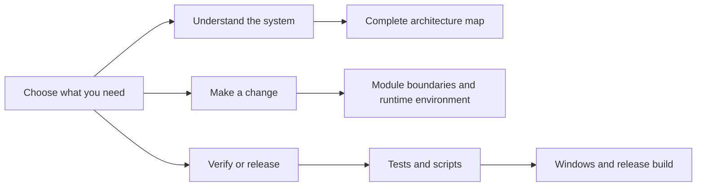

# MIO Kitchen documentation

This tree documents the current Python application in English. Production code under `src` is the source of truth; documentation checks validate this tree's structure, links, commands, and key architectural claims against the repository.

## Architecture

| Document | Purpose |
|---|---|
| [Architecture overview](architecture/architecture_overview.md) | The `ui`, `app`, `logic`, `core`, and `platform` layers and dependency direction |
| [Current architecture status](architecture/architecture_status.md) | Current constraints and known limitations, without a refactoring history |
| [Complete architecture map](architecture/architecture_map_english.md) | Detailed diagrams of modules, startup, runtime data, import, unpacking, packing, plugins, formats, and change impact |
| [Module boundaries](architecture/module_boundaries.md) | Canonical imports and responsibilities of the main modules |
| [Runtime state](architecture/runtime_state.md) | Runtime-session creation and the four typed phases |
| [Typed boundaries](architecture/typed_boundaries.md) | Where protocols are used and what the strict Mypy profile checks |

## Development

| Document | Purpose |
|---|---|
| [Repository structure](development/repository_structure.md) | Directory ownership and file-placement rules |
| [Tests and scripts](development/tests_and_scripts.md) | Test groups, real-code rules, Ruff, Mypy, Architecture Guard, commands, and Windows launchers |
| [Runtime environment](development/runtime_environment.md) | Dependencies, runtime directories, and environment setup |
| [Logging and diagnostics](development/logging_and_diagnostics.md) | Log locations, recorded events, and error-report evidence |
| [Localization and UI text](development/localization_and_ui_text.md) | Separation of technical values from user-facing labels |
| [Plugin development](development/plugin_development.md) | Installed-plugin layout, execution boundaries, and MPK format |
| [Integrated and bundled components](development/third_party_components.md) | Current third-party code, bundled executables, attribution, and maintenance rules |

## Preserved material

[Historical audits](../archive/audits/README.md) and [legacy README translations](../archive/readmes/) are preserved under `docs/archive`. They are useful for tracing earlier decisions but do not define the current architecture; use the code and the active documents above for current behavior.

[Russian version](../ru/README.md)
