# Complete MIO Kitchen architecture map

Source of truth: the current code, runtime directories, format registries, bundled binary sets, and automated architecture checks in this repository.

## 1. Architecture at a glance

| Area | Current implementation |
|---|---|
| Application | Tkinter desktop interface for Android ROM and partition image operations |
| Entry point | `tool.py`, then `src/app/entrypoint.py`, then `src/app/bootstrap.py` |
| Main layers | `ui`, `app`, `logic`, `core`, `platform` |
| Project workspace | `<settings.path>/Projects/<project>/input`, `unpack`, `output` |
| Active unpack filesystems | EXT, EROFS, F2FS, ROMFS |
| Active pack filesystems | EXT4, EROFS, F2FS |
| Partition output formats in the pack window | `raw`, `sparse`, `new.dat`, `new.dat.br` |
| Containers and special images | payload, super, UPDATE.APP, boot, vendor_boot, dtbo, vbmeta, logo, splash, GPT, RKFW, RKAF, Amlogic |
| Localization | 15 dynamically discovered JSON files, with English as the reference |
| Plugins | MPK packages, Python plugins, shell plugins, virtual plugins, Plugin Store |
| Runtime resources and data | `bin`, `config`, `languages`, `plugins`, `temp`, `logs`, `templates`, plus `Projects` under `settings.path` |
| Current repository mode | Basic, because the optional `src/pro` package is absent |
| Payload packing | Unavailable on every platform, because no generator backend is registered |

## 2. System context

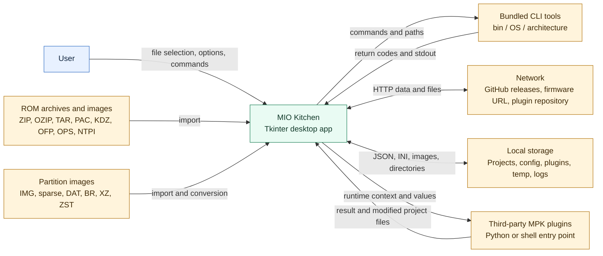

## 3. Layers and dependency direction

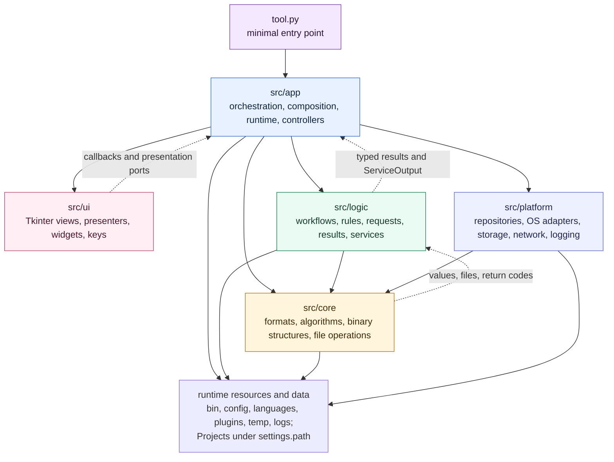

The static import rule is enforced by `scripts/arch_guard`.

| Layer | Allowed internal imports |
|---|---|
| `src/core` | Only `src/core` |
| `src/logic` | `src/logic`, `src/core` |
| `src/platform` | `src/platform`, `src/core` |
| `src/ui` | Only `src/ui` |
| `src/app` | All five layers, because it is the composition root |

The `platform` layer does not own all system I/O. Many project file operations and external packer calls still live in `logic` and `core`. This map describes the code as it exists today.

## 4. Startup and runtime session

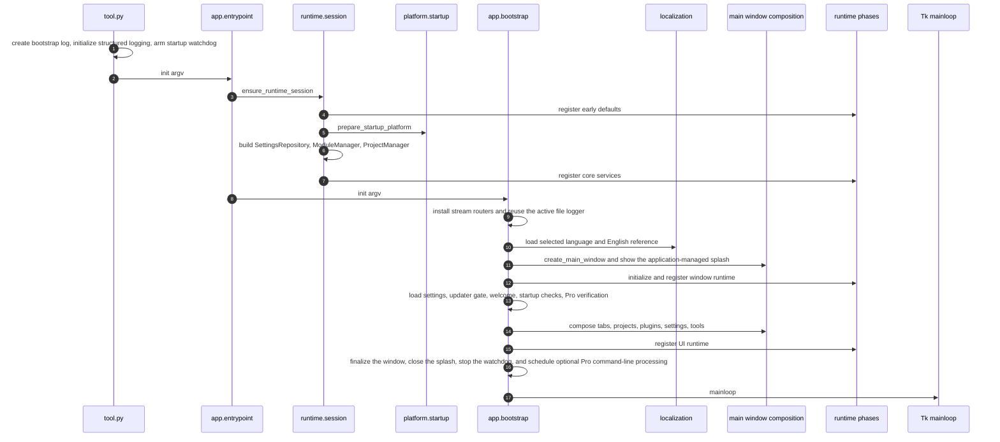

### Four runtime phases

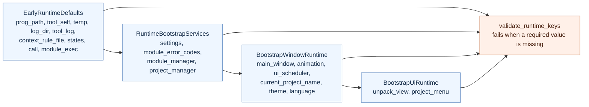

### Main startup functions

| Module | Key functions | Receives | Returns or changes |
|---|---|---|---|
| `tool.py` | `init` | `sys.argv` | Transfers control to the application |
| `app.entrypoint` | `init`, `restart` | Process arguments | Guarantees one runtime session |
| `app.runtime.session` | `ensure_runtime_session`, `sync_runtime_globals` | Nothing or partial runtime values | `RuntimeSession` and registered bundles |
| `app.runtime.service_bootstrap` | `build_runtime_bootstrap_services` | Runtime paths | Settings, ModuleManager, ProjectManager |
| `platform.startup` | `prepare_startup_platform`, `prepare_tool_binaries` | Active OS and `tool_bin` | Freeze support on Windows, execute bits on POSIX |
| `app.bootstrap` | `init`, `_init_tk`, `init_verify`, `restart` | Runtime services and argv | Main window and Tk event loop |
| `app.composition.main_window` | `create_main_window`, `compose_main_window` | Runtime ports and localization catalog | Fully connected UI |

## 5. UI and composition

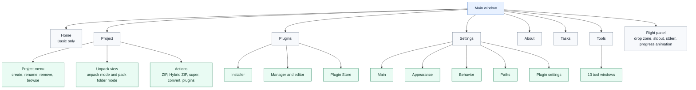

UI creates only Tk objects, presentation state, and callbacks. `src/app/composition` creates controllers and services, connects views to `logic`, and supplies the scheduler, notifier, file dialogs, runtime contexts, and platform functions.

All normal child windows are created through `src/ui/common/windowing.py`. The shared `Toplevel` resolves its owner and attaches the native transient relationship while the window is still withdrawn. It then reveals the completely built window through the same first-paint pipeline used by the startup splash and the main root. Native file dialogs receive the active owner through `parent`.

### First-frame presentation pipeline

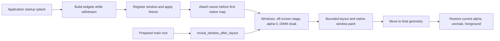

`window_paint.py` drains only layout and native window events, so unrelated timer and file callbacks remain queued for the normal main loop. `window_appearance.py` keeps theme and transparency consistent across every registered window. `startup_splash.py` closes the splash and passes the prepared main root to `window_reveal.py`; this prevents an unthemed white client area from being published between the splash and the application window.

## 6. Background task and message flow

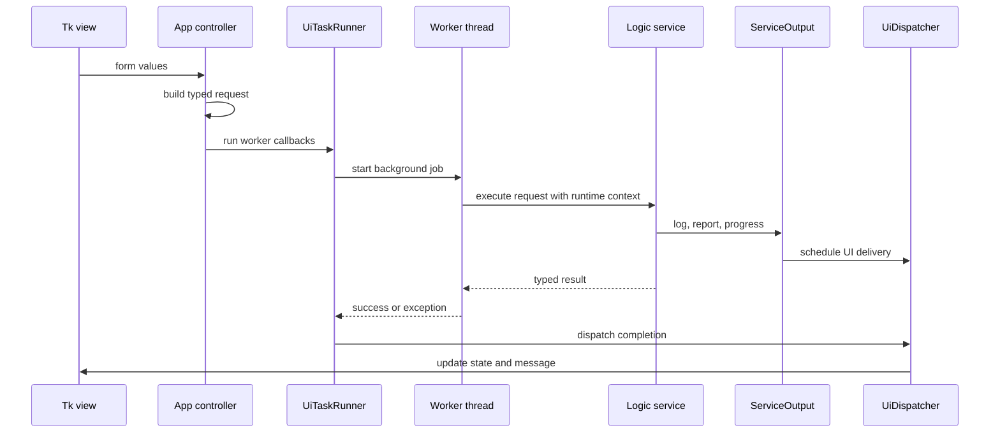

| Component | Role |
|---|---|
| `app.background_jobs.start_background_job` | Creates an application-managed worker |
| `app.ui_tasks.UiTaskRunner` | Preserves the result type and delivers success and error callbacks |
| `app.ui_scheduler.AppUiScheduler` | Owns Tk `after` and `after_cancel` scheduling |
| `app.ui_feedback.UiDispatcher` | Moves callbacks into the UI thread |
| `app.ui_feedback.UiNotifier` | Displays messages through an explicit presentation port |
| `logic.common.service_output.ServiceOutput` | Neutral log, report, and progress channel |
| `app.std_streams.StreamRouter` | Routes stdout and stderr to debugger, log view, and original stream |

## 7. Project structure and data ownership

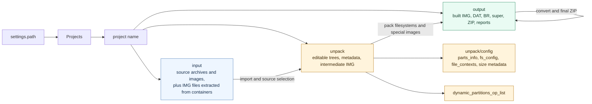

`ProjectManager` always creates all three directories. `current_input_path` is the canonical accessor for project sources, and every import or unpack workflow receives that path explicitly.

## 8. Complete import flow

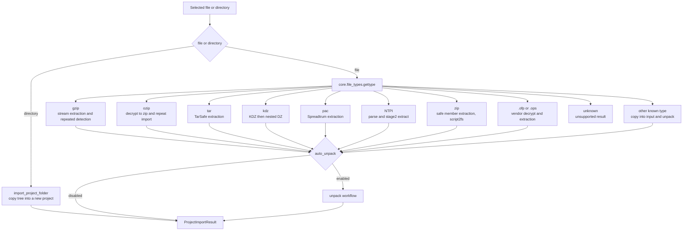

### Importable containers

| Type | Detection | Action | Result |
|---|---|---|---|
| ZIP | `PK` magic | Safe member extraction and `script2fs` | Files in `unpack` |
| OZIP | `OPPOENCRYPT!` magic | Decrypt into ZIP | Repeated ZIP import |
| TAR and TAR.MD5 | `tarfile.is_tarfile` | `TarSafe.extractall` | Files in `unpack` |
| GZIP and TAR.GZ | GZIP magic | Streaming extraction | Repeated detection of the nested type |
| KDZ and DZ | KDZ and DZ magic | Extract LG containers | Partitions and files in `unpack` |
| OFP | `.ofp` extension | MTK or Qualcomm decrypt mode | Files and `script2fs` metadata |
| OPS | `.ops` extension | `opscrypto` decrypt | Files in `unpack` |
| PAC | Magic at offset 2116 | Spreadtrum extractor | Images, then optional automatic unpack |
| NTPI | `NTPI` magic | Parser and stage2 extractor | Extracted files |
| Known single image | `gettype` is not `unknown` | Preserve in `input`, copy to `unpack` | Optional automatic unpack |

The detector contains a `7z` branch based on the current literal header check `b"7z"`, but there is no dedicated 7z import handler. That condition does not cover the standard 7z signature, so the current workflow does not claim full support for ordinary 7z archives.

## 9. Complete unpack flow

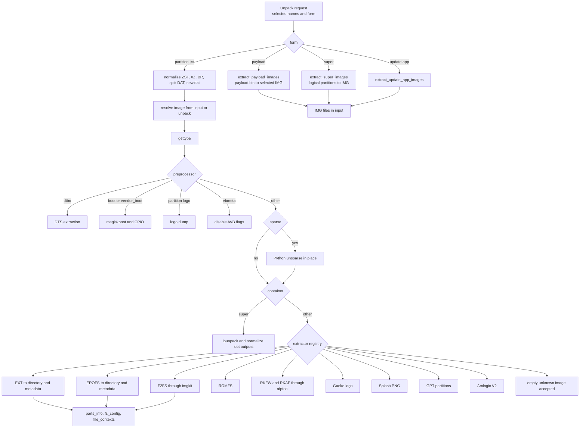

### Registered unpack window modes

`new.dat.br`, `new.dat`, `new.dat.xz`, `img`, `sparse`, `payload`, `super`, `update.app`, `zst`.

### Types actively extracted by the workflow

| Group | Types | Backend | Output data |
|---|---|---|---|
| Filesystems | EXT, EROFS, F2FS, ROMFS | Python EXT parser, `extract.erofs`, `imgkit`, ROMFS parser | Partition directory and repack metadata |
| Android boot family | boot, vendor_boot | `magiskboot`, `cpio`, optional RK resource parser | Component directory and ramdisk |
| Device tree | dtbo | Python DTBO parser and `dtc` | DTS files |
| Dynamic partitions | super, sparse super | `lpunpack`, Python sparse reader | Logical partition IMG |
| OTA | payload, `new.dat`, BR, XZ, ZST, split DAT | protobuf payload parser, Sdat2img, Brotli, LZMA, Zstandard | Partition IMG |
| Vendor containers | UPDATE.APP, RKFW, RKAF, Amlogic V2 | `splituapp`, `afptool`, Amlogic parser | Images or extracted files |
| Graphics | logo, guoke_logo, splash | LogoDumper, GuoKeLogo, splash editor | BMP or PNG assets and metadata |
| Partition table | GPT | Python GPT reader | Partition binary files |
| Verification | vbmeta | `Vbpatch.disavb` | Modified vbmeta image |

UBI, SquashFS, and JFFS2 are recognized by `gettype`, but they are not in the active `_EXTRACTABLE_TYPES` set of the current project unpack workflow.

## 10. Complete pack flow

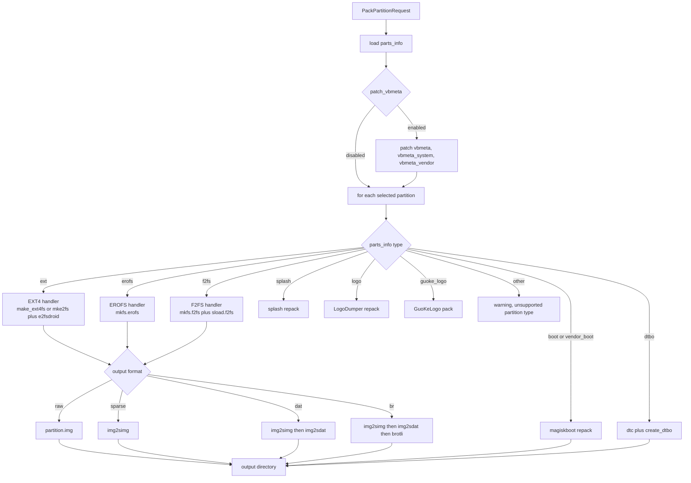

### `PackPartitionRequest` options

| Field | Purpose |
|---|---|
| `chosen_parts` | Partition names |
| `patch_vbmeta` | Disable AVB in all found vbmeta images |
| `remove_source_files` | After a filesystem partition is packed successfully, remove that selected partition directory and its related metadata. The special boot, dtbo, logo, and splash handlers are not controlled by this flag |
| `ext4_packer` | `make_ext4fs` or `mke2fs` |
| `ext4_size_mode` | `auto` or `fixed` |
| `output_format` | The UI offers `raw`, `sparse`, `dat`, and `br`, displayed as `raw`, `sparse`, `new.dat`, and `new.dat.br` |
| `erofs_compress_format`, `erofs_level`, `erofs_old_kernel` | EROFS compression settings |
| `brotli_level`, `utc` | Brotli level and timestamp |
| `origin_fs`, `modify_fs`, `fs_convert` | Explicit EXT, EROFS, or F2FS conversion before packing |
| `custom_size` | Per partition EXT4 sizes |

Before packing, `prepare_partition_context_files` updates `fs_config`, `file_contexts`, context rules, and removes duplicates. Automatic sizing estimates the directory tree and can update `dynamic_partitions_op_list`.

Filesystem handlers, `boot`, `vendor_boot`, and `dtbo` publish their result to `output`. The current `splash`, `logo`, and `guoke_logo` handlers work with the image inside `unpack` and do not move the rebuilt file to `output` themselves.

## 11. Super, Hybrid ZIP, and Payload

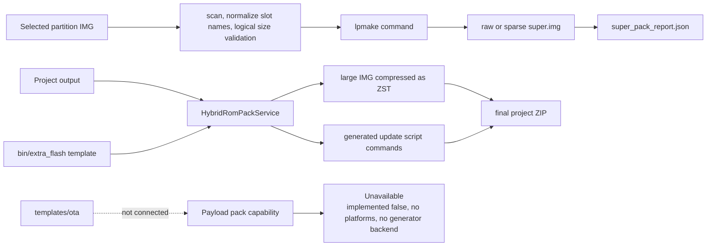

Super supports non-A/B, A/B, and virtual A/B layouts, raw or sparse output, read-only attributes, a group name, a block device name, and logical-size validation. Hybrid ZIP does not support projects whose `output` already contains `payload.bin`.

A logic repository, App controller, and UI editor exist for `postinstall_config.txt`. The window is not registered in the active project menu, so postinstall editing is prepared in code but unavailable through the normal interface.

## 12. Format conversion

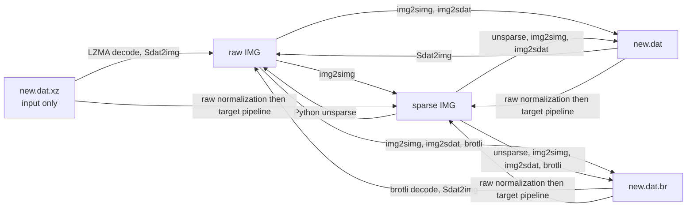

Input formats: `raw`, `sparse`, `dat`, `br`, `xz`.

Output formats: `raw`, `sparse`, `dat`, `br`.

Raw candidates include detected EXT, EROFS, F2FS, and super images.

## 13. Filesystems

| Filesystem | Detector | Unpack | Metadata | Pack | Main dependencies |
|---|---|---|---|---|---|
| EXT family | EXT magic at offset 1080 | Active | `fs_config`, `file_contexts`, `parts_info` | EXT4 active | Python EXT parser, `make_ext4fs` or `mke2fs` and `e2fsdroid` |
| EROFS | Magic at offset 1024 | Active | `fs_config`, `file_contexts`, `parts_info` | Active | `extract.erofs`, `mkfs.erofs` |
| F2FS | Magic at offset 1024 | Active when `imgkit` exists | `fs_config`, `file_contexts`, `parts_info` | Active when both tools exist | `imgkit`, `mkfs.f2fs`, `sload.f2fs` |
| ROMFS | `rom1fs` magic | Active | No complete round-trip metadata | No active pack handler | Python ROMFS parser |
| SquashFS | `sqsh` or `hsqs` | Detector and library code only | Not connected to project workflow | No | `PySquashfsImage` library |
| UBI | `UBI#` | Detector only | No | No | No registered workflow |
| JFFS2 | Magic `0x1985` | Detector only | No | No | No registered workflow |

## 14. Detected type registry

`core.file_types.gettype` recognizes these values:

| Family | Values |
|---|---|
| Archives and compression | `zip`, `ozip`, `7z`, `tar`, `gzip`, `bzip2`, `zopfli`, `lzma`, `lz4`, `lz4_legacy`, `lz4_lg`, `zstd` |
| Android images | `boot`, `vendor_boot`, `dtbo`, `vbmeta`, `avb_foot`, `payload`, `super`, `sparse`, `ext`, `erofs`, `f2fs`, `gpt`, `dtb` |
| Graphics and vendor | `logo`, `guoke_logo`, `splash`, `rk_rsce`, `rkfw`, `rkaf`, `amlogic` |
| Firmware containers | `kdz`, `dz`, `pac`, `NTPI`, `romfs`, `ubi`, `squashfs`, `jffs2` |
| Executables and media | `exe`, `elf`, `macos_bin`, `png`, `chrome` |
| Service results | `unknown`, `fnf`; the `fne` branch exists in the function but is unreachable with the current check order |

Type detection does not imply a complete unpack and pack round trip. Active capability is documented in sections 8, 9, 10, and 13.

## 15. Core engine

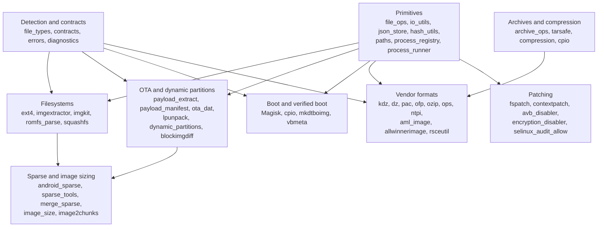

### Core group map

| Group | Main modules | Role and key functions |
|---|---|---|
| Types and paths | `file_types`, `paths`, `file_finder`, `directory_listing` | `gettype`, file search, program root, and platform tool path |
| File primitives | `file_ops`, `io_utils`, `cache_ops`, `json_store`, `hash_utils`, `random_utils` | Read, write, remove, JSON, hash, temporary identifiers |
| Processes | `process_runner`, `process_registry`, `diagnostics` | `call`, PID registry, stdout and logging sink |
| Sparse | `android_sparse`, `sparse_img`, `sparse_tools`, `merge_sparse`, `image2chunks` | Unsparse, sparse conversion, split, merge, chunking |
| EXT | `ext4`, `imgextractor`, `resize_ext4`, `fspatch`, `contextpatch` | EXT parsing, extraction, metadata generation, resize, patching |
| EROFS and F2FS | `imgkit`, `extract.erofs`, `mkfs.erofs`, `mkfs.f2fs`, `sload.f2fs` | `imgkit` handles F2FS unpacking. EROFS unpacking and EROFS or F2FS packing are invoked by separate logic services through external tools |
| Dynamic partitions | `lpunpack`, `dynamic_partitions`, `gpt`, `pygpt` | Super metadata, logical partitions, GPT |
| OTA | `payload_extract`, `payload_manifest`, `ota_dat`, `blockimgdiff`, `rangelib`, `sign_payload` | Payload extraction, DAT conversion, range operations, signing helper |
| Boot | `Magisk`, `cpio`, `mkdtboimg`, `vbmeta`, `rsceutil` | Boot ramdisk, DTBO, verified boot, Rockchip resources |
| Vendor | `aml_image`, `allwinnerimage`, `kdz`, `dz`, `unkdz`, `undz`, `unpac`, `splituapp`, `ofp_*`, `ozipdecrypt`, `opscrypto`, `ntpiutils` | Vendor firmware parsing and extraction |
| Graphics | `logo`, `splash_editor`, `opsplash`, `rsceutil` | Logo, splash, resource images |
| Compression and archives | `compression`, `archive_ops`, `tarsafe`, `cpio`, `squashfs`, `PySquashfsImage` | Safe extraction and compression codecs |
| Security patching | `avb_disabler`, `encryption_disabler`, `selinux_audit_allow`, `te2cil` | fstab and SELinux transformations |

## 16. Logic services

| Subsystem | Services and functions | Input | Output | Dependencies |
|---|---|---|---|---|
| Initial setup | `WelcomeStepPolicy` | Step number and page count | Valid step number | None |
| Project workspace | `ProjectManager`, `pack_zip`, `rmdir` | Workspace path and project name | `input`, `unpack`, `output`, final ZIP | Core file operations |
| Import | `copy_project`, `unpackrom`, format handlers | File or directory, `ProjectImportRuntimeContext` | `ProjectImportResult` | Type detector, archive and vendor parsers |
| Unpack registry | `get_available_formats`, `list_candidates`, `run_unpack` | Format key and selected items | Candidate list or bool | Lazy controllers |
| Unpack workflow | `unpack`, `unpack_compressed_dat`, `process_partition_image` | Partition names, form, runtime context | Trees, IMG, metadata, bool | Core format engines and CLI tools |
| Convert | `list_candidate_groups`, `convert_selection` | `ConvertSelection` | Final `bool`; individual `ConvertResult` values are created during processing but are not returned to the caller | Sparse, DAT, Brotli, LZMA |
| Partition pack | `pack_selected_partitions`, `pack_filesystem_partition` | `PackPartitionRequest` | Images and converted outputs | Filesystem handlers and pack registry |
| Super pack | `pack_super`, `scan_packable_super_images`, `validate_super_size` | Images, groups, slots, size | `super.img`, JSON report | `lpmake`, image size parser |
| Hybrid pack | `HybridRomPackService.pack` | Output directory, template, target device | Flashable layout and ZIP inputs | `zstd`, safe template operations |
| Payload pack capability | `get_capability`, `audit_implementation` | Platform and project root | Explicit unavailable status | No generator backend |
| Boot and DTBO | `unpack_boot_image`, `repack_boot_image`, `unpack_dtbo`, `pack_dtbo` | Image and runtime context | Editable tree or rebuilt image | `magiskboot`, `cpio`, `dtc` |
| Plugins | `ModuleManager` and focused plugin services | MPK, plugin ID, runtime values | Installed files, event, result code | ZIP, Python loader, BusyBox shell |
| Settings | Load, save, validation, and plugin settings services | Form values and repository | Persisted settings and validation | Platform SettingsRepository |
| Update | Release check and install services | GitHub release metadata | Downloaded update and restart state | HTTP and platform restart |
| Bug report | Attachment and report services | Settings snapshot, log file, output directory | Local report ZIP containing `detail.txt` and the log | Filesystem and archive operations |
| Editor | Editor service and controller | Directory and filename | Read and modified text files | App file dialog and UI editor |

## 17. Tools

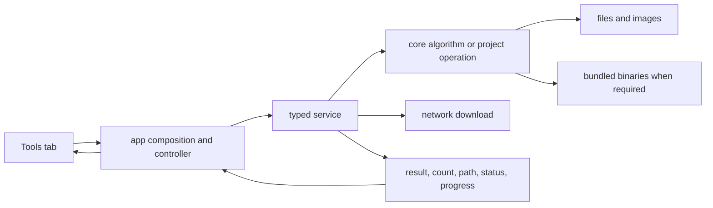

| Tool | Main functions | Receives | Produces | Conditions |
|---|---|---|---|---|
| Firmware download | `DownloadFirmwareUseCase.execute` | URL, output directory, automatic import | Downloaded file or imported project, progress | Network required |
| File info | `describe_file` | File path | Name, path, type, bytes, ctime | Any local file |
| Byte calculator | `convert_text` | Number and B to PB units | Converted text | Always |
| SELinux audit allow | `build_request`, `execute_request` | Audit log and output directory | Generated allow rules | Valid input file |
| Disable AVB in fstab | `scan_project_for_fstab_partitions`, `patch_selected_partitions` | Current unpack tree | Modified fstab files and count | Selected project |
| Disable encryption | Same orchestration functions with another patch backend | Current unpack tree | Modified encryption flags and count | Selected project |
| Trim raw image | `execute_trim`, `trim_trailing_zeros` | Image path | Same file truncated and removed byte count | Destructive in-place operation |
| Magisk patch | `get_arch`, `patch_boot_image` | Boot image, Magisk APK, architecture and flags | Patched boot IMG | Magisk APK and supported architecture |
| Merge Qualcomm image | `execute_merge` | `rawprogram.xml`, partition name, output directory | Merged image | Valid Qualcomm XML and chunks |
| Merge super segments | `MergeSuperService.execute` | Project, output name, delete source flag | Merged image and status | Sparse segment set in project |
| Split raw super | `execute_split_super` | Raw super, part count, block size | Android sparse parts | Input must be raw super |
| Decrypt XTC XML | `decrypt_tree` | Directory tree | XML files changed in place | Matching XML files |
| MTK Port Tool | `MtkPortService.execute` | Boot, system, port ROM, profile, flags | Results in the relative `out` directory and temporary extraction in the relative `tmp` directory | Matching binaries, valid profile, optional Magisk APK |

## 18. Plugins

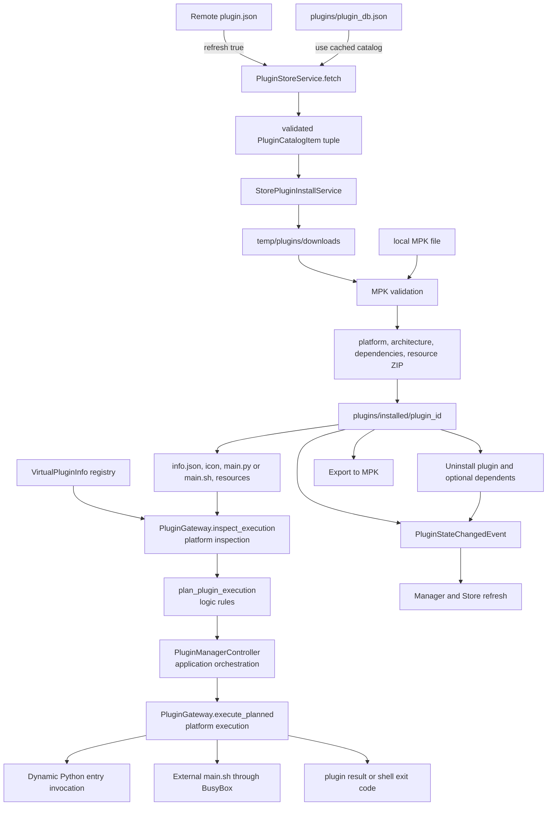

### Plugin contract

| Element | Purpose |
|---|---|
| MPK outer archive | ZIP container with `info`, optional `icon`, required resource archive |
| `info` | Module metadata: identifier, name, version, author, description, system, architecture, dependencies, resource |
| Installed `info.json` | Normalized runtime metadata |
| `main.py` | Python `main` or `entrances` mapping |
| `main.sh` | Shell entry through BusyBox and `bin/exec.sh` |
| `main.json` | Optional configuration dialog model |
| Virtual plugin | Callable registered without an installed directory |
| Runtime exports | Project work, project output, tool bin, version, language, plugin paths, mapped form values |

Installation checks the operating system, architecture, and dependencies. Execution requires a selected project. The application controller only coordinates the scenario through the plugin gateway port. Logic creates the execution plan. Platform code reads plugin files, dynamically loads `main.py`, or launches the external `main.sh` entry through BusyBox. Shell values are escaped and sensitive values are removed from command logs.

## 19. Platform adapters

| Module | Role | Main functions or classes |
|---|---|---|
| `runtime_paths` | Canonical registry for most runtime directories and files | Constants for bin, config, languages, plugins, temp, and templates. `prog_path`, `tool_bin`, and the log path are resolved by other runtime modules |
| `runtime_directories` | Mutable directory creation | `ensure_runtime_directories`, `prepare_log_files` |
| `runtime_environment` | Environment warnings | Non-root POSIX and LoongArch64 |
| `startup` | OS preparation | POSIX execute bits and Windows freeze support |
| `settings_repository` | INI persistence | `SettingsRepository.load`, `set_value` |
| `json_file_repository` | Atomic UTF-8 JSON replacement | `read`, `write` |
| `language_repository` | Dynamic language discovery and loading | `list_language_names`, `read_language_map` |
| `mtk_port_profile_repository` | MTK profile JSON persistence | `load`, `save` |
| `metrics_repository` | Metrics storage | Observation reads and writes |
| `welcome_content_repository` | Welcome content data | Content loading |
| `network` | Optional HTTP client boundary | `load_requests_module` |
| `git_repository` | Git workspace detection | Repository checks |
| `logging_setup` | UTF-8 file and optional development-console logging | `configure_logging` |
| `process_launcher` | Detached process | `launch_detached` |
| `process_restart` | Program restart adapter | Process replacement or launch |
| `system_shell` | External URL and file manager | Windows shell, macOS open, Linux xdg open |
| `filesystem` | Small path query adapter | exists, is file, is directory, absolute and parent paths |

## 20. Runtime storage

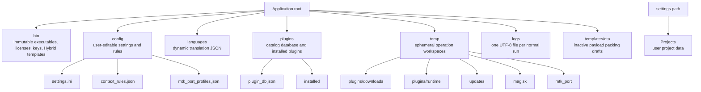

| Directory or file | Owner | Lifetime | Content |
|---|---|---|---|
| `bin` | Distribution | Until an application update | OS and architecture tools, licenses, keys, `extra_flash`, tkdnd |
| `config/settings.ini` | SettingsRepository | Persistent | Theme, language, workspace path, behavior, repository URL, flags |
| `config/context_rules.json` | Partition pack context patch | Persistent | SELinux context learning rules |
| `config/mtk_port_profiles.json` | MTK profile repository | Persistent | Chipset profiles, replacements, flags |
| `languages/*.json` | Localization repositories | Until update or manual change | Translation key maps |
| `plugins/plugin_db.json` | Plugin Store service | Cached until forced refresh | The single local catalog database |
| `plugins/installed` | ModuleManager | Until uninstall | Installed plugin directories |
| `temp/plugins/downloads` | Store installer | Temporary | MPK downloads |
| `temp/plugins/runtime` | Plugin execution | Temporary | Shell plugin workspace |
| `temp/updates` | Update orchestrator | Temporary | Update packages and staging |
| `temp/magisk` | Magisk tool | Temporary | Patch workspace |
| `temp/mtk_port` | MTK Port Tool | Temporary | Workspace passed to the Magisk patch stage. The MTK flow also resolves its working `tmp` and `out` directories relative to the active operation |
| `logs` | Logging setup | One file per normal run | DEBUG-level UTF-8 diagnostics |
| `templates/ota` | Unfinished payload feature | Distribution resource | OTA text templates not consumed by active tools |
| `<settings.path>/Projects` | ProjectManager | User-controlled | Input, unpack, and output for every project |

## 21. Localization

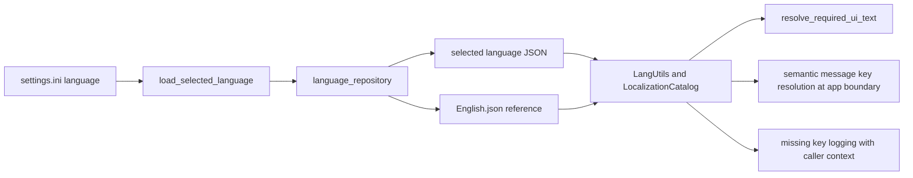

Names returned by `list_language_names`: Brazilian-Portuguese, Chinese-Simplified, Chinese-Traditional, Deutsch, English, Hungarian, Indonesian, Japanese, korean, Lithuanian, Russian, Spanish, Thailand, Turkish, Vietnamese.

## 22. Modes and feature availability

### Application modes

| Feature | Basic | Optional Pro package | Additional condition |
|---|---|---|---|
| Home tab | Available | Hidden | This repository is currently Basic |
| Project, Plugins, Settings, About, Tasks, Tools | Available | Available | Tk UI builds successfully |
| Import, unpack, pack, convert | Available | Available | A project is selected and required binaries exist |
| Command-line argument processing after startup | Unavailable | Available | `src/pro` imports successfully |
| Activation UI | Not used | Available | Pro verifier reports an inactive state |
| Basic mode notice | Shown | Hidden | Startup finalization |
| Debugger banner | Shown | Hidden | Pro gate |
| Development logging | UTF-8 file and console | UTF-8 file and console | `states.development` is true |
| Normal logging | UTF-8 file | UTF-8 file | `states.development` is false |

### User feature flags

| Setting | Disabled mode | Enabled mode |
|---|---|---|
| `auto_unpack` | Import only places source files | Import automatically starts unpack workflow |
| `contextpatch` | Existing file contexts remain without learned rules | Pack runs context patch and rule scan |
| `boot_skip_ramdisk` | Boot ramdisk is unpacked and packed | Ramdisk stage is skipped |
| `magisk_not_decompress` | Magiskboot decompresses boot components | Uses `magiskboot unpack -n` |
| `check_upgrade` | Automatic release check is off | Main window loop starts update checks |
| `treff` | Normal window | Transparency effect is enabled |
| EXT4 size auto | Size is estimated from the directory | Not applicable |
| EXT4 size fixed | Not applicable | Original or custom byte size is used with fit warnings |
| Unpack view mode | Image format and image candidates are selected | Pack folder mode disables format selection and selects directories |

### Platform capabilities provided by bundled tools

Legend: Yes means that the complete required set is present. Partial means that part of the backend is absent. Python means that the main path does not need a separate binary. Disabled means that code explicitly disables the feature.

| Capability | Windows AMD64 | Windows x86 | Linux x86_64 | Linux aarch64 | Linux loongarch64 | macOS x86_64 | macOS arm64 |
|---|---|---|---|---|---|---|---|
| Tk DnD library | Yes | Yes | Yes | Yes | Yes | Yes | Yes |
| EXT4 unpack | Python | Python | Python | Python | Python | Python | Python |
| EXT4 pack | Yes | Yes | Yes | Yes | Yes through `make_ext4fs`, while `mke2fs` mode does not match the `mke2fs.android` filename | Yes | Yes |
| EROFS unpack and pack | Yes | Yes | Yes | Yes | Yes | Yes | Yes |
| F2FS unpack | Yes | No `imgkit` | Yes | Yes | No `imgkit` | No `imgkit` | Yes |
| F2FS pack | Yes | No | Yes | No | No | Yes | Yes |
| Boot unpack and repack | Yes | Yes | Yes | Partial, no bundled `cpio` | No `magiskboot` and no `cpio` | Yes | Yes |
| DTBO | Yes | Yes | Yes | Yes | Yes | Yes | Yes |
| Super unpack | Python | Python | Python | Python | Python | Python | Python |
| Super pack | Yes | Yes | Yes | Yes | Yes | Yes | Yes |
| Sparse to raw | Python | Python | Python | Python | Python | Python | Python |
| Raw to sparse | Yes | Yes | Yes | Yes | Yes | Yes | Yes |
| RKFW and RKAF unpack | Yes | No `afptool` | Yes | Yes | Yes | Yes | Yes |
| Payload unpack | Python | Python | Python | Python | Python | Python | Python |
| Payload pack | Disabled | Disabled | Disabled | Disabled | Disabled | Disabled | Disabled |

`bin/Android/aarch64` provides a separate tool set, but Android is not declared as a desktop Tk host. A Windows ARM64 tkdnd adapter exists, but this snapshot has no `bin/Windows/ARM64` directory.

## 23. Complete bundled binary matrix

| Platform and architecture | Files |
|---|---|
| Android aarch64 | brotli, busybox, cpio, dtc, e2fsdroid, extract.erofs, img2simg, imgkit, lpmake, magiskboot, make_ext4fs, mke2fs, mkfs.erofs, zstd |
| Darwin arm64 | afptool, brotli, busybox, cpio, dtc, e2fsdroid, extract.erofs, img2simg, imgkit, lpmake, magiskboot, make_ext4fs, mke2fs, mkfs.erofs, mkfs.f2fs, sload.f2fs, zstd |
| Darwin x86_64 | afptool, brotli, busybox, cpio, dtc, e2fsdroid, extract.erofs, img2simg, lpmake, magiskboot, make_ext4fs, mke2fs, mkfs.erofs, mkfs.f2fs, sload.f2fs, zstd |
| Darwin universal | afptool only |
| Linux aarch64 | afptool, brotli, busybox, delta_generator, dtc, e2fsdroid, extract.erofs, img2simg, imgkit, lpmake, magiskboot, make_ext4fs, mke2fs, mkfs.erofs, zstd |
| Linux loongarch64 | afptool, brotli, busybox, dtc, e2fsdroid, extract.erofs, img2simg, lpmake, make_ext4fs, mke2fs.android, mkfs.erofs, zstd |
| Linux x86_64 | afptool, brotli, busybox, cpio, delta_generator, dtc, e2fsdroid, extract.erofs, extract.f2fs, img2simg, imgkit, lpmake, magiskboot, make_ext4fs, mke2fs, mkfs.erofs, mkfs.f2fs, simg2img, sload.f2fs, zstd |
| Windows AMD64 | afptool.exe, brotli.exe, busybox.exe, cpio.exe, cygwin1.dll, dtc.exe, e2fsdroid.exe, extract.erofs.exe, img2simg.exe, imgkit.exe, lpmake.exe, magiskboot.exe, make_ext4fs.exe, mke2fs.exe, mkfs.erofs.exe, mkfs.f2fs.exe, mv.exe, simg2img.exe, sload.f2fs.exe, zstd.exe |
| Windows x86 | brotli.exe, busybox.exe, cpio.exe, cygwin1.dll, dtc.exe, e2fsdroid.exe, extract.erofs.exe, img2simg.exe, lpmake.exe, magiskboot.exe, make_ext4fs.exe, mke2fs.exe, mkfs.erofs.exe, mv.exe, simg2img.exe, zstd.exe |

`core.paths.tool_bin` selects only `bin/<platform.system()>/<platform.machine()>`. The directory name must therefore match the Python platform API value.

## 24. Python dependencies

| Group | Packages | Use |
|---|---|---|
| UI | Pillow, sv_ttk, chlorophyll, Pygments | Images, theme, editor, syntax highlighting |
| Network | requests, httpx | Updates, firmware, Plugin Store, reports |
| Binary formats | protobuf, pycryptodome, cryptography, asn1crypto | Payload manifests, vendor decryption, signatures |
| Compression | zstandard, lz4, python lzo on Linux | Compression formats |
| Data and config | toml, configparser, lxml | Configuration and XML processing |
| Packaging | PyInstaller | Binary distribution |
| Cross-version and Windows support | future, six, wmi on Windows | Compatibility helpers and Windows system information |

GitHub Actions builds releases with Python 3.12 for Windows x64, Ubuntu 24.04 x64, macOS 15 Intel x64, and macOS 15 ARM64. `requirements-quality.txt` is used only for manual Ruff and mypy checks and is not included in user builds.

## 25. Update, logging, and diagnostics

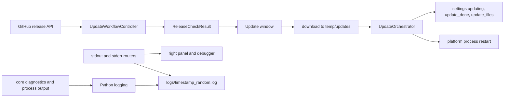

Every run creates a UTF-8 log at DEBUG level before the application modules are imported. Development mode adds a console handler without disabling file logging. A startup watchdog writes all Python thread stacks every 30 seconds until the main window is ready. The visible splash is managed by the application after logging starts, not by the PyInstaller bootloader. Pillow DEBUG noise is suppressed unless `MIO_DEBUG_PIL_LOGS` is enabled.

## 26. Architecture and quality checks

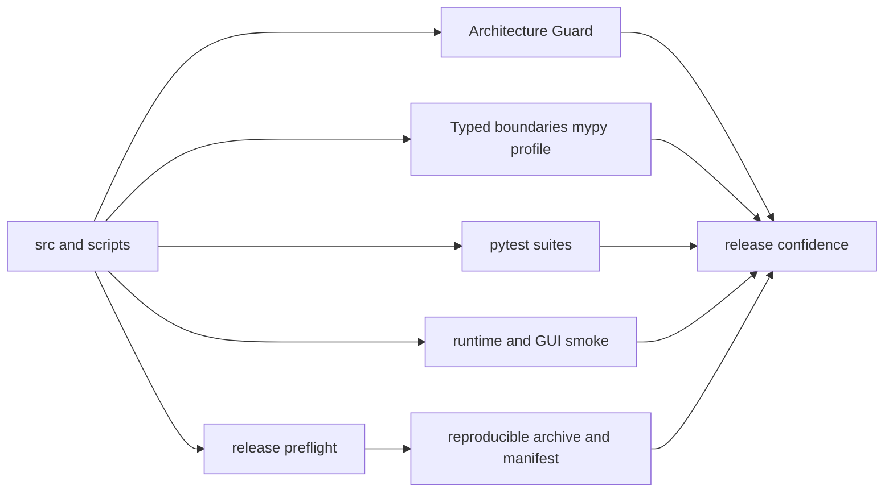

Architecture Guard checks import direction, the absence of static cycles, removed compatibility surfaces, UI operational boundaries, runtime ownership, and process exit semantics. Tests are organized into architecture, contract, functional, integration, regression, release, smoke, unit, and e2e suites.

## 27. Top-level responsibility map

| Directory | What it owns | What it must not do |
|---|---|---|
| `src/ui` | Tk windows, widgets, layout, presenters, localization keys | Read project files, start processes, import app, logic, core, or platform |
| `src/app` | Composition, runtime session, controllers, background tasks, UI delivery | Implement format algorithms |
| `src/logic` | Project workflows, typed requests and results, plugin and tool services | Depend on Tkinter, app, ui, or platform |
| `src/core` | Low-level format engines, parsers, algorithms, compatible process bridge | Depend on higher layers or Tkinter |
| `src/platform` | Repositories, paths, startup, logging, shell, restart, network loader | Contain domain decisions or UI |
| `bin` | Executable backends by OS and architecture | Store mutable user settings |
| `config` | User-editable persistent configuration | Store binaries or temporary data |
| `languages` | Translation catalogs | Store application state |
| `plugins` | Store database and installed modules | Store downloads or transient execution files |
| `temp` | Disposable downloads and operation workspaces | Store canonical settings or installed plugins |
| `logs` | Runtime diagnostics | Be a source of project data |
| `Projects` | User inputs, editable trees, and outputs | Mix with application resources |

## 28. End-to-end data flow

```mermaid
flowchart LR
  INPUT["User input<br/>archive, image, folder, URL"]
  UI["UI view"]
  APP["App controller and typed runtime context"]
  LOGIC["Logic service and workflow"]
  CORE["Core parser, transformer, or patcher"]
  BIN["Bundled CLI when needed"]
  STORAGE["input, unpack, output, config, temp"]
  RESULT["Typed result, file paths, progress, messages"]

  INPUT --> UI --> APP --> LOGIC --> CORE
  CORE <--> BIN
  CORE <--> STORAGE
  LOGIC <--> STORAGE
  CORE --> RESULT
  LOGIC --> RESULT
  RESULT --> APP --> UI
```

The central architecture principle is: UI presents, App connects, Logic decides the sequence, Core understands formats, Platform serves the environment, and runtime directories keep data under an explicit owner.

## 29. Change impact map

This map shows which layers, contracts, data, and checks are affected by a change in each major area.

```mermaid
flowchart TB
  UI_CHANGE["UI change"]
  RUNTIME_CHANGE["Runtime contract change"]
  SERVICE_CHANGE["Service or controller change"]
  FORMAT_CHANGE["Image format change"]
  PROJECT_CHANGE["Project layout change"]
  PLUGIN_CHANGE["Plugin or catalog change"]
  UPDATE_CHANGE["Update or network change"]
  BINARY_CHANGE["Platform binary change"]

  UI_LAYER["UI views, presenters, localization keys"]
  APP_LAYER["App composition, controllers, runtime contexts"]
  LOGIC_LAYER["Logic workflows, services, policies"]
  CORE_LAYER["Core formats, parsers, packers"]
  PLATFORM_LAYER["Platform paths, detached and restart processes, network, repositories"]
  STORAGE_LAYER["projects, plugins, temp, config, logs, bin"]

  UI_TESTS["UI smoke, localization, functional scenarios"]
  CONTRACT_TESTS["Contract and integration tests"]
  ROUNDTRIP_TESTS["Round-trip tests, format compatibility, fixtures"]
  RELEASE_TESTS["Asset, dependency, and startup checks"]

  UI_CHANGE --> UI_LAYER --> APP_LAYER --> UI_TESTS
  RUNTIME_CHANGE --> APP_LAYER --> CONTRACT_TESTS
  SERVICE_CHANGE --> APP_LAYER --> LOGIC_LAYER --> CONTRACT_TESTS
  FORMAT_CHANGE --> CORE_LAYER --> LOGIC_LAYER --> APP_LAYER
  CORE_LAYER --> ROUNDTRIP_TESTS
  PROJECT_CHANGE --> LOGIC_LAYER --> STORAGE_LAYER --> CONTRACT_TESTS
  PLUGIN_CHANGE --> LOGIC_LAYER --> APP_LAYER --> UI_LAYER
  PLUGIN_CHANGE --> STORAGE_LAYER
  UPDATE_CHANGE --> PLATFORM_LAYER
  UPDATE_CHANGE --> LOGIC_LAYER
  UPDATE_CHANGE --> APP_LAYER
  UPDATE_CHANGE --> STORAGE_LAYER
  BINARY_CHANGE --> PLATFORM_LAYER
  BINARY_CHANGE --> CORE_LAYER
  BINARY_CHANGE --> LOGIC_LAYER
  BINARY_CHANGE --> RELEASE_TESTS
  APP_LAYER --> STORAGE_LAYER
  PLATFORM_LAYER --> STORAGE_LAYER

  classDef change fill:#6d28d9,stroke:#c4b5fd,color:#ffffff,stroke-width:2px
  classDef layer fill:#0f766e,stroke:#5eead4,color:#ffffff,stroke-width:2px
  classDef storage fill:#1d4ed8,stroke:#93c5fd,color:#ffffff,stroke-width:2px
  classDef check fill:#b45309,stroke:#fcd34d,color:#ffffff,stroke-width:2px
  class UI_CHANGE,RUNTIME_CHANGE,SERVICE_CHANGE,FORMAT_CHANGE,PROJECT_CHANGE,PLUGIN_CHANGE,UPDATE_CHANGE,BINARY_CHANGE change
  class UI_LAYER,APP_LAYER,LOGIC_LAYER,CORE_LAYER,PLATFORM_LAYER layer
  class STORAGE_LAYER storage
  class UI_TESTS,CONTRACT_TESTS,ROUNDTRIP_TESTS,RELEASE_TESTS check
```

| Change area | Primary sources | Direct impact | Data impact | Minimum verification |
|---|---|---|---|---|
| Screen or user scenario | [src/ui](../../../src/ui/), [src/app/composition](../../../src/app/composition/) | presenters, composition, scenario controller, localization | user input, widget state, displayed results | window startup, main scenario, missing localization keys |
| Runtime bundle, phase, or context | [src/app/runtime](../../../src/app/runtime/), [src/app/bootstrap.py](../../../src/app/bootstrap.py) | bootstrap, composition, every runtime accessor consumer | paths, settings, language, services, startup state | runtime contracts, phase order, storage tests |
| Service or controller contract | [src/app](../../../src/app/), [src/logic](../../../src/logic/) | UI ports, orchestration, request and result models | commands, progress, errors, cancellation, final result | contract tests, integration happy path, error handling |
| Image format or conversion algorithm | [src/core](../../../src/core/), [src/logic/projects](../../../src/logic/projects/) | unpacking, packing, conversion, type detection | byte streams, partition metadata, filesystems | round-trip test, fixture for every format, binary compatibility |
| Project workspace | [project_manager.py](../../../src/logic/projects/common/project_manager.py), [workspace_service.py](../../../src/logic/projects/common/workspace_service.py) | import, unpacking, building, active project selection | `Projects/<name>/input`, `unpack`, `output`, and project metadata in `unpack/config` | creation, reopen, cleanup, name collision |
| Plugin or MPK schema | [src/logic/plugins](../../../src/logic/plugins/), [src/app/plugins](../../../src/app/plugins/) | catalog, installation, module loading, store UI | manifest, archive, plugin directory, installation state | plugin contract suite, MPK validation, installation, execution, and removal |
| Network or update | [network.py](../../../src/platform/network.py), [src/logic/update](../../../src/logic/update/), [update_orchestrator.py](../../../src/app/update_orchestrator.py) | downloads, version check, staging, restart | API response, downloaded archive, temp, config | network errors, release asset selection, cancellation, safe ZIP paths, staging, application, and update cleanup |
| Binary bundle | [bin](../../../bin/), [src/core/paths.py](../../../src/core/paths.py), [process_runner.py](../../../src/core/process_runner.py) | image handlers, external processes, operating system support | stdin, stdout, stderr, result files, return codes | required assets, system dependencies, smoke test for each binary |
| Localization key | [languages](../../../languages/), [language_repository.py](../../../src/platform/language_repository.py) | every visible label and message | language JSON dictionary, selected locale | parse every dictionary, key parity, RU and EN startup |

Practical rule: verify a contract change at its data producer, at every direct consumer, and at the boundary with a filesystem or external process.

## 30. Key source links

### UI and application composition

| Source | Role |
|---|---|
| [src/ui/main_window.py](../../../src/ui/main_window.py) | Main window and top-level UI boundary |
| [src/ui/window_sections/panels.py](../../../src/ui/window_sections/panels.py) | Main window panel assembly |
| [src/ui/common/windowing.py](../../../src/ui/common/windowing.py) | Shared child-window ownership and first-map behavior |
| [src/ui/common/window_appearance.py](../../../src/ui/common/window_appearance.py) | Theme and transparency registry for all windows |
| [src/ui/common/window_paint.py](../../../src/ui/common/window_paint.py) | Bounded initial native painting without timer callbacks |
| [src/ui/common/window_reveal.py](../../../src/ui/common/window_reveal.py) | Gated reveal of the prepared main root |
| [src/ui/startup_splash.py](../../../src/ui/startup_splash.py) | Application-managed startup splash lifecycle |
| [src/ui/tabs/project/unpack/view.py](../../../src/ui/tabs/project/unpack/view.py) | Unpacking scenario view |
| [src/ui/tabs/project/pack/partition/window.py](../../../src/ui/tabs/project/pack/partition/window.py) | Partition packing window |
| [src/ui/tabs/plugins/store/window.py](../../../src/ui/tabs/plugins/store/window.py) | Plugin catalog and installation UI |
| [src/ui/tabs/tools/view.py](../../../src/ui/tabs/tools/view.py) | Built-in tools screen |
| [src/app/composition/main_window.py](../../../src/app/composition/main_window.py) | Main window binding to App services |
| [src/app/composition/main_tabs.py](../../../src/app/composition/main_tabs.py) | Tab and user scenario composition |

### Runtime, application core, and layer boundaries

| Source | Role |
|---|---|
| [tool.py](../../../tool.py) | Application launch point |
| [src/app/entrypoint.py](../../../src/app/entrypoint.py) | App runtime entry point |
| [src/app/bootstrap.py](../../../src/app/bootstrap.py) | Runtime construction and UI startup |
| [src/app/runtime/session.py](../../../src/app/runtime/session.py) | Runtime session lifecycle |
| [src/app/runtime/phases.py](../../../src/app/runtime/phases.py) | Explicit startup phases and order |
| [src/app/runtime/models.py](../../../src/app/runtime/models.py) | Runtime models and bundle contracts |
| [src/app/runtime/service_bootstrap.py](../../../src/app/runtime/service_bootstrap.py) | Runtime service construction |
| [src/app/runtime/contexts/contracts.py](../../../src/app/runtime/contexts/contracts.py) | Execution context contracts |
| [scripts/arch_guard/current_rules.py](../../../scripts/arch_guard/current_rules.py) | Automated dependency direction rules |

### Services and controllers

| Area | App controllers | Logic services |
|---|---|---|
| Project import | [import_controller.py](../../../src/app/projects/import_controller.py) | [import_flow/service.py](../../../src/logic/projects/import_flow/service.py) |
| Unpacking | [unpack/controller.py](../../../src/app/projects/unpack/controller.py), [view_controller.py](../../../src/app/projects/unpack/view_controller.py) | [unpack/workflow/service.py](../../../src/logic/projects/unpack/workflow/service.py) |
| Partition packing | [partition_controller.py](../../../src/app/projects/pack/partition_controller.py) | [partition_flow/service.py](../../../src/logic/projects/pack/partition_flow/service.py) |
| Super packing | [super_controller.py](../../../src/app/projects/pack/super_controller.py) | [pack/super/service.py](../../../src/logic/projects/pack/super/service.py) |
| Conversion | [src/app/projects/convert](../../../src/app/projects/convert/) | [convert/service.py](../../../src/logic/projects/convert/service.py) |
| Plugin manager | [manager_controller.py](../../../src/app/plugins/manager_controller.py) | [module_manager.py](../../../src/logic/plugins/module_manager.py) |
| Plugin store | [fetch_flow.py](../../../src/app/plugins/store/fetch_flow.py), [install_flow.py](../../../src/app/plugins/store/install_flow.py) | [store_service.py](../../../src/logic/plugins/store_service.py) |
| Update | [update_controller.py](../../../src/app/update_controller.py), [update_orchestrator.py](../../../src/app/update_orchestrator.py) | [update/service.py](../../../src/logic/update/service.py), [install_service.py](../../../src/logic/update/install_service.py) |

### Data flows, projects, and plugins

| Source | Data and responsibility |
|---|---|
| [project_manager.py](../../../src/logic/projects/common/project_manager.py) | Project list, active project, creation, and opening |
| [workspace_service.py](../../../src/logic/projects/common/workspace_service.py) | Workspace structure and project paths |
| [source_handlers.py](../../../src/logic/projects/unpack/workflow/source_handlers.py) | Input file routing by source type |
| [image_processing.py](../../../src/logic/projects/unpack/workflow/image_processing.py) | Image unpacking flow and intermediate results |
| [pack/filesystem_service.py](../../../src/logic/projects/pack/filesystem_service.py) | Filesystem selection and preparation during builds |
| [filesystem_handlers.py](../../../src/logic/projects/pack/partition_flow/filesystem_handlers.py) | Packing implementation for supported filesystems |
| [plugins/install/service.py](../../../src/logic/plugins/install/service.py) | Plugin package validation and installation |
| [execution_plan.py](../../../src/logic/plugins/execution_plan.py) | Pure plugin execution rules and plan selection |
| [manager_controller.py](../../../src/app/plugins/manager_controller.py) | Application orchestration of the execution scenario |
| [plugin_gateway.py](../../../src/platform/plugin_gateway.py) | Plugin file inspection, registration, storage operations, and platform port implementation |
| [plugins/execution.py](../../../src/platform/plugins/execution.py) | Dynamic Python execution and external shell process launch |
| [composition/plugin_store.py](../../../src/app/composition/plugin_store.py) | Store UI binding to download and installation flows |

### Formats and Core

| Source | Responsibility |
|---|---|
| [file_types.py](../../../src/core/file_types.py) | Input file and image type detection |
| [sparse_tools.py](../../../src/core/sparse_tools.py) | Android sparse and raw conversions |
| [payload_extract.py](../../../src/core/payload_extract.py) | Partition extraction from payload |
| [lpunpack.py](../../../src/core/lpunpack.py) | Super logical partition parsing |
| [imgextractor.py](../../../src/core/imgextractor.py) | Filesystem image content extraction |
| [ext4.py](../../../src/core/ext4.py) | EXT4 structure handling |
| [Magisk.py](../../../src/core/Magisk.py) | Boot image operations through Magisk tools |
| [mkdtboimg.py](../../../src/core/mkdtboimg.py) | DTBO image reading and construction |
| [ota_dat.py](../../../src/core/ota_dat.py) | OTA dat format operations |
| [merge_sparse.py](../../../src/core/merge_sparse.py) | Sparse fragment merging |
| [process_runner.py](../../../src/core/process_runner.py) | Main shared bridge for external tool execution from Core. Format-specific algorithms may call `subprocess` directly when process control is part of the algorithm |

### Network, processes, storage, and platform binaries

| Source or directory | Role |
|---|---|
| [runtime_paths.py](../../../src/platform/runtime_paths.py) | Most canonical runtime directories and files |
| [runtime_directories.py](../../../src/platform/runtime_directories.py) | Working directory creation and validation |
| [settings_repository.py](../../../src/platform/settings_repository.py) | Configuration reading and writing |
| [language_repository.py](../../../src/platform/language_repository.py) | Language dictionary loading |
| [crash_logging.py](../../../src/platform/crash_logging.py) | Earliest file logging, exception hooks, fault capture, and startup phases |
| [startup_watchdog.py](../../../src/platform/startup_watchdog.py) | Periodic thread stack dumps when startup stops making progress |
| [logging_setup.py](../../../src/platform/logging_setup.py) | File and console logging setup |
| [network.py](../../../src/platform/network.py) | Lazy loading of `requests` at the platform boundary |
| [process_launcher.py](../../../src/platform/process_launcher.py) | Detached child process launch without connected stdout or stderr |
| [process_restart.py](../../../src/platform/process_restart.py) | Controlled application restart |
| [system_shell.py](../../../src/platform/system_shell.py) | Platform shell and system commands |
| [startup.py](../../../src/platform/startup.py) | Platform preparation at startup |
| [src/core/paths.py](../../../src/core/paths.py) | Bundled tool path resolution |
| [network_downloads.py](../../../src/logic/network_downloads.py) | Shared network download flow |
| [download_firmware/use_case.py](../../../src/logic/tools/download_firmware/use_case.py) | Firmware download user scenario |
| [splash.png](../../../splash.png), [splash_loongarch.png](../../../splash_loongarch.png) | Root application startup splash resources shown only after early logging is active. LoongArch64 uses the separate image |
| [bin](../../../bin/) | Platform binaries and helper tools |
| [config](../../../config/) | Persistent application settings |
| [languages](../../../languages/) | Localization dictionaries |
| [plugins](../../../plugins/) | Installed plugins |
| [temp](../../../temp/) | Temporary downloads and intermediate artifacts |
| [logs](../../../logs/) | Application and tool logs |
| [templates/ota](../../../templates/ota/) | OTA build templates |

### Architecture and end-to-end checks

| Check | Protected property |
|---|---|
| [test_layer_dependency_direction.py](../../../tests/architecture/test_layer_dependency_direction.py) | Dependency direction between layers |
| [test_runtime_storage_layout.py](../../../tests/architecture/test_runtime_storage_layout.py) | Runtime directory ownership and storage layout |
| [test_static_import_cycles_guard.py](../../../tests/architecture/test_static_import_cycles_guard.py) | Absence of forbidden import cycles |
| [test_workflow_contracts.py](../../../tests/contract/projects/unpack/test_workflow_contracts.py) | Unpacking flow contracts |
| [test_partition_contracts.py](../../../tests/contract/projects/pack/test_partition_contracts.py) | Partition packing contracts |
| [test_store_service_contracts.py](../../../tests/contract/plugins/test_store_service_contracts.py) | Plugin catalog and installation contracts |
| [test_update_contracts.py](../../../tests/contract/update/test_update_contracts.py) | Update check and installation contracts |
| [check_required_assets.py](../../../scripts/quality/check_required_assets.py) | Presence of required files and binaries |
| [check_system_dependencies.py](../../../scripts/quality/check_system_dependencies.py) | Availability of system dependencies |
