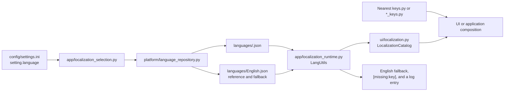

# UI text and localization

Every fixed, user-facing string lives in a JSON file under `languages`.

Source code must not hard-code button labels, window titles, messages, mode names, format names, filesystem names, image names, or tool names intended for display.

## Core rule

An internal value and its displayed label are different pieces of data.

Application, logic, platform, and core use the internal value. It is stable and independent of the selected language.

UI code and application composition resolve display text by key from the active language file. Logic, core, platform, and request models keep the internal value.

For example, Super image groups are displayed as follows:

```text
qti_dynamic_partitions is displayed as Qualcomm
main is displayed as MTK
mot_dp_group is displayed as Moto
```

The user sees the short labels `Qualcomm`, `MTK`, and `Moto`. Build requests and `lpmake` receive the original technical values. `mot_dp_group` belongs to Motorola's group scheme.

The same rule applies to:

1. `raw`, `sparse`, `img`, `payload`, `super`, and `new.dat` formats.
2. `ext4`, `EROFS`, and `F2FS`.
3. `boot`, `recovery`, `vendor_boot`, and `vbmeta`.
4. `Magisk` and tool names.
5. `fs_config` and `file_contexts`.
6. Android architectures.
7. File encodings.
8. Size units.
9. Light and dark themes.
10. Built-in Super group names.

## Where keys live

There is no single Python file containing every key. Each feature owns its keys in the nearest `keys.py` or `*_keys.py`. A constant's value is the JSON key string; the visible text itself lives only in `languages/*.json`.

`src/app/runtime/keys.py` is an important exception: it contains runtime-session field names, not localization keys. Never add UI text keys there.

### Exact storage and loading flow



| File or directory | Responsibility | When to edit it |
|---|---|---|
| [`languages/English.json`](../../../languages/English.json) | Reference catalog and fallback for required visible text | Always when adding a key; when changing English copy |
| [`languages/Russian.json`](../../../languages/Russian.json) | Russian values for the same keys | When changing Russian copy or adding a key |
| [`languages/*.json`](../../../languages/) | All 15 catalogs; the filename without `.json` is the language identifier | Add every new key to every supported language |
| [`config/settings.ini`](../../../config/settings.ini) | `setting.language` stores the selected language filename | Normally changed by the application language selector, not by hand |
| [`src/platform/runtime_paths.py`](../../../src/platform/runtime_paths.py) | Defines the canonical `LANGUAGE_DIR` | Only when relocating the entire language directory |
| [`src/platform/language_repository.py`](../../../src/platform/language_repository.py) | Builds paths, lists `*.json`, and reads a mapping through `JsonEdit` | When changing storage format or language discovery rules |
| [`src/app/localization.py`](../../../src/app/localization.py) | Loads the selected catalog and `English` separately as the reference; checks required keys | When changing the loading process, not for an ordinary translation |
| [`src/app/localization_runtime.py`](../../../src/app/localization_runtime.py) | `LangUtils`: resolves keys, applies fallback, returns `[missing:key]`, and logs the caller | When changing the global missing/required text policy |
| [`src/app/localization_selection.py`](../../../src/app/localization_selection.py) | Reads the selected language from settings, persists a new choice, and activates it | When changing the language-switch workflow |
| [`src/ui/localization.py`](../../../src/ui/localization.py) | Read-only `LocalizationCatalog` protocol supplied to UI components | When changing the App-to-UI text-resolution contract |

### Index of key declaration files

The table below covers every group of localization-key files in the current code. Within a group, each `keys.py` belongs only to its matching feature or window.

| Area | Concrete key files | Responsibility |
|---|---|---|
| Application actions | [`submit_action_keys.py`](../../../src/app/bug_report/submit_action_keys.py), [`cmdline_keys.py`](../../../src/app/cmdline_keys.py), [`input_actions_keys.py`](../../../src/app/input_actions_keys.py), [`view_controller_keys.py`](../../../src/app/projects/unpack/view_controller_keys.py) | Bug-report submission, command-line handling, input import, and unpack-controller messages |
| Application composition | [`crash_keys.py`](../../../src/app/composition/crash_keys.py), [`debugger_keys.py`](../../../src/app/composition/debugger_keys.py), [`editor_keys.py`](../../../src/app/composition/editor_keys.py), [`file_dialog_keys.py`](../../../src/app/composition/file_dialog_keys.py), [`log_stream_keys.py`](../../../src/app/composition/log_stream_keys.py), [`main_window_keys.py`](../../../src/app/composition/main_window_keys.py), [`plugin_store_keys.py`](../../../src/app/composition/plugin_store_keys.py), [`project_import_keys.py`](../../../src/app/composition/project_import_keys.py), [`settings_tab_keys.py`](../../../src/app/composition/settings_tab_keys.py) | Messages passed by the application layer to windows, dialogs, main composition, import, Plugin Store, and Settings |
| Shared UI | [`controls_keys.py`](../../../src/ui/common/controls_keys.py), [`error_helper_keys.py`](../../../src/ui/common/dialogs/error_helper_keys.py), [`editor/keys.py`](../../../src/ui/common/editor/keys.py), [`mkc_filedialog_keys.py`](../../../src/ui/common/mkc_filedialog_keys.py), [`technical_choice_keys.py`](../../../src/ui/common/technical_choice_keys.py), [`windowing_keys.py`](../../../src/ui/common/windowing_keys.py), [`debugger_keys.py`](../../../src/ui/log_interface/debugger_keys.py) | Shared dialogs, editor, file selection, technical labels, windows, and debugger |
| Main window and startup | [`main_window_keys.py`](../../../src/ui/main_window_keys.py), [`startup_checks_keys.py`](../../../src/ui/startup_checks_keys.py), [`startup_issue_keys.py`](../../../src/ui/startup_issue_keys.py), [`startup_status_keys.py`](../../../src/ui/startup_status_keys.py), [`crash_keys.py`](../../../src/ui/warn/crash_keys.py), [`dialog_keys.py`](../../../src/ui/warn/dialog_keys.py), [`main_window_presenter_keys.py`](../../../src/ui/window_sections/main_window_presenter_keys.py), [`right_panel_keys.py`](../../../src/ui/window_sections/right_panel_keys.py) | Main window, startup states and problems, warnings, crash dialog, and right panel |
| Setup wizard | [`navigation_keys.py`](../../../src/ui/welcome/navigation_keys.py), [`page_builders_keys.py`](../../../src/ui/welcome/page_builders_keys.py) | Welcome-wizard navigation and page content |
| Top-level tabs | [`about/keys.py`](../../../src/ui/tabs/about/keys.py), [`home/keys.py`](../../../src/ui/tabs/home/keys.py) | About and Home tabs |
| Plugins | [`installer/keys.py`](../../../src/ui/tabs/plugins/installer/keys.py), [`manager/keys.py`](../../../src/ui/tabs/plugins/manager/keys.py), [`module_dialogs_keys.py`](../../../src/ui/tabs/plugins/module_dialogs_keys.py), [`store/keys.py`](../../../src/ui/tabs/plugins/store/keys.py) | Installer, manager, create/configure dialogs, and Plugin Store |
| Projects | [`action_panel_keys.py`](../../../src/ui/tabs/project/action_panel_keys.py), [`convert/keys.py`](../../../src/ui/tabs/project/convert/keys.py), [`project_menu_keys.py`](../../../src/ui/tabs/project/project_menu_keys.py), [`pack/boot_images/keys.py`](../../../src/ui/tabs/project/pack/boot_images/keys.py), [`device_prompt_keys.py`](../../../src/ui/tabs/project/pack/hybrid/device_prompt_keys.py), [`partition/keys.py`](../../../src/ui/tabs/project/pack/partition/keys.py), [`payload/keys.py`](../../../src/ui/tabs/project/pack/payload/keys.py), [`postinstall/keys.py`](../../../src/ui/tabs/project/pack/postinstall/keys.py), [`super/keys.py`](../../../src/ui/tabs/project/pack/super/keys.py), [`zip_prompt_keys.py`](../../../src/ui/tabs/project/pack/zip_prompt_keys.py), [`unpack/boot_images/keys.py`](../../../src/ui/tabs/project/unpack/boot_images/keys.py), [`info_dialog_keys.py`](../../../src/ui/tabs/project/unpack/info_dialog_keys.py), [`layout_keys.py`](../../../src/ui/tabs/project/unpack/layout_keys.py), [`presenter_keys.py`](../../../src/ui/tabs/project/unpack/presenter_keys.py), [`view_keys.py`](../../../src/ui/tabs/project/unpack/view_keys.py) | Project panel, conversion, menu, every packing window, and unpack views |
| Tools | [`tools/keys.py`](../../../src/ui/tabs/tools/keys.py), [`allow_selinux_audit/keys.py`](../../../src/ui/tabs/tools/allow_selinux_audit/keys.py), [`byte_calculator/keys.py`](../../../src/ui/tabs/tools/byte_calculator/keys.py), [`decrypt_xtc_xml/keys.py`](../../../src/ui/tabs/tools/decrypt_xtc_xml/keys.py), [`disable_avb_in_fstab/keys.py`](../../../src/ui/tabs/tools/disable_avb_in_fstab/keys.py), [`disable_encryption/keys.py`](../../../src/ui/tabs/tools/disable_encryption/keys.py), [`download_firmware/keys.py`](../../../src/ui/tabs/tools/download_firmware/keys.py), [`get_file_info/keys.py`](../../../src/ui/tabs/tools/get_file_info/keys.py), [`magisk_patch/keys.py`](../../../src/ui/tabs/tools/magisk_patch/keys.py), [`merge_qualcomm_image/keys.py`](../../../src/ui/tabs/tools/merge_qualcomm_image/keys.py), [`merge_super/keys.py`](../../../src/ui/tabs/tools/merge_super/keys.py), [`mtk_port_tool/keys.py`](../../../src/ui/tabs/tools/mtk_port_tool/keys.py), [`split_super/keys.py`](../../../src/ui/tabs/tools/split_super/keys.py), [`trim_raw_image/keys.py`](../../../src/ui/tabs/tools/trim_raw_image/keys.py) | Tools tab title and keys for each of its 13 tool windows |
| Updates | [`src/ui/update/keys.py`](../../../src/ui/update/keys.py) | Release checking, download, and application window |

### Deciding what to edit

| Task | Files to change |
|---|---|
| Correct existing Russian or English copy | Change only the existing value in `languages/Russian.json` or `languages/English.json`; keep the key identifier stable |
| Change a translation in every language | Change the same key's value in every `languages/*.json` |
| Add an ordinary label, title, or message | The feature's nearest `keys.py`/`*_keys.py`, every `languages/*.json`, and the code calling `resolve_required_ui_text` |
| Add a technical list value | `src/ui/common/technical_choice_keys.py`, the `TECHNICAL_VALUE_KEYS` mapping in `src/ui/common/technical_choices.py`, and every language JSON |
| Add a message produced by a logic service | Keep the semantic code in logic; map it to a key in [`src/ui/common/service_output.py`](../../../src/ui/common/service_output.py), then add the text to every JSON |
| Change required composition text | The matching `*_keys.py`; when that module declares `ALL_KEYS` or `ALL_REQUIRED_KEYS`, include the new key there too |
| Add a language | Add one complete `languages/<Name>.json`; no Python registration is needed because discovery uses the filename |

### Adding a regular key

1. Identify the UI feature or application composition that owns the text.
2. Add a descriptive constant to its nearest `keys.py` or `*_keys.py`; its value must be a unique feature-prefixed `snake_case` key.
3. Resolve it through `LocalizationCatalog.resolve_required_ui_text(keys.NAME)`. Use `resolve_optional` only for genuinely optional copy.
4. Add the key to `languages/English.json` first, then `languages/Russian.json` and every other language JSON.
5. Preserve `%s`, `%d`, `{name}`, and other placeholders consistently across translations.
6. If the feature has `ALL_KEYS` or `ALL_REQUIRED_KEYS`, add the key to that collection.
7. Run the localization contracts and the strict key check.

### Adding a language

1. Copy the complete structure of `languages/English.json` to `languages/<Name>.json`.
2. Keep every key unchanged and translate values only; `language_file_by` records the translator.
3. The filename without `.json` becomes the value returned by `list_language_names` and stored in `setting.language`.
4. Validate JSON syntax, non-empty values, and placeholder parity with English.
5. Start the application with the new language and run the full localization test suite.

## Adding a localized label for a technical value

1. Define a separate internal value for the logic.
2. Add a key constant to `technical_choice_keys.py`.
3. Map the internal value to the key in `TECHNICAL_VALUE_KEYS`.
4. Add the key to every language JSON file.
5. Build a `LocalizedChoiceSet` with `build_choice_set`.
6. Pass only localized labels to the widget.
7. Keep the technical value separately, or recover it by the selected item's index.
8. Never reconstruct a technical value from translated text.
9. Add or update the scenario test.

## Format labels

Format names are technical notation. They are still stored in `languages/*.json`, but their displayed spelling is the same in every language.

The unpack selector shows:

```text
new.dat.br
new.dat
new.dat.xz
img
sparse
payload
super
update.app
zst
```

The output-format field in the partition-packing window shows only:

```text
raw
sparse
new.dat
new.dat.br
```

The internal values remain `raw`, `sparse`, `dat`, and `br`. Even when the internal `sparse` value and its displayed label happen to match, the UI still resolves that label through localization.

## Theme state and image assets

The application stores the theme as the exact technical identifier `light` or `dark`. The menu displays a localized label, while application and UI actions receive only the technical identifier.

`src/app/settings/theme.py` defines the application-layer identifiers as `LIGHT_THEME` and `DARK_THEME`; the UI theme boundary mirrors the same identifiers in `src/ui/common/themes/identifiers.py`.

The loading indicator is a separate image resource, not a theme. `src/ui/assets/images.py` uses the explicit names `loading_indicator_light` and `loading_indicator_dark`. `src/ui/assets/loading_indicator.py` selects the resource from the technical theme identifier.

Do not derive a resource filename from a translated label, and do not reconstruct technical state from menu text.

Theme switching follows a stable order. First, `sv_ttk` finishes applying the selected theme. Then ordinary Tk widgets and `Combobox` lists are updated once. Overlay panels, reapplying the theme on `Map` or `FocusIn`, toggling `topmost`, and restoring focus are not used. A theme change must not alter UI geometry or window order.

The setup wizard keeps one root window and prebuilds every page as a separate `ttk.Frame` in one stacked container while the root is withdrawn. Navigation raises the selected frame with `tkraise`; it does not destroy the visible page, expose an empty surface, or resize the native window. Hidden pages have `takefocus` disabled. The root is measured and revealed only after the initial stack is fully laid out. A language change rebuilds the page frames inside `snapshot_window_transition` and then raises the selected page. Moving the window does not recalculate its size.

Layer boundaries remain strict. UI owns widgets, sizes, spacing, and adaptive buttons. Application coordinates steps, saves choices, and obtains content through injected access functions. Logic contains `WelcomeStepPolicy` and validates the selected step. Platform reads language, license, and privacy-notice data and performs operating-system actions. The concrete platform repository is connected only in `src/app/composition/welcome.py`.

The VBMeta patch option also gets its label only from `project_pack_partition_window_patch_vbmeta`. The build request receives the Boolean `patch_vbmeta` state, not the displayed text.

## Forbidden patterns

Do not pass hard-coded user-facing strings to `text`, `title`, `values`, `message`, or similar parameters.

Do not treat a localized label as a technical value in application, logic, platform, or core. Application composition may resolve text at the UI boundary, but it must not feed that text back into domain requests or stored state.

Do not change an internal value to make the UI prettier. For example, a build request must keep `main`; it must not replace it with `MTK`.

Do not add English fallback text to source code. Localization checks must expose a missing key.

## File sizes

Logic and application pass sizes as numeric byte counts. They must not construct strings containing `KB`, `MB`, `MiB`, or any other unit.

UI formats sizes through:

```text
src/ui/common/byte_size.py
```

Functions in this module choose a technical unit identifier and resolve its displayed label through `languages/*.json`.

General sizes use localized `B`, `KB`, `MB`, `GB`, `TB`, `PB`, and `EB` labels. Super build results use the separate binary labels `B`, `KiB`, `MiB`, `GiB`, and `TiB`.

The file-information window receives a numeric size, timestamp, and technical file type from logic. Only UI code formats the type name and size unit.

## Checks

The main technical-label contract lives in:

```text
tests/contract/localization/test_technical_choice_localization.py
```

It verifies:

1. Required keys exist in every language.
2. Labels are unique within each choice list.
3. Super groups display as `Qualcomm`, `MTK`, and `Moto` without reverse-parsing translated text.
4. Localization exists for `Magisk`, `vbmeta`, `fs_config`, and `file_contexts`.
5. UI choice lists do not contain direct technical strings.
6. File types, EXT4 information fields, MTK profiles, and MTK actions are localized.
7. Super workflows keep technical identifiers until the window closes and pass localized labels only to UI.
8. Size units are localized and all UI size formatting uses the shared formatter.

The general visible-text contract lives in:

```text
tests/contract/localization/test_no_hardcoded_translatable_ui_text.py
```

Run the full localization test suite with:

```bash
python -m pytest tests/contract/localization -q --rootdir=. -c scripts/config/pytest.ini
```

## MTK profiles and actions

Internal MTK profile names and flags are technical identifiers. Configuration, application, and logic use them unchanged.

UI does not display those identifiers directly. Built-in profile and action mappings live in:

```text
src/ui/tabs/tools/mtk_port_tool/labels.py
```

The user sees labels from `languages/*.json`. When a profile is selected, UI obtains the technical name by position and passes that name to the controller.

User-created profiles and actions use localized templates. The user-supplied object name is user data, not hard-coded application text.

## Format view models

Packing and unpacking `view.py` modules store technical format values only. A `display_name` field is forbidden there.

`get_display_name` accepts a `LocalizationCatalog` and resolves the label through `technical_label`. This keeps helper representations for `raw`, `sparse`, `new.dat`, `payload`, `super`, and other formats free of hard-coded UI text.

## File types and image details

A detected file type remains a technical value such as `ext`, `erofs`, `empty`, or `vbmeta`.

Unpack lists, the Super partition list, and the image-information window resolve labels through `technical_label`. The built-in EXT4 parser returns field identifiers such as `magic_number` and `block_size`; UI resolves those names through `src/ui/tabs/project/unpack/presenter_keys.py`.

Core contains no hard-coded English labels for the information table. Logs retain original technical values so diagnostics do not depend on the selected language.
