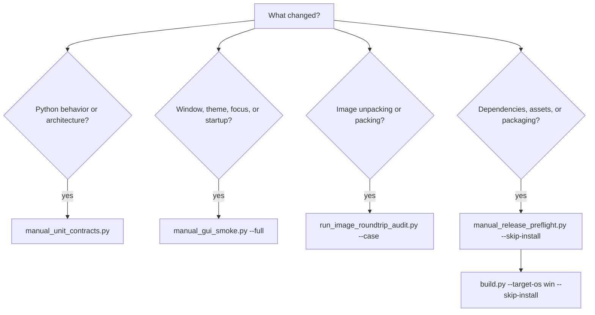

# Tests and scripts

All project checks are run manually. GitHub Actions installs runtime dependencies, builds the application, and publishes archives. It does not run Pytest, Ruff, Mypy, Architecture Guard, smoke scenarios, audits, or release preflight.

All maintenance Python files live under the root `scripts` directory. The `src` tree contains only modules used by the running application.



## Preparing the environment

Install runtime dependencies separately.

```bash
python -m pip install -r requirements.txt
```

Development quality tools are listed in `requirements-quality.txt`.

```bash
python -m pip install -r requirements-quality.txt
```

On Windows, you can double-click:

```text
scripts/install_quality_tools.cmd
```

This installs Pytest, Ruff, and Mypy. It is not part of the application build.

## What Pytest does

Pytest runs automated behavior checks. It discovers `test_*.py` files, executes `test_*` functions, and reports which behavior failed.

Configuration lives in:

```text
scripts/config/pytest.ini
```

Run the complete test tree manually with:

```bash
python -m pytest -q --rootdir=. -c scripts/config/pytest.ini tests
```

Run one test module with:

```bash
python tests/unit/core/test_byte_size.py
```

Run one test function with:

```bash
python -m pytest tests/unit/core/test_byte_size.py::test_name -vv --rootdir=. -c scripts/config/pytest.ini
```

Every `test_*.py` module in this repository supports direct execution. The module locates the repository root and hands control to Pytest.

## Testing the production code

Contract, integration, smoke, end-to-end, and audit scenarios import the current production modules from `src` and construct valid files or records in temporary directories. They must not install replacement packages through `sys.modules`, import hidden test implementations from scripts, or claim success from placeholder image and archive bytes.

When a test reaches an unavoidable external boundary—such as a bundled executable, native desktop dialog, or remote service—it may record the call or provide a local service at that boundary. Everything inside the application—the controller, service, parser, serializer, project layout, and data model—must still be the production implementation. `scripts/quality/check_test_integrity.py` enforces the structural part of this rule.

## What Ruff does

Ruff checks Python syntax and style. In this project it detects import errors, undefined names, invalid constructs, and the core `E` and `F` rule sets.

Configuration lives in:

```text
ruff.toml
```

Run it from a terminal with:

```bash
python -m ruff check . --config ruff.toml
```

On Windows, double-click:

```text
scripts/run_ruff.cmd
```

This command only reports problems; it does not rewrite code.

## What Mypy does

Mypy verifies that type annotations agree with actual values and calls. MIO Kitchen applies it to selected architectural boundaries where a type mismatch could break communication among UI, application, logic, platform, Plugin Store, and Tk callbacks. It is deliberately not applied to every legacy module.

Configuration lives in:

```text
scripts/config/mypy-typed-boundaries.ini
```

The checked module list lives in:

```text
scripts/quality/check_typed_boundaries.py
```

The `python_version = 3.12` setting defines the release compatibility baseline used during analysis; it does not require Python 3.12 to be installed locally. The same check runs under any supported Python 3 interpreter, including Python 3.13.

Run it from a terminal with:

```bash
python scripts/quality/check_typed_boundaries.py
```

On Windows, double-click:

```text
scripts/run_mypy.cmd
```

See [Typed boundaries](../architecture/typed_boundaries.md) for the detailed rules.

## Main test groups

| Directory | What it covers | When to run it |
|---|---|---|
| `tests/unit` | Individual functions, models, and small classes | After changing a specific function or algorithm |
| `tests/functional` | A complete application feature | After changing one feature or window |
| `tests/integration` | Several components working together | After changing links among layers or services |
| `tests/contract` | Public interfaces, data formats, and repository agreements | After changing signatures, configuration, or repository structure |
| `tests/regression` | Defects that have already been fixed | After a similar fix or a change to related code |
| `tests/architecture` | Import direction, file placement, protocol budget, and exception rules | After moving modules or changing architecture |
| `tests/smoke` | Fast startup, window, and runtime scenarios | After UI, startup, or build changes |
| `tests/e2e` | Complete user flows | Before a release and after large changes |
| `tests/release` | Archive contents, reproducibility, and packaging rules | After build, resource, or release-script changes |
| `tests/external` | External libraries, bundled binaries, and platform capabilities | On a system with the required external tools |
| `tests/embedded` | Environment checks kept outside runtime code | After dependency or environment setup changes |
| `tests/support` | Shared test infrastructure | Normally not launched by itself |

To see the exact tests Pytest will execute without running them:

```bash
python -m pytest --collect-only -q --rootdir=. -c scripts/config/pytest.ini tests
```

## Complete command reference

All commands below are run from the repository root. `--dry-run` is available on the manual orchestration scripts and prints their subprocesses without starting them.

### Manual orchestration

| Command | What it runs | When to use it |
|---|---|---|
| `python scripts/manual/manual_unit_contracts.py` | Integrity guard, full Pytest, direct-execution check, Mypy, Ruff, and Architecture Guard | Normal non-GUI validation after a code or architecture change |
| `python scripts/manual/manual_unit_contracts.py --dry-run` | Prints that suite without executing it | Check the suite definition or diagnose command resolution |
| `python scripts/manual/manual_gui_smoke.py` | Checks required GUI dependencies, then runs the core real-window, theme, runtime, lifecycle, and end-to-end scenarios | Fast desktop validation after UI work |
| `python scripts/manual/manual_gui_smoke.py --full` | Runs the full registered runtime suite, including metric collection | Before release or after startup/window/runtime changes |
| `python scripts/manual/manual_gui_smoke.py --dry-run` | Prints the selected GUI commands | Review the configured GUI suite without opening windows |
| `python scripts/manual/runtime_smoke_suite.py` | Preflight checks followed by every registered real runtime smoke scenario in isolated processes | Run or troubleshoot the full GUI/runtime suite directly |
| `python scripts/manual/runtime_smoke_suite.py --dry-run` | Validates and prints the full scenario list | Confirm that no scenario or referenced file is stale |
| `python scripts/manual/manual_release_preflight.py --skip-install` | Required assets, Python dependencies, localization policy, tests, and release prerequisites in an already prepared environment | Immediately before a local build |
| `python scripts/manual/manual_release_preflight.py` | System prerequisites and package installation followed by the same release checks | Prepare a clean build machine |
| `python scripts/manual/manual_release_preflight.py --dry-run` | Prints the preflight steps | Inspect what the release gate will execute |

### Standalone runtime scenarios

These files are scripts rather than Pytest modules because each one launches and cleans up its own Tk/runtime process.

| Script | Real behavior it verifies |
|---|---|
| `tests/smoke/targeted.py` | Runs the current targeted controller/contract selection through Pytest |
| `tests/smoke/welcome.py` | Builds the real welcome wizard, navigates it, applies appearance, and reveals it |
| `tests/smoke/ui.py` | Composes the real main window and checks layout, startup messages, transparency, and window behavior |
| `tests/smoke/settings_ui.py` | Uses the real settings/runtime/localization state and technical choices |
| `tests/smoke/theme_cycle.py` | Exercises `dark → light → dark`, first-paint behavior, wizard persistence, and geometry stability |
| `tests/smoke/windows.py` | Opens the primary application windows through their production composition functions |
| `tests/smoke/window_catalog.py` | Opens the remaining dialogs and `Toplevel` classes with valid production models |
| `tests/smoke/byte_calculator.py` | Opens and drives the composed byte calculator |
| `tests/smoke/toolbox_click.py` | Invokes every Toolbox action through real button bindings and validates the resulting dialog/window path |
| `tests/smoke/runtime.py` | Creates runtime-owned debugger and plugin-manager surfaces |
| `tests/smoke/scenario.py` | Creates a real project workspace and performs current sparse-image operations |
| `tests/smoke/operational.py` | Exercises Plugin Store operations through the production repository/service boundary and a local HTTP repository |
| `tests/e2e/main_flow.py` | Creates a project, splits a real raw image, and packages the current project through the application flow |
| `tests/smoke/lifecycle.py` | Verifies project, settings, Plugin Store, event, and download lifecycle cleanup |
| `tests/smoke/deep_happy_path.py` | Executes real AVB/fstab, JSON, hybrid-pack, and post-install happy paths |
| `scripts/quality/collect_metric_observations.py` | Starts the application, opens workspace, plugin manager, and Plugin Store, then records production metrics |
| `scripts/quality/check_metric_observations.py` | Reads the collected metric file and compares all required labels with production baselines |

## Main manual suites

### Complete code and test check

```bash
python scripts/manual/manual_unit_contracts.py
```

This suite runs, in order:

1. Test-integrity validation.
2. The complete `tests` tree in one isolated Pytest process.
3. Direct-execution structure checks for tests and scripts.
4. Mypy for the typed boundaries.
5. Ruff for the whole repository.
6. Architecture Guard.

On Windows, double-click:

```text
scripts/run_all_checks.cmd
```

### GUI checks

Run the short suite with:

```bash
python scripts/manual/manual_gui_smoke.py
```

Run all window and runtime scenarios with:

```bash
python scripts/manual/manual_gui_smoke.py --full
```

On Windows, double-click:

```text
scripts/run_gui_checks.cmd
```

GUI checks open real windows. Run them on a normal desktop rather than a remote session without a graphical environment.

`tests/smoke/windows.py` covers the primary windows opened through application composition. `tests/smoke/window_catalog.py` covers the remaining `Toplevel` classes, modal warnings, project system dialogs, plugin configuration, and parameter editors. The architecture check `tests/architecture/test_window_smoke_inventory.py` prevents a new window class from being added without including it in one of these smoke scenarios.

### Release readiness

If runtime dependencies are already installed, run:

```bash
python scripts/manual/manual_release_preflight.py --skip-install
```

To include system-dependency checks and Python package installation, run:

```bash
python scripts/manual/manual_release_preflight.py
```

On a prepared Windows machine, double-click:

```text
scripts/run_release_checks.cmd
```

## Architecture Guard

Architecture Guard checks dependency direction, forbidden imports, file placement, startup boundaries, and other structural rules.

Full check:

```bash
python scripts/arch_guard/main.py
```

Quick check without startup compilation and import smoke:

```bash
python scripts/arch_guard/main.py --quick
```

Check one section:

```bash
python scripts/arch_guard/main.py --section layers
```

List the available section names with:

```bash
python scripts/arch_guard/main.py --help
```

On Windows, double-click:

```text
scripts/run_architecture_check.cmd
```

## Quality scripts

| Command | Purpose | Run it when |
|---|---|---|
| `python scripts/quality/check_direct_execution.py` | Verifies that every test and standalone maintenance file has a working direct entry point | Adding, moving, or renaming tests/scripts |
| `python scripts/quality/check_direct_execution.py --verify-samples` | Also launches representative files from outside the repository | Changing path/bootstrap logic |
| `python scripts/quality/check_localization_keys.py` | Compares used keys with language JSON and validates required values | Changing UI text or a language file |
| `python scripts/quality/check_localization_keys.py --strict` | Rejects every missing reference key and invalid translation value | Before declaring localization complete |
| `python scripts/quality/check_metric_baselines.py` | Verifies the required labels in `src.app.metrics_baseline` | Changing startup/performance instrumentation |
| `python scripts/quality/collect_metric_observations.py` | Collects metrics through real startup and real composed windows | Producing a local performance observation file |
| `python scripts/quality/check_metric_observations.py` | Validates the file named by `MIO_METRIC_OBSERVATIONS_FILE` against current baselines | After metric collection |
| `python scripts/quality/check_required_assets.py` | Verifies application assets and runtime resources required by source/build paths | Changing resources or packaging |
| `python scripts/quality/check_required_dependencies.py` | Checks required and optional Python packages by category | Preparing a build or diagnosing imports |
| `python scripts/quality/check_required_dependencies.py --smoke-only` | Checks only required runtime/UI packages | Before GUI smoke |
| `python scripts/quality/check_required_dependencies.py --json` | Emits a machine-readable dependency report | CI integration or diagnostics |
| `python scripts/quality/check_runtime_contracts.py` | Compares runtime protocols with their actual production implementations | Changing runtime contexts or adapters |
| `python scripts/quality/check_system_dependencies.py` | Checks known OS-level build prerequisites | Preparing a clean machine |
| `python scripts/quality/check_system_dependencies.py --allow-missing` | Reports missing OS prerequisites without failing | Diagnostic inventory only |
| `python scripts/quality/check_test_integrity.py` | Rejects package replacement, placeholder smoke data, script-to-test imports, and stale literal paths | After any test/script change |
| `python scripts/quality/check_typed_boundaries.py` | Runs Mypy against the selected production architecture boundaries | Changing a typed interface or callback |

The contract `tests/contract/localization/test_technical_choice_localization.py` separately checks localized technical labels, exact format names, short Super group labels, the absence of reverse mapping from translated text to internal values, and localized size units.

Check the structure of files that must support direct execution with:

```bash
python scripts/quality/check_direct_execution.py
```

Also launch representative files from an external working directory with:

```bash
python scripts/quality/check_direct_execution.py --verify-samples
```

Every standalone script provides help:

```bash
python scripts/quality/check_localization_keys.py --help
```

## Audit scripts

| Command | Purpose | Run it when |
|---|---|---|
| `python scripts/audits/audit_ui_controls.py` | Reads the current UI source, prints a JSON inventory, and fails for unconnected controls | Adding or rewiring buttons, checkboxes, or radio buttons |
| `python scripts/audits/run_image_roundtrip_audit.py` | Creates valid case data and drives current unpack/repack/read paths for Ext4, EROFS, F2FS, sparse, DAT, BR, XZ, ZSTD, boot, vendor_boot, and Super | Changing an image workflow or bundled image tool |
| `python scripts/audits/run_image_roundtrip_audit.py --case boot --case vendor_boot` | Runs only the named cases; `--case` may be repeated | Isolating a failure or validating a focused change |
| `python scripts/audits/run_legacy_migration_audit.py --output audit/migration.json` | Writes JSON results for Imgkit assets, F2FS, GPT, splash, and split-Super real round trips | Checking the remaining low-level migration-sensitive paths |

Audits are not required after every change. Run them when working on the area they inspect.

Run every image case, or isolate one or more named cases with repeated `--case` arguments:

```bash
python scripts/audits/run_image_roundtrip_audit.py
python scripts/audits/run_image_roundtrip_audit.py --case boot --case vendor_boot
```

## Build and release scripts

| Command | Purpose | Run it when |
|---|---|---|
| `python build.py --target-os win --skip-install` | Builds the Windows x64 `tool.exe`, assembles `dist`, validates the release tree, and creates `MIO-KITCHEN-win.x64.zip` | Creating a Windows build from an already prepared environment |
| `python build.py --target-os win` | Installs dependencies first, then performs the same build | Preparing and building in one step |
| `python scripts/release/build_release_archive.py --root dist --output mio_kitchen_runtime.zip` | Packages an existing runtime tree, excludes repository-only content, and embeds `release_manifest.json` | Creating a separately named archive from `dist` |
| `python scripts/release/build_release_archive.py --root dist --output mio_kitchen_runtime.zip --skip-checks` | Packages without repeating its preflight | Only after the same checks passed in separate processes |
| `python scripts/release/build_release_archive.py --root dist --output mio_kitchen_runtime.zip --no-manifest` | Omits the manifest | Compatibility work that explicitly requires a manifest-free archive |
| `python scripts/release/release_archive.py --output mio_kitchen_runtime.zip` | Runs archive creation as an isolated release workflow | Validating release orchestration or CI behavior |
| `python scripts/release/release_archive.py --dry-run --output mio_kitchen_runtime.zip` | Prints the packaging command | Inspecting release command composition |

`scripts/release/release_manifest.py` is an imported support module used by `build_release_archive.py`, not an independent archive CLI. It creates the names, sizes, SHA-256 hashes, environment, dependency inventory, and localization section embedded in the manifest.

Build the application into `dist` first. Then, if a second archive name is needed, create it with:

```bash
python scripts/release/build_release_archive.py --root dist --output mio_kitchen_runtime.zip
```

Use `--skip-checks` only when the same checks have already completed successfully in separate processes.

## Support scripts

`scripts/support/command_runner.py` owns subprocess steps, cross-platform output decoding, and Xvfb wrapping. `scripts/support/direct_execution.py` owns direct-file entry-point checks. They are imported helpers and normally are not run by hand.

The exception is:

```bash
python scripts/support/clean_workspace_artifacts.py
```

It removes Python, Pytest, Mypy, and Ruff caches only. It does not clear the runtime `logs` or `temp` directories.

Preview the cleanup safely with:

```bash
python scripts/support/clean_workspace_artifacts.py --dry-run
```

## Windows launchers

These wrappers are Windows-only. They use `python` from `PATH`, falling back to any installed Python 3 through `py -3`; no minor version is pinned.

On Linux and macOS, run the Python entry point named in the table directly with `python3` or `python`. This executes the same script and the same check, not a separate implementation.

| Launcher | Exact action | When to use it |
|---|---|---|
| `scripts/install_quality_tools.cmd` | Installs `requirements-quality.txt` | Once per local quality environment |
| `scripts/run_all_checks.cmd` | Runs `manual_unit_contracts.py` | Normal complete non-GUI validation |
| `scripts/run_gui_checks.cmd` | Runs `manual_gui_smoke.py --full` | Complete desktop smoke validation |
| `scripts/run_architecture_check.cmd` | Runs full Architecture Guard | Architecture/import changes |
| `scripts/run_mypy.cmd` | Runs `check_typed_boundaries.py` | Typed-boundary changes |
| `scripts/run_ruff.cmd` | Runs Ruff without rewriting files | Any Python change |
| `scripts/run_release_checks.cmd` | Runs release preflight with `--skip-install` | Immediately before building on a prepared Windows machine |

## What to run after a change

| Change | Minimum validation |
|---|---|
| Ordinary Python change | `scripts/run_all_checks.cmd` or `manual_unit_contracts.py` |
| New window, focus behavior, theme, or setup-wizard pages | The full GUI smoke suite, including `tests/smoke/theme_cycle.py`, which checks `dark → light → dark`, a stable log panel, one persistent wizard container, preserved size after movement, and no redundant repaint on `Map` or `FocusIn` |
| Architecture or import change | Architecture Guard, Mypy, and full Pytest |
| Localization change | `check_localization_keys.py` and full Pytest |
| Build or resource change | Release preflight and release tests |
| Image unpacking or packing change | The relevant functional tests and image round-trip audit |
| Plugin change | Mypy, Plugin Store tests, and full Pytest |

## Exit codes

Exit code `0` means success.

Any other code means a failure, a missing dependency, or a violated rule. The `.cmd` launchers keep the console window open so the final message remains readable.

## Contents of the user build

`docs`, `tests`, and `scripts` belong to the source repository only. They are not shipped in the user archive. Release tests enforce this rule separately.
