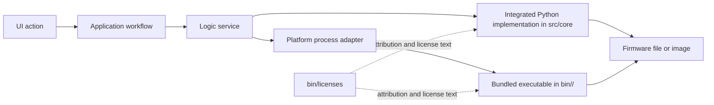

# Integrated and bundled components

This page records third-party work that is still present in the current source tree or bundled tool set. It is an attribution and maintenance guide, not a promise that every operation is available on every platform. For exact platform coverage, see the [capability matrix](../architecture/architecture_map_english.md#22-modes-and-feature-availability) and the [bundled binary inventory](../architecture/architecture_map_english.md#23-complete-bundled-binary-matrix).

## How the pieces fit together

The workflow layers decide when an operation runs. `src/core` understands binary formats. `src/platform` resolves and launches platform tools. UI code does not invoke these executables directly.

## Integrated Python implementations

| Component or upstream work | Current code | Current responsibility | Upstream or attribution |
|---|---|---|---|
| Spreadtrum PAC unpacker | [`src/core/unpac.py`](../../../src/core/unpac.py) | Reads PAC structures and extracts contained files | [spreadtrum_flash](https://github.com/ilyakurdyukov/spreadtrum_flash); Python rewrite credited to affggh in the module |
| FsPatcher | [`src/core/fspatch.py`](../../../src/core/fspatch.py) | Adds missing `fs_config` entries for a directory tree | [fspatch](https://github.com/affggh/fspatch); bundled notice in [`bin/licenses/fspatch.txt`](../../../bin/licenses/fspatch.txt) |
| Context patcher | [`src/core/contextpatch.py`](../../../src/core/contextpatch.py) | Learns and adds missing SELinux file-context entries | [context_patch](https://github.com/ColdWindScholar/context_patch) |
| MTK old-device port helpers | [`src/core/mtk_port`](../../../src/core/mtk_port/) and [`src/core/extra.py`](../../../src/core/extra.py) | Rebuilds boot images and prepares legacy-compatible filesystem metadata | [mtk-garbage-porttool](https://github.com/ColdWindScholar/mtk-garbage-porttool), credited in `extra.py` |
| Logical-partition unpacker | [`src/core/lpunpack.py`](../../../src/core/lpunpack.py) | Reads raw or sparse Android Super metadata and extracts logical partitions | [lpunpack](https://github.com/unix3dgforce/lpunpack) |
| CPIO implementation | [`src/core/cpio.py`](../../../src/core/cpio.py) | Reads and rebuilds ramdisk CPIO archives | [cpio_py](https://github.com/ColdWindScholar/cpio_py); bundled license in [`bin/licenses/cpio.txt`](../../../bin/licenses/cpio.txt) |
| Android OTA block conversion | [`src/core/ota_dat.py`](../../../src/core/ota_dat.py) | Converts transfer-list data to images and images to OTA data sets | [sdat2img](https://github.com/xpirt/sdat2img), [img2sdat](https://github.com/xpirt/img2sdat), and their notices in [`bin/licenses`](../../../bin/licenses/) |
| LG KDZ/DZ tools | [`src/core/kdz.py`](../../../src/core/kdz.py), [`src/core/unkdz.py`](../../../src/core/unkdz.py), [`src/core/mkkdz.py`](../../../src/core/mkkdz.py), [`src/core/mkdz.py`](../../../src/core/mkdz.py) | Parses, extracts, and rebuilds LG KDZ/DZ containers | [kdztools](https://github.com/ehem/kdztools); authorship and GPL text are retained in the modules and [`bin/licenses/KdzExtractor.txt`](../../../bin/licenses/KdzExtractor.txt) |
| Oppo package decryptors | [`src/core/ozipdecrypt.py`](../../../src/core/ozipdecrypt.py), [`src/core/ofp_mtk_decrypt.py`](../../../src/core/ofp_mtk_decrypt.py), [`src/core/ofp_qc_decrypt.py`](../../../src/core/ofp_qc_decrypt.py) | Decrypts supported OZIP and OFP package variants | [oppo_decrypt](https://github.com/bkerler/oppo_decrypt); B. Kerler attribution is retained in each module |
| Huawei UPDATE.APP extractor | [`src/core/splituapp.py`](../../../src/core/splituapp.py) | Locates and extracts images from UPDATE.APP | [splituapp](https://github.com/superr/splituapp); SuperR attribution is retained in the module |
| ROMFS parser | [`src/core/romfs_parse.py`](../../../src/core/romfs_parse.py) | Parses and extracts ROMFS images | [ROMFS_PARSER](https://github.com/ddddhm1234/ROMFS_PARSER), credited in the module |
| Payload extractor | [`src/core/payload_extract.py`](../../../src/core/payload_extract.py) and [`src/core/payload_manifest.py`](../../../src/core/payload_manifest.py) | Parses OTA payload metadata and reconstructs selected partitions | payload_dumper by vm03 is credited in [`bin/licenses/other.txt`](../../../bin/licenses/other.txt) |
| DTBO tooling | [`src/core/mkdtboimg.py`](../../../src/core/mkdtboimg.py) and [`src/logic/projects/dtbo/service.py`](../../../src/logic/projects/dtbo/service.py) | Reads, extracts, and rebuilds DTBO tables | Android [`libufdt`](https://android.googlesource.com/platform/system/libufdt/) lineage |

## Bundled executable families

The exact filenames vary by operating system and processor architecture. These families are present under [`bin`](../../../bin/) and are resolved through the runtime platform path service.

| Tool family | Used for | Local evidence |
|---|---|---|
| Android filesystem tools: `mke2fs`, `e2fsdroid`, `make_ext4fs`, `img2simg`, `simg2img` | Ext4 image creation and Android sparse conversion | [`bin/licenses/android-tools.txt`](../../../bin/licenses/android-tools.txt), [`bin/licenses/e2fsprogs.txt`](../../../bin/licenses/e2fsprogs.txt) |
| EROFS tools: `mkfs.erofs`, `extract.erofs` | EROFS image creation and extraction | [`bin/licenses/erofs-utils.txt`](../../../bin/licenses/erofs-utils.txt) |
| F2FS tools: `mkfs.f2fs`, `sload.f2fs`, `extract.f2fs` where available | F2FS creation, population, and extraction | [`bin/licenses/f2fs-tools.txt`](../../../bin/licenses/f2fs-tools.txt) |
| `lpmake` | Android logical-partition/Super image creation | [`bin/licenses/android-tools.txt`](../../../bin/licenses/android-tools.txt) |
| `magiskboot` | Boot-family unpacking and repacking | [`bin/licenses/Magisk.txt`](../../../bin/licenses/Magisk.txt) |
| `brotli` and `zstd` | Compressed OTA data and Zstandard streams | [`bin/licenses/brotli.txt`](../../../bin/licenses/brotli.txt) and the platform directories under [`bin`](../../../bin/) |
| `busybox` | External shell entry points of installed plugins and portable command support | [`bin/licenses/busybox-w32.txt`](../../../bin/licenses/busybox-w32.txt) |
| `dtc` | Device-tree compilation and decompilation | [`bin/licenses/dtc.txt`](../../../bin/licenses/dtc.txt) |
| `cpio` | External CPIO operations on platforms that bundle it | [`bin/licenses/cpio.txt`](../../../bin/licenses/cpio.txt) |
| `imgkit` | Filesystem extraction used by image round-trip audits and runtime workflows | Platform directories under [`bin`](../../../bin/) |

## Maintenance rules

- Do not infer platform support from a project name or an old README. Check the actual platform directory under `bin` and the architecture map.
- Keep third-party notices under `bin/licenses` in release builds.
- When replacing a bundled executable, update its notice, the platform inventory, and the relevant real-image audit together.
- A bundled tool returning exit code `0` is not enough for a round-trip test: the audit must read the produced image and verify the restored contents.
