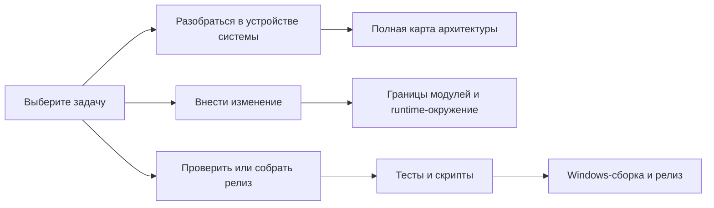

# Документация MIO Kitchen

Это дерево описывает текущее Python-приложение на русском языке. Источником истины является production-код в `src`; проверки документации сверяют структуру, ссылки, команды и выбранные архитектурные утверждения с репозиторием.

## Архитектура

| Документ | Для чего нужен |
|---|---|
| [Обзор архитектуры](architecture/architecture_overview.md) | Слои `ui`, `app`, `logic`, `core`, `platform` и направление зависимостей |
| [Текущее состояние архитектуры](architecture/architecture_status.md) | Действующие ограничения и известные ограничения без истории рефакторинга |
| [Полная карта архитектуры](architecture/architecture_map_russian.md) | Подробные диаграммы модулей, запуска, runtime-данных, импорта, распаковки, упаковки, плагинов, форматов и влияния изменений |
| [Границы модулей](architecture/module_boundaries.md) | Канонические импорты и ответственность основных модулей |
| [Runtime-состояние](architecture/runtime_state.md) | Создание runtime session и четыре типизированные фазы |
| [Типизированные границы](architecture/typed_boundaries.md) | Где применяются Protocol и что проверяет строгий профиль Mypy |

## Разработка

| Документ | Для чего нужен |
|---|---|
| [Структура репозитория](development/repository_structure.md) | Владение каталогами и правила размещения файлов |
| [Тесты и скрипты](development/tests_and_scripts.md) | Виды тестов, правила проверки реального кода, Ruff, Mypy, Architecture Guard, команды и Windows launchers |
| [Runtime-окружение](development/runtime_environment.md) | Зависимости, runtime-каталоги и подготовка окружения |
| [Логи и диагностика](development/logging_and_diagnostics.md) | Расположение журналов, записываемые события и данные для отчёта об ошибке |
| [Локализация текста интерфейса](development/localization_and_ui_text.md) | Разделение технических значений и пользовательских подписей |
| [Разработка плагинов](development/plugin_development.md) | Структура установленного плагина, границы выполнения и формат MPK |
| [Интегрированные и встроенные компоненты](development/third_party_components.md) | Текущий сторонний код, встроенные утилиты, авторство и правила сопровождения |

## Сохранённые материалы

[Исторические аудиты](../archive/audits/README.md) и [прежние переводы README](../archive/readmes/) сохранены в `docs/archive`. Они помогают восстановить причины прежних решений, но не определяют текущую архитектуру; для текущего поведения нужно использовать код и активные документы выше.

[English version](../en/README.md)
