# Полная карта архитектуры MIO Kitchen

Источник истины: текущий код, каталоги runtime, реестры форматов, наборы бинарников и автоматические архитектурные проверки этого репозитория.

## 1. Краткий паспорт

| Область | Фактическое состояние |
|---|---|
| Приложение | Настольный Tkinter интерфейс для работы с Android ROM и образами разделов |
| Точка входа | `tool.py`, затем `src/app/entrypoint.py`, затем `src/app/bootstrap.py` |
| Основные слои | `ui`, `app`, `logic`, `core`, `platform` |
| Рабочий каталог проекта | `<settings.path>/Projects/<project>/input`, `unpack`, `output` |
| Активные файловые системы распаковки | EXT, EROFS, F2FS, ROMFS |
| Активные файловые системы упаковки | EXT4, EROFS, F2FS |
| Форматы результата раздела в окне упаковки | `raw`, `sparse`, `new.dat`, `new.dat.br` |
| Контейнеры и специальные образы | payload, super, UPDATE.APP, boot, vendor_boot, dtbo, vbmeta, logo, splash, GPT, RKFW, RKAF, Amlogic |
| Локализация | 15 динамически обнаруживаемых JSON файлов, English служит эталоном |
| Плагины | MPK пакеты, Python плагины, shell плагины, виртуальные плагины, Plugin Store |
| Runtime ресурсы и данные | `bin`, `config`, `languages`, `plugins`, `temp`, `logs`, `templates`, а также `Projects` внутри `settings.path` |
| Текущий режим репозитория | Basic, поскольку пакет `src/pro` отсутствует |
| Упаковка Payload | Недоступна на всех платформах, генератор не зарегистрирован |

## 2. Контекст системы

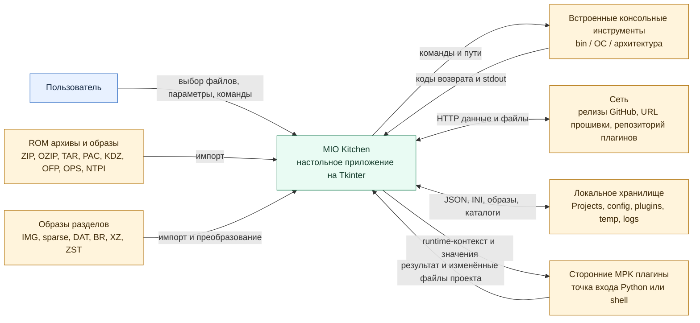

## 3. Слои и направление зависимостей

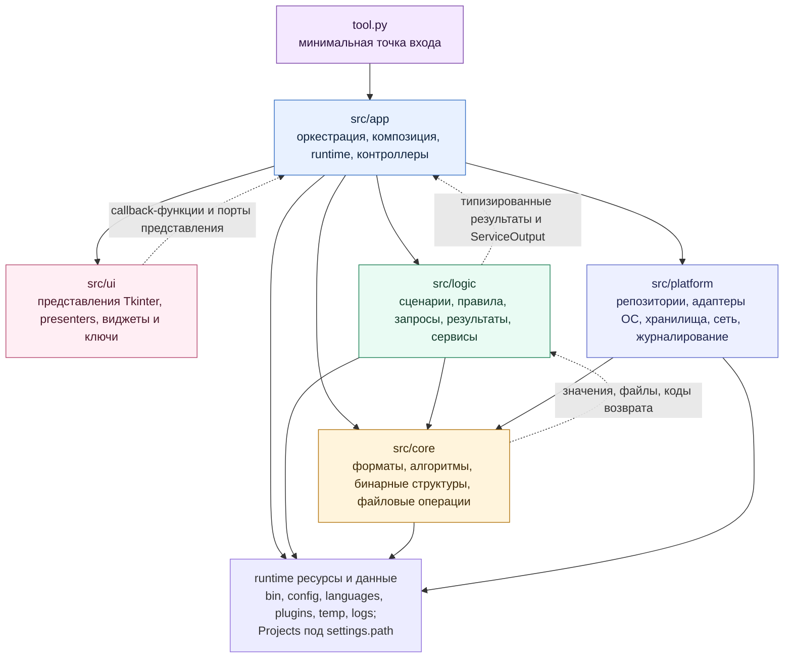

Статическое правило импортов закреплено в `scripts/arch_guard`.

| Слой | Может импортировать |
|---|---|
| `src/core` | Только `src/core` |
| `src/logic` | `src/logic`, `src/core` |
| `src/platform` | `src/platform`, `src/core` |
| `src/ui` | Только `src/ui` |
| `src/app` | Все пять слоёв, поскольку это корень композиции |

Фактическая роль `platform` уже, чем полный системный ввод и вывод. Значительная часть операций над файлами проекта и запуск внешних упаковщиков всё ещё находится в `logic` и `core`. Архитектурная карта отражает именно текущее состояние.

## 4. Запуск и runtime-сессия

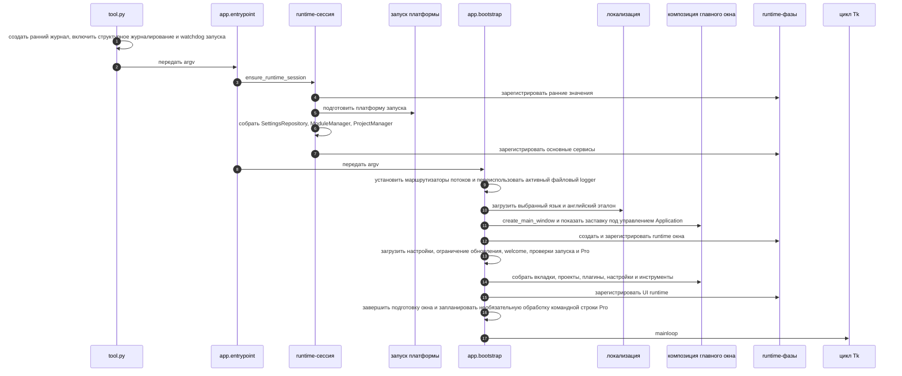

### Четыре фазы runtime

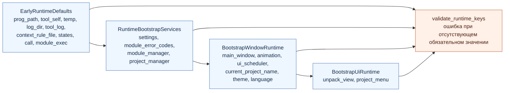

### Основные функции запуска

| Модуль | Ключевые функции | Получает | Возвращает или изменяет |
|---|---|---|---|
| `tool.py` | `init` | `sys.argv` | Передаёт управление приложению |
| `app.entrypoint` | `init`, `restart` | Аргументы процесса | Гарантирует одну runtime-сессию |
| `app.runtime.session` | `ensure_runtime_session`, `sync_runtime_globals` | Нет или частичные runtime-значения | `RuntimeSession` и зарегистрированные наборы |
| `app.runtime.service_bootstrap` | `build_runtime_bootstrap_services` | Пути runtime | Settings, ModuleManager, ProjectManager |
| `platform.startup` | `prepare_startup_platform`, `prepare_tool_binaries` | Активная ОС и `tool_bin` | Поддержка frozen-сборки Windows, права выполнения POSIX |
| `app.bootstrap` | `init`, `_init_tk`, `init_verify`, `restart` | Runtime-сервисы и argv | Главное окно и цикл событий Tk |
| `app.composition.main_window` | `create_main_window`, `compose_main_window` | Runtime-порты и каталог локализации | Полностью связанный UI |

## 5. UI и composition

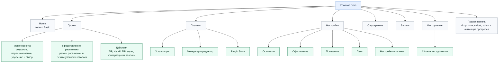

UI создаёт только объекты Tk, состояние представления и callback-функции. `src/app/composition` создаёт контроллеры и сервисы, связывает представления с `logic`, передаёт планировщик, уведомления, файловые диалоги, runtime-контексты и функции платформы.

Все рабочие дочерние окна создаются через `src/ui/common/windowing.py`. Общий `Toplevel` определяет владельца и устанавливает нативную связь `transient`, пока окно ещё скрыто. Затем полностью построенное окно показывается через тот же конвейер первого кадра, который используют стартовая заставка и главное корневое окно. Нативные файловые диалоги получают активного владельца через `parent`.

### Конвейер показа первого кадра

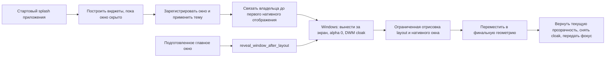

`window_paint.py` обрабатывает только layout и нативные оконные события, поэтому посторонние callback-функции таймеров и файлов остаются в очереди обычного главного цикла. `window_appearance.py` поддерживает единую тему и прозрачность всех зарегистрированных окон. `startup_splash.py` закрывает заставку и передаёт подготовленное главное окно в `window_reveal.py`; благодаря этому между заставкой и приложением не публикуется белая клиентская область без темы.

## 6. Потоки фоновых задач и сообщений

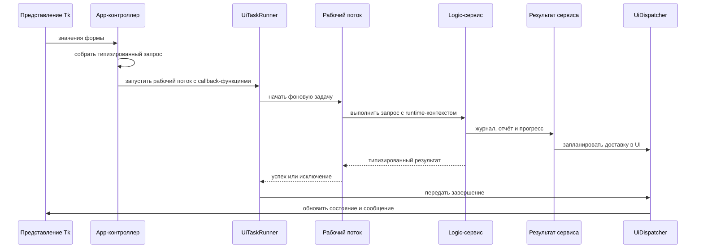

| Компонент | Роль |
|---|---|
| `app.background_jobs.start_background_job` | Создаёт рабочий поток под управлением application-слоя |
| `app.ui_tasks.UiTaskRunner` | Сохраняет тип результата, доставляет callback-функции успеха и ошибки |
| `app.ui_scheduler.AppUiScheduler` | Управляет Tk `after` и `after_cancel` |
| `app.ui_feedback.UiDispatcher` | Переносит callback-функцию в поток UI |
| `app.ui_feedback.UiNotifier` | Показывает сообщения через явный порт представления |
| `logic.common.service_output.ServiceOutput` | Нейтральный канал журнала, отчёта и прогресса |
| `app.std_streams.StreamRouter` | Разветвляет stdout и stderr в отладчик, панель журнала и исходный поток |

## 7. Структура проекта и владение данными

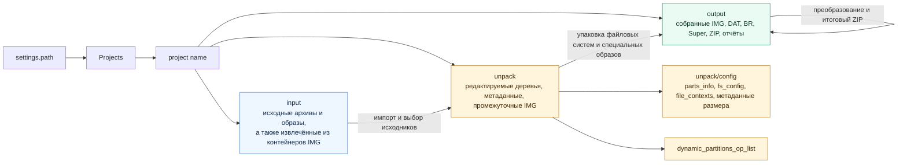

`ProjectManager` всегда создаёт три каталога. `current_input_path` — канонический способ доступа к исходникам проекта; каждый сценарий импорта и распаковки получает этот путь явно.

## 8. Полный поток импорта

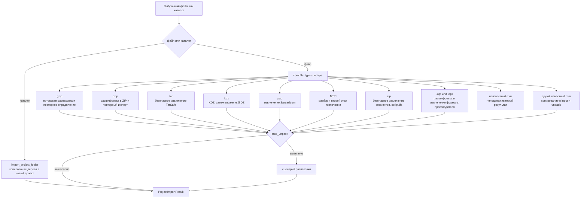

### Импортируемые контейнеры

| Тип | Определение | Действие | Результат |
|---|---|---|---|
| ZIP | Сигнатура `PK` | Безопасное извлечение элементов, `script2fs` | Файлы в `unpack` |
| OZIP | Сигнатура `OPPOENCRYPT!` | Расшифровка в ZIP | Повторный импорт ZIP |
| TAR и TAR.MD5 | `tarfile.is_tarfile` | `TarSafe.extractall` | Файлы в `unpack` |
| GZIP и TAR.GZ | Сигнатура GZIP | Потоковая распаковка | Повторное определение вложенного типа |
| KDZ и DZ | Сигнатуры KDZ и DZ | Извлечение контейнеров LG | Разделы и файлы в `unpack` |
| OFP | Расширение `.ofp` | Расшифровка MTK или Qualcomm | Файлы и метаданные `script2fs` |
| OPS | Расширение `.ops` | Расшифровка `opscrypto` | Файлы в `unpack` |
| PAC | Сигнатура со смещением 2116 | Распаковщик Spreadtrum | Образы, затем необязательная автоматическая распаковка |
| NTPI | Сигнатура `NTPI` | Парсер и второй этап извлечения | Извлечённые файлы |
| Известный одиночный образ | `gettype` не равен `unknown` | Сохранение в `input`, копия в `unpack` | Необязательная автоматическая распаковка |

Значение `7z` предусмотрено детектором через текущую проверку буквального заголовка `b"7z"`, но отдельного обработчика импорта 7z нет. Стандартная сигнатура 7z этим условием не покрывается, поэтому полноценная поддержка обычных архивов 7z в текущем сценарии не заявляется.

## 9. Полный поток распаковки

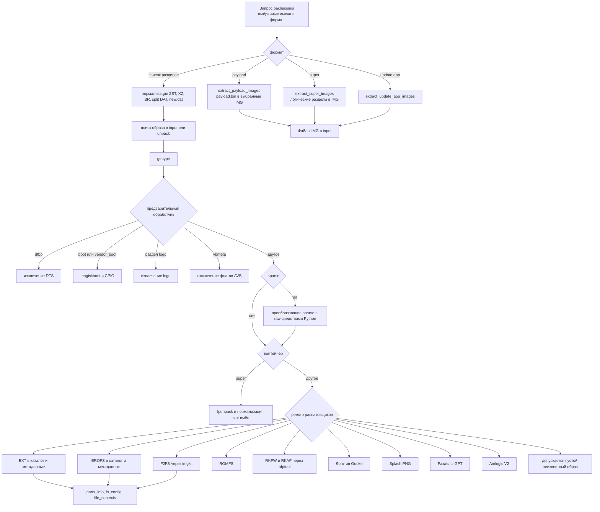

### Зарегистрированные режимы окна распаковки

`new.dat.br`, `new.dat`, `new.dat.xz`, `img`, `sparse`, `payload`, `super`, `update.app`, `zst`.

### Типы, которые реально извлекает текущий сценарий

| Группа | Типы | Реализация | Выходные данные |
|---|---|---|---|
| Файловые системы | EXT, EROFS, F2FS, ROMFS | Парсер EXT на Python, `extract.erofs`, `imgkit`, парсер ROMFS | Каталог раздела, метаданные для повторной упаковки |
| Семейство Android boot | boot, vendor_boot | `magiskboot`, `cpio`, необязательный парсер ресурсов RK | Каталог компонентов и ramdisk |
| Дерево устройств | dtbo | Парсер DTBO на Python и `dtc` | Файлы DTS |
| Динамические разделы | super, sparse super | `lpunpack`, sparse-reader на Python | IMG логических разделов |
| OTA | payload, `new.dat`, BR, XZ, ZST, split DAT | Парсер payload protobuf, Sdat2img, Brotli, LZMA, Zstandard | IMG разделов |
| Контейнеры производителей | UPDATE.APP, RKFW, RKAF, Amlogic V2 | `splituapp`, `afptool`, парсер Amlogic | Образы или извлечённые файлы |
| Графика | logo, guoke_logo, splash | LogoDumper, GuoKeLogo, редактор splash | Ресурсы BMP или PNG и метаданные |
| Таблица разделов | GPT | Чтение GPT на Python | Бинарные файлы разделов |
| Верификация | vbmeta | `Vbpatch.disavb` | Изменённый образ vbmeta |

UBI, SquashFS и JFFS2 распознаются `gettype`, но не входят в активный `_EXTRACTABLE_TYPES` текущего сценария распаковки проекта.

## 10. Полный поток упаковки

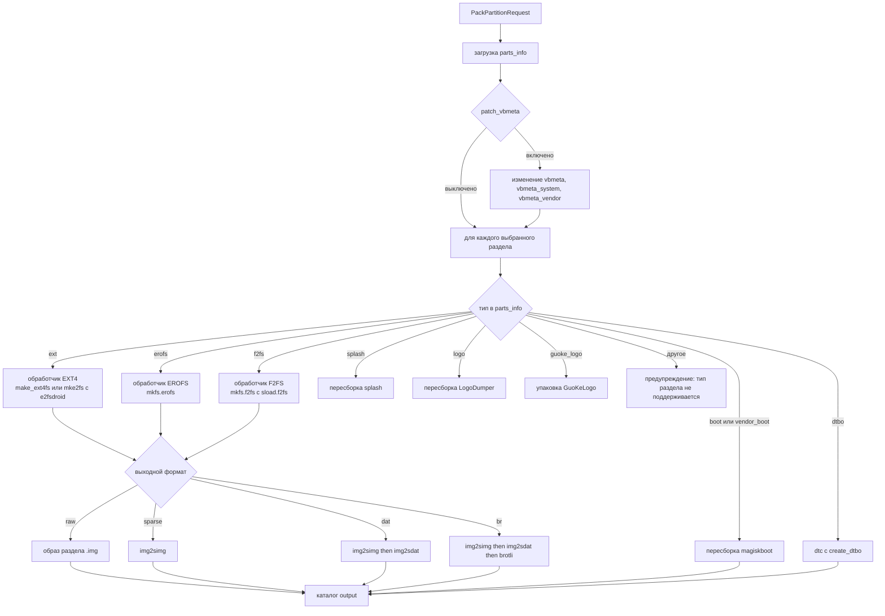

### Параметры `PackPartitionRequest`

| Поле | Назначение |
|---|---|
| `chosen_parts` | Имена разделов |
| `patch_vbmeta` | Отключение AVB во всех найденных образах vbmeta |
| `remove_source_files` | После успешной сборки файловой системы удаляет каталог выбранного раздела и относящиеся к нему метаданные; специальные обработчики boot, dtbo, logo и splash этим флагом не управляются |
| `ext4_packer` | `make_ext4fs` или `mke2fs` |
| `ext4_size_mode` | `auto` или `fixed` |
| `output_format` | В UI доступны `raw`, `sparse`, `dat`, `br`, отображаемые как `raw`, `sparse`, `new.dat`, `new.dat.br` |
| `erofs_compress_format`, `erofs_level`, `erofs_old_kernel` | Настройки сжатия EROFS |
| `brotli_level`, `utc` | Уровень Brotli и временная метка |
| `origin_fs`, `modify_fs`, `fs_convert` | Явное преобразование EXT, EROFS или F2FS перед сборкой |
| `custom_size` | Размеры EXT4 по разделам |

Перед упаковкой `prepare_partition_context_files` обновляет `fs_config`, `file_contexts`, правила контекстов и удаляет дубликаты. Автоматический размер использует оценку дерева и может обновлять `dynamic_partitions_op_list`.

Файловые системы, `boot`, `vendor_boot` и `dtbo` публикуют результат в `output`. Текущие обработчики `splash`, `logo` и `guoke_logo` работают с образом внутри `unpack` и сами не переносят собранный файл в `output`.

## 11. Super, Hybrid ZIP и Payload

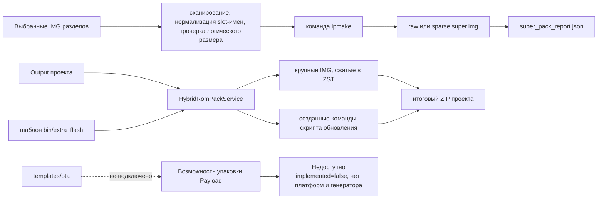

Super поддерживает схемы non-A/B, A/B и virtual A/B, вывод raw или sparse, атрибуты только для чтения, имя группы, имя блочного устройства и проверку логического размера. Hybrid ZIP не поддерживает проекты, где в `output` уже есть `payload.bin`.

Для `postinstall_config.txt` существуют репозиторий logic-слоя, controller application-слоя и редактор UI. Окно не зарегистрировано в активном меню проекта, поэтому редактирование postinstall остаётся подготовленной, но недоступной из обычного интерфейса функцией.

## 12. Преобразование форматов

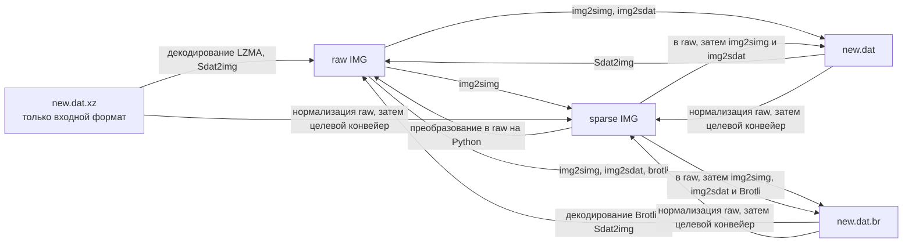

Входные форматы: `raw`, `sparse`, `dat`, `br`, `xz`.

Выходные форматы: `raw`, `sparse`, `dat`, `br`.

Кандидатами raw считаются распознаваемые образы EXT, EROFS, F2FS и Super.

## 13. Файловые системы

| Файловая система | Детектор | Распаковка | Метаданные | Упаковка | Основные зависимости |
|---|---|---|---|---|---|
| Семейство EXT | Сигнатура EXT со смещением 1080 | Активна | `fs_config`, `file_contexts`, `parts_info` | EXT4 активна | Парсер EXT на Python, `make_ext4fs` или `mke2fs` и `e2fsdroid` |
| EROFS | Сигнатура со смещением 1024 | Активна | `fs_config`, `file_contexts`, `parts_info` | Активна | `extract.erofs`, `mkfs.erofs` |
| F2FS | Сигнатура со смещением 1024 | Активна при наличии `imgkit` | `fs_config`, `file_contexts`, `parts_info` | Активна при наличии двух инструментов | `imgkit`, `mkfs.f2fs`, `sload.f2fs` |
| ROMFS | Сигнатура `rom1fs` | Активна | Нет полных метаданных для обратного цикла | Нет активного обработчика упаковки | Парсер ROMFS на Python |
| SquashFS | `sqsh` или `hsqs` | Только детектор и библиотечный код | Не подключена к сценарию проекта | Нет | Библиотека `PySquashfsImage` |
| UBI | `UBI#` | Только детектор | Нет | Нет | Нет зарегистрированного сценария |
| JFFS2 | Сигнатура `0x1985` | Только детектор | Нет | Нет | Нет зарегистрированного сценария |

## 14. Реестр определяемых типов

`core.file_types.gettype` распознаёт следующие значения:

| Семейство | Значения |
|---|---|
| Архивы и сжатие | `zip`, `ozip`, `7z`, `tar`, `gzip`, `bzip2`, `zopfli`, `lzma`, `lz4`, `lz4_legacy`, `lz4_lg`, `zstd` |
| Образы Android | `boot`, `vendor_boot`, `dtbo`, `vbmeta`, `avb_foot`, `payload`, `super`, `sparse`, `ext`, `erofs`, `f2fs`, `gpt`, `dtb` |
| Графика и форматы производителей | `logo`, `guoke_logo`, `splash`, `rk_rsce`, `rkfw`, `rkaf`, `amlogic` |
| Контейнеры прошивок | `kdz`, `dz`, `pac`, `NTPI`, `romfs`, `ubi`, `squashfs`, `jffs2` |
| Исполняемые и мультимедийные файлы | `exe`, `elf`, `macos_bin`, `png`, `chrome` |
| Служебные результаты | `unknown`, `fnf`; ветка `fne` присутствует в функции, но при текущем порядке проверок недостижима |

Определение типа не означает наличие полного цикла распаковки и упаковки. Активность каждого типа указана в разделах 8, 9, 10 и 13.

## 15. Ядро Core

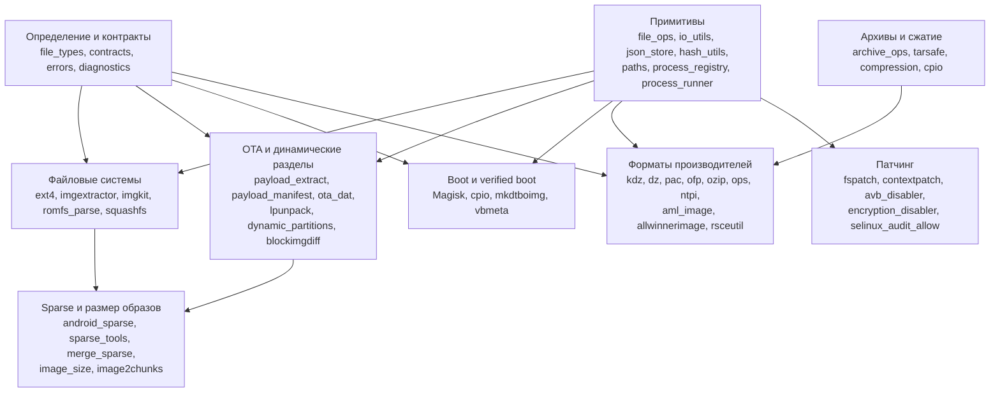

### Карта групп Core

| Группа | Основные модули | Роль и ключевые функции |
|---|---|---|
| Типы и пути | `file_types`, `paths`, `file_finder`, `directory_listing` | `gettype`, поиск файлов, корень программы и путь к платформенным инструментам |
| Файловые примитивы | `file_ops`, `io_utils`, `cache_ops`, `json_store`, `hash_utils`, `random_utils` | Чтение, запись, удаление, JSON, хеширование, временные идентификаторы |
| Процессы | `process_runner`, `process_registry`, `diagnostics` | `call`, реестр PID, stdout и приёмник журнала |
| Sparse | `android_sparse`, `sparse_img`, `sparse_tools`, `merge_sparse`, `image2chunks` | Преобразование sparse/raw, разделение, объединение, нарезка на части |
| EXT | `ext4`, `imgextractor`, `resize_ext4`, `fspatch`, `contextpatch` | Разбор и извлечение EXT, создание метаданных, изменение размера и патчинг |
| EROFS и F2FS | `imgkit`, `extract.erofs`, `mkfs.erofs`, `mkfs.f2fs`, `sload.f2fs` | `imgkit` распаковывает F2FS; распаковку EROFS и упаковку EROFS/F2FS отдельные logic-сервисы выполняют внешними инструментами |
| Динамические разделы | `lpunpack`, `dynamic_partitions`, `gpt`, `pygpt` | Метаданные Super, логические разделы, GPT |
| OTA | `payload_extract`, `payload_manifest`, `ota_dat`, `blockimgdiff`, `rangelib`, `sign_payload` | Извлечение Payload, преобразование DAT, операции с диапазонами, вспомогательная подпись |
| Boot | `Magisk`, `cpio`, `mkdtboimg`, `vbmeta`, `rsceutil` | Ramdisk Boot, DTBO, verified boot, ресурсы Rockchip |
| Форматы производителей | `aml_image`, `allwinnerimage`, `kdz`, `dz`, `unkdz`, `undz`, `unpac`, `splituapp`, `ofp_*`, `ozipdecrypt`, `opscrypto`, `ntpiutils` | Разбор и извлечение прошивок производителей |
| Графика | `logo`, `splash_editor`, `opsplash`, `rsceutil` | Logo, splash и образы ресурсов |
| Сжатие и архивы | `compression`, `archive_ops`, `tarsafe`, `cpio`, `squashfs`, `PySquashfsImage` | Безопасная распаковка и кодеки сжатия |
| Патчинг безопасности | `avb_disabler`, `encryption_disabler`, `selinux_audit_allow`, `te2cil` | Преобразования fstab и SELinux |

## 16. Сервисы Logic

| Подсистема | Сервисы и функции | Вход | Выход | Зависимости |
|---|---|---|---|---|
| Первоначальная настройка | `WelcomeStepPolicy` | Номер шага и число страниц | Допустимый номер шага | Нет |
| Рабочее пространство проекта | `ProjectManager`, `pack_zip`, `rmdir` | Путь рабочего пространства, имя проекта | `input`, `unpack`, `output`, итоговый ZIP | Файловые операции Core |
| Импорт | `copy_project`, `unpackrom`, обработчики форматов | Файл или каталог, `ProjectImportRuntimeContext` | `ProjectImportResult` | Детектор типа, парсеры архивов и форматов производителей |
| Реестр распаковки | `get_available_formats`, `list_candidates`, `run_unpack` | Ключ формата и выбранные элементы | Список кандидатов или `bool` | Ленивые контроллеры |
| Сценарий распаковки | `unpack`, `unpack_compressed_dat`, `process_partition_image` | Имена разделов, формат, runtime-контекст | Деревья, IMG, метаданные, `bool` | Движки форматов Core и консольные инструменты |
| Convert | `list_candidate_groups`, `convert_selection` | `ConvertSelection` | Итоговый `bool`; отдельные `ConvertResult` создаются внутри обработки, но наружу не возвращаются | Sparse, DAT, Brotli, LZMA |
| Упаковка разделов | `pack_selected_partitions`, `pack_filesystem_partition` | `PackPartitionRequest` | Образы и преобразованные результаты | Обработчики файловых систем и реестр упаковки |
| Упаковка Super | `pack_super`, `scan_packable_super_images`, `validate_super_size` | Образы, группы, слоты, размер | `super.img`, отчёт JSON | `lpmake`, парсер размера образа |
| Упаковка Hybrid | `HybridRomPackService.pack` | Каталог output, шаблон, целевое устройство | Структура прошивки и входные данные ZIP | `zstd`, безопасные операции с шаблоном |
| Возможность упаковки Payload | `get_capability`, `audit_implementation` | Платформа и корень проекта | Явно недоступная возможность | Нет генератора |
| Boot и DTBO | `unpack_boot_image`, `repack_boot_image`, `unpack_dtbo`, `pack_dtbo` | Образ и runtime-контекст | Редактируемое дерево или пересобранный образ | `magiskboot`, `cpio`, `dtc` |
| Плагины | `ModuleManager` и узкие сервисы плагинов | MPK, идентификатор, runtime-значения | Установленные файлы, событие, код результата | ZIP, загрузчик Python, shell BusyBox |
| Настройки | Сервисы загрузки, сохранения, проверки и настроек плагинов | Значения формы и репозиторий | Сохранённые настройки и результат проверки | Платформенный `SettingsRepository` |
| Обновление | Сервисы проверки и установки релиза | Метаданные релиза GitHub | Загруженное обновление и состояние перезапуска | HTTP и платформенный перезапуск |
| Отчёт об ошибке | Сервисы вложений и отчёта | Снимок настроек, файл журнала, выходной каталог | Локальный ZIP отчёта с `detail.txt` и журналом | Файловые и архивные операции |
| Редактор | Сервис и контроллер редактора | Каталог и имя файла | Прочитанные и изменённые текстовые файлы | Файловый диалог App и редактор UI |

## 17. Инструменты

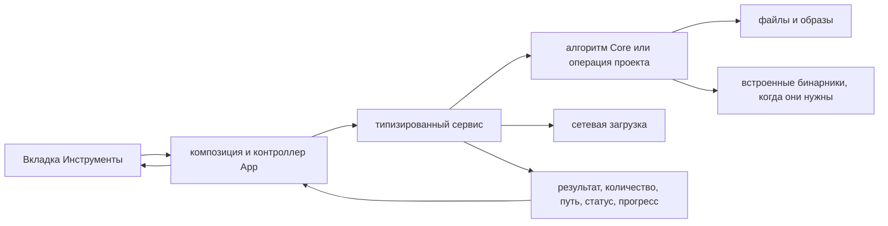

| Инструмент | Главные функции | Получает | Производит | Условия |
|---|---|---|---|---|
| Загрузка прошивки | `DownloadFirmwareUseCase.execute` | URL, выходной каталог, автоимпорт | Загруженный файл или импортированный проект, прогресс | Требуется сеть |
| Сведения о файле | `describe_file` | Путь к файлу | Имя, путь, тип, байты, время создания | Любой локальный файл |
| Калькулятор байтов | `convert_text` | Число и единицы от B до PB | Преобразованный текст | Всегда |
| Разрешения SELinux из audit | `build_request`, `execute_request` | Журнал audit и выходной каталог | Созданные разрешающие правила | Корректный входной файл |
| Отключение AVB в fstab | `scan_project_for_fstab_partitions`, `patch_selected_partitions` | Текущее дерево unpack | Изменённые fstab и их количество | Выбран проект |
| Отключение шифрования | Те же функции оркестрации с другим патчером | Текущее дерево unpack | Изменённые флаги шифрования и их количество | Выбран проект |
| Обрезка raw-образа | `execute_trim`, `trim_trailing_zeros` | Путь к образу | Тот же укороченный файл и число удалённых байтов | Разрушающая операция на месте |
| Патч Magisk | `get_arch`, `patch_boot_image` | Boot-образ, APK Magisk, архитектура и флаги | Изменённый boot IMG | APK Magisk и поддерживаемая архитектура |
| Объединение образа Qualcomm | `execute_merge` | `rawprogram.xml`, имя раздела, выходной каталог | Объединённый образ | Корректный Qualcomm XML и части |
| Объединение сегментов Super | `MergeSuperService.execute` | Проект, имя результата, флаг удаления исходников | Объединённый образ и статус | Набор sparse-сегментов в проекте |
| Разделение raw Super | `execute_split_super` | Raw Super, число частей, размер блока | Части Android sparse | Вход должен быть raw Super |
| Расшифровка XTC XML | `decrypt_tree` | Дерево каталогов | XML-файлы, изменённые на месте | Подходящие XML-файлы |
| MTK Port Tool | `MtkPortService.execute` | Boot, system, переносимая ROM, профиль, флаги | Результаты в относительном каталоге `out`, временная распаковка в относительном `tmp` | Подходящие бинарники, корректный профиль, необязательный APK Magisk |

## 18. Плагины

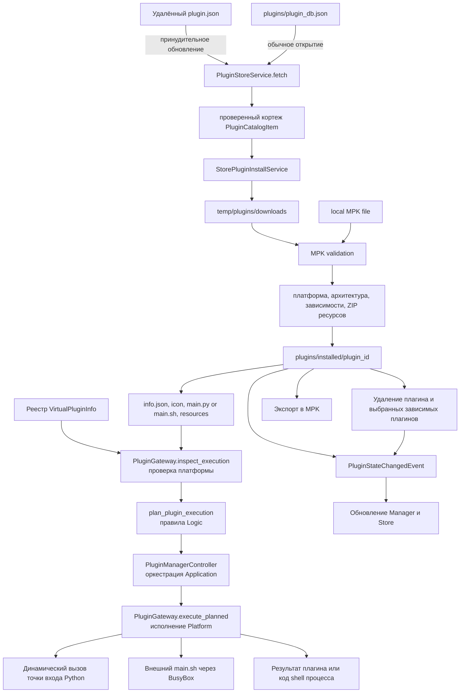

### Контракт плагина

| Элемент | Назначение |
|---|---|
| Внешний архив MPK | ZIP-контейнер с `info`, необязательным `icon` и обязательным архивом ресурсов |
| `info` | Метаданные модуля: идентификатор, имя, версия, автор, описание, система, архитектура, зависимости, ресурс |
| Установленный `info.json` | Нормализованные метаданные для runtime |
| `main.py` | Python-функция `main` или отображение `entrances` |
| `main.sh` | Точка входа shell через BusyBox и `bin/exec.sh` |
| `main.json` | Необязательная модель диалога конфигурации |
| Виртуальный плагин | Callable-объект, зарегистрированный без каталога installed |
| Экспорт runtime | Рабочий каталог и output проекта, каталог инструментов, версия, язык, пути плагина, сопоставленные значения формы |

Установка проверяет операционную систему, архитектуру и зависимости. Для выполнения нужен выбранный проект. Контроллер Application только организует сценарий через порт плагинного шлюза. Logic формирует план выполнения. Platform читает файлы плагина, динамически загружает `main.py` или запускает внешний `main.sh` через BusyBox. Значения shell экранируются, а чувствительные данные исключаются из журнала команды.

## 19. Адаптеры Platform

| Модуль | Роль | Основные функции или классы |
|---|---|---|
| `runtime_paths` | Канонический реестр большинства runtime-каталогов и файлов | Константы `bin`, `config`, `languages`, `plugins`, `temp`, `templates`; `prog_path`, `tool_bin` и путь журнала определяются в других runtime-модулях |
| `runtime_directories` | Создание изменяемых каталогов | `ensure_runtime_directories`, `prepare_log_files` |
| `runtime_environment` | Предупреждения окружения | POSIX без root, LoongArch64 |
| `startup` | Подготовка ОС | Права выполнения POSIX и поддержка frozen-сборки Windows |
| `settings_repository` | Хранение INI | `SettingsRepository.load`, `set_value` |
| `json_file_repository` | Атомарная замена JSON в UTF-8 | `read`, `write` |
| `language_repository` | Динамическое обнаружение и чтение языков | `list_language_names`, `read_language_map` |
| `mtk_port_profile_repository` | Хранение профилей MTK в JSON | `load`, `save` |
| `metrics_repository` | Хранение метрик | Чтение и запись наблюдений |
| `welcome_content_repository` | Данные мастера первого запуска | Загрузка содержимого |
| `network` | Необязательная граница HTTP-клиента | `load_requests_module` |
| `git_repository` | Определение рабочего дерева Git | Проверки репозитория |
| `logging_setup` | Журнал в файл UTF-8 или консоль разработки | `configure_logging` |
| `process_launcher` | Отделённый процесс | `launch_detached` |
| `process_restart` | Адаптер перезапуска программы | Замена или запуск процесса |
| `system_shell` | Внешние URL и файловый менеджер | Shell Windows, `open` macOS, `xdg-open` Linux |
| `filesystem` | Малый адаптер запросов к путям | Существование, файл, каталог, абсолютный и родительский пути |

## 20. Хранилища Runtime

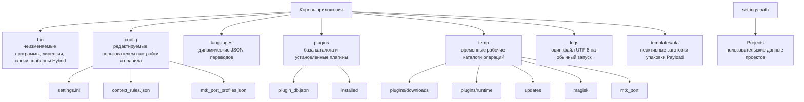

| Каталог или файл | Владелец | Срок жизни | Содержимое |
|---|---|---|---|
| `bin` | Дистрибутив | До обновления программы | Инструменты ОС и архитектуры, лицензии, ключи, `extra_flash`, tkdnd |
| `config/settings.ini` | SettingsRepository | Постоянно | Тема, язык, путь workspace, поведение, URL репозитория, флаги |
| `config/context_rules.json` | Патч контекстов при упаковке раздела | Постоянно | Правила определения контекстов SELinux |
| `config/mtk_port_profiles.json` | Репозиторий профилей MTK | Постоянно | Профили чипсетов, замены, флаги |
| `languages/*.json` | Репозитории локализации | До обновления или ручного изменения | Отображения ключей перевода |
| `plugins/plugin_db.json` | Сервис Plugin Store | Кэш до принудительного обновления | Единственная локальная база каталога |
| `plugins/installed` | ModuleManager | До удаления | Каталоги установленных плагинов |
| `temp/plugins/downloads` | Установщик Store | Временный | Загрузки MPK |
| `temp/plugins/runtime` | Выполнение плагина | Временный | Рабочий каталог shell-плагина |
| `temp/updates` | Оркестратор обновления | Временный | Пакеты обновления и подготовка |
| `temp/magisk` | Инструмент Magisk | Временный | Рабочий каталог патча |
| `temp/mtk_port` | MTK Port Tool | Временный | Workspace, переданный Magisk patch этапу; MTK flow также разрешает рабочие каталоги `tmp` и `out` относительно активной операции |
| `logs` | Настройка журналирования | Один файл на обычный запуск | Диагностика уровня DEBUG в UTF-8 |
| `templates/ota` | Незавершённая функция Payload | Ресурс дистрибутива | Текстовые шаблоны OTA, которые активные инструменты сейчас не используют |
| `<settings.path>/Projects` | ProjectManager | Пользовательский | `input`, `unpack` и `output` каждого проекта |

## 21. Локализация

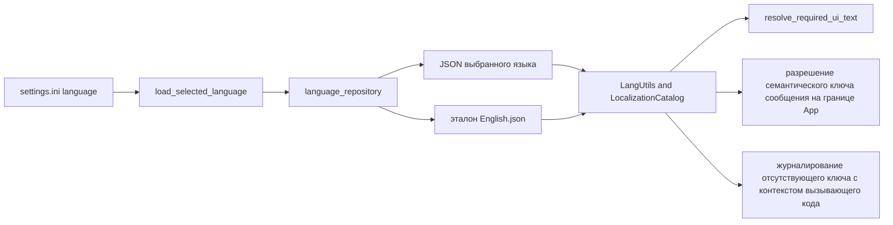

Текущий комплект языков, который возвращает `list_language_names`, включает: Brazilian-Portuguese, Chinese-Simplified, Chinese-Traditional, Deutsch, English, Hungarian, Indonesian, Japanese, korean, Lithuanian, Russian, Spanish, Thailand, Turkish, Vietnamese.

## 22. Режимы и доступность функций

### Режимы приложения

| Функция | Basic | Необязательный пакет Pro | Дополнительное условие |
|---|---|---|---|
| Вкладка Home | Доступна | Скрыта | В текущем репозитории Basic |
| Project, Plugins, Settings, About, Tasks, Tools | Доступны | Доступны | Tk UI успешно создан |
| Import, unpack, pack, convert | Доступны | Доступны | Выбран проект и существуют нужные binaries |
| Обработка аргументов командной строки после запуска | Недоступно | Доступно | `src/pro` успешно импортирован |
| UI активации | Не используется | Доступно | Проверка Pro сообщает неактивное состояние |
| Уведомление режима Basic | Показывается | Не показывается | Финализация запуска |
| Баннер отладчика | Показывается | Скрывается | Ограничение Pro |
| Журналирование разработки | Файл UTF-8 и консоль | Файл UTF-8 и консоль | `states.development=true` |
| Обычное журналирование | Файл UTF-8 | Файл UTF-8 | `states.development=false` |

### Пользовательские флаги возможностей

| Настройка | Выключено | Включено |
|---|---|---|
| `auto_unpack` | Импорт только раскладывает входные файлы | После импорта автоматически запускается сценарий распаковки |
| `contextpatch` | Существующие контексты файлов сохраняются без новых правил | Перед упаковкой запускаются патчинг контекстов и сканирование правил |
| `boot_skip_ramdisk` | Ramdisk Boot распаковывается и собирается | Этап ramdisk пропускается |
| `magisk_not_decompress` | Magiskboot декомпрессирует компоненты Boot | Используется `magiskboot unpack -n` |
| `check_upgrade` | Автопроверка релиза отключена | Цикл главного окна запускает проверку обновлений |
| `treff` | Обычное окно | Включён эффект прозрачности |
| EXT4 size mode auto | Размер оценивается по каталогу | Не применяется |
| Фиксированный размер EXT4 | Не применяется | Используется исходный или заданный размер в байтах с предупреждением о вместимости |
| Режим представления распаковки | Выбор формата образа и кандидатов | В режиме упаковки каталога выбор формата выключен, выбираются каталоги |

### Платформенные возможности по встроенным инструментам

Обозначения: «Да» означает полный необходимый набор в каталоге. «Частично» означает, что часть реализации отсутствует. Python означает, что основной путь не требует отдельного бинарника. «Отключено» означает явное отключение функции в коде.

| Возможность | Windows AMD64 | Windows x86 | Linux x86_64 | Linux aarch64 | Linux loongarch64 | macOS x86_64 | macOS arm64 |
|---|---|---|---|---|---|---|---|
| Библиотека Tk DnD | Да | Да | Да | Да | Да | Да | Да |
| Распаковка EXT4 | Python | Python | Python | Python | Python | Python | Python |
| Упаковка EXT4 | Да | Да | Да | Да | Да через `make_ext4fs`; режим `mke2fs` не совпадает с именем `mke2fs.android` | Да | Да |
| Распаковка и упаковка EROFS | Да | Да | Да | Да | Да | Да | Да |
| Распаковка F2FS | Да | Нет `imgkit` | Да | Да | Нет `imgkit` | Нет `imgkit` | Да |
| Упаковка F2FS | Да | Нет | Да | Нет | Нет | Да | Да |
| Распаковка и упаковка Boot | Да | Да | Да | Частично, нет встроенного `cpio` | Нет `magiskboot` и `cpio` | Да | Да |
| DTBO | Да | Да | Да | Да | Да | Да | Да |
| Распаковка Super | Python | Python | Python | Python | Python | Python | Python |
| Упаковка Super | Да | Да | Да | Да | Да | Да | Да |
| Sparse в raw | Python | Python | Python | Python | Python | Python | Python |
| Raw в sparse | Да | Да | Да | Да | Да | Да | Да |
| Распаковка RKFW и RKAF | Да | Нет `afptool` | Да | Да | Да | Да | Да |
| Распаковка Payload | Python | Python | Python | Python | Python | Python | Python |
| Упаковка Payload | Отключено | Отключено | Отключено | Отключено | Отключено | Отключено | Отключено |

В `bin/Android/aarch64` есть отдельный набор инструментов, но Android не заявлен как настольная система для Tk. Для Windows ARM64 есть адаптер tkdnd, но каталога `bin/Windows/ARM64` в текущем дереве нет.

## 23. Полная матрица встроенных бинарников

| Платформа и архитектура | Файлы |
|---|---|
| Android aarch64 | brotli, busybox, cpio, dtc, e2fsdroid, extract.erofs, img2simg, imgkit, lpmake, magiskboot, make_ext4fs, mke2fs, mkfs.erofs, zstd |
| Darwin arm64 | afptool, brotli, busybox, cpio, dtc, e2fsdroid, extract.erofs, img2simg, imgkit, lpmake, magiskboot, make_ext4fs, mke2fs, mkfs.erofs, mkfs.f2fs, sload.f2fs, zstd |
| Darwin x86_64 | afptool, brotli, busybox, cpio, dtc, e2fsdroid, extract.erofs, img2simg, lpmake, magiskboot, make_ext4fs, mke2fs, mkfs.erofs, mkfs.f2fs, sload.f2fs, zstd |
| Darwin universal | Только afptool |
| Linux aarch64 | afptool, brotli, busybox, delta_generator, dtc, e2fsdroid, extract.erofs, img2simg, imgkit, lpmake, magiskboot, make_ext4fs, mke2fs, mkfs.erofs, zstd |
| Linux loongarch64 | afptool, brotli, busybox, dtc, e2fsdroid, extract.erofs, img2simg, lpmake, make_ext4fs, mke2fs.android, mkfs.erofs, zstd |
| Linux x86_64 | afptool, brotli, busybox, cpio, delta_generator, dtc, e2fsdroid, extract.erofs, extract.f2fs, img2simg, imgkit, lpmake, magiskboot, make_ext4fs, mke2fs, mkfs.erofs, mkfs.f2fs, simg2img, sload.f2fs, zstd |
| Windows AMD64 | afptool.exe, brotli.exe, busybox.exe, cpio.exe, cygwin1.dll, dtc.exe, e2fsdroid.exe, extract.erofs.exe, img2simg.exe, imgkit.exe, lpmake.exe, magiskboot.exe, make_ext4fs.exe, mke2fs.exe, mkfs.erofs.exe, mkfs.f2fs.exe, mv.exe, simg2img.exe, sload.f2fs.exe, zstd.exe |
| Windows x86 | brotli.exe, busybox.exe, cpio.exe, cygwin1.dll, dtc.exe, e2fsdroid.exe, extract.erofs.exe, img2simg.exe, lpmake.exe, magiskboot.exe, make_ext4fs.exe, mke2fs.exe, mkfs.erofs.exe, mv.exe, simg2img.exe, zstd.exe |

`core.paths.tool_bin` выбирает только `bin/<platform.system()>/<platform.machine()>`. Поэтому название каталога и значение платформенного API Python должны совпасть.

## 24. Python зависимости

| Группа | Пакеты | Использование |
|---|---|---|
| UI | Pillow, sv_ttk, chlorophyll, Pygments | Изображения, тема, редактор и подсветка синтаксиса |
| Сеть | requests, httpx | Обновления, прошивки, Plugin Store и отчёты |
| Бинарные форматы | protobuf, pycryptodome, cryptography, asn1crypto | Манифесты Payload, расшифровка форматов производителей, подписи |
| Сжатие | zstandard, lz4, python-lzo в Linux | Форматы сжатия |
| Данные и конфигурация | toml, configparser, lxml | Обработка конфигурации и XML |
| Упаковка приложения | PyInstaller | Бинарный дистрибутив |
| Межверсионная и Windows-поддержка | future, six, wmi в Windows | Помощники совместимости и системная информация Windows |

GitHub Actions собирает релизы на Python 3.12 для Windows x64, Ubuntu 24.04 x64, macOS 15 Intel x64 и macOS 15 ARM64. `requirements-quality.txt` используется только для ручных проверок Ruff и mypy и не входит в пользовательскую сборку.

## 25. Обновление, журналирование и диагностика

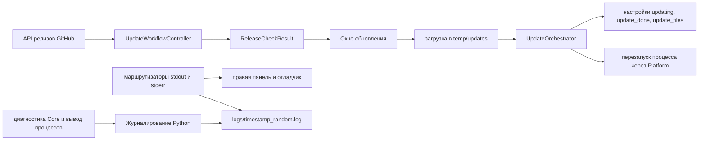

Обычный режим пишет журнал DEBUG в новый файл UTF-8. Режим разработки использует обработчик консоли. Шум сообщений DEBUG от Pillow подавляется, если `MIO_DEBUG_PIL_LOGS` не включён.

## 26. Проверки архитектуры и качества

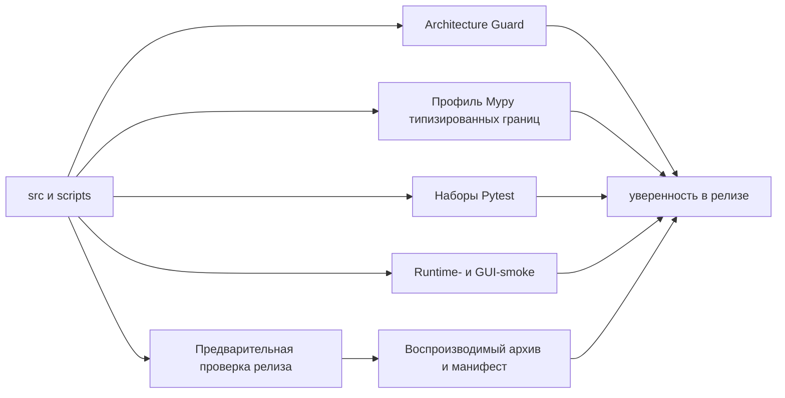

Architecture Guard проверяет направление импортов, отсутствие статических циклов, удалённые поверхности совместимости, рабочие границы UI, владение runtime-ресурсами и семантику завершения процессов. Тесты разделены на architecture, contract, functional, integration, regression, release, smoke, unit и e2e.

## 27. Карта ответственности верхнего уровня

| Каталог | Что хранит | Чего не должен делать |
|---|---|---|
| `src/ui` | Окна Tk, виджеты, layout, presenters, ключи локализации | Читать файлы проекта, запускать процессы, импортировать app, logic, core или platform |
| `src/app` | Композиция, runtime-сессия, контроллеры, фоновые задачи, доставка в UI | Реализовывать алгоритмы форматов |
| `src/logic` | Сценарии проектов, типизированные запросы и результаты, сервисы плагинов и инструментов | Зависеть от Tkinter, app, ui или platform |
| `src/core` | Низкоуровневые движки форматов, парсеры, алгоритмы и совместимый мост процессов | Зависеть от верхних слоёв или Tkinter |
| `src/platform` | Репозитории, пути, запуск, журналирование, shell, перезапуск, загрузчик сети | Содержать решения предметной области или UI |
| `bin` | Исполняемые реализации для ОС и архитектур | Хранить изменяемые пользовательские настройки |
| `config` | Постоянная конфигурация, редактируемая пользователем | Хранить бинарники или временные данные |
| `languages` | Каталоги переводов | Хранить состояние приложения |
| `plugins` | База Store и установленные модули | Хранить загрузки или временные файлы выполнения |
| `temp` | Одноразовые загрузки и рабочие каталоги операций | Хранить канонические настройки или установленные плагины |
| `logs` | Диагностика runtime | Быть источником данных проектов |
| `Projects` | Пользовательские входные данные, редактируемые деревья и результаты | Смешиваться с ресурсами приложения |

## 28. Итоговая цепочка данных

```mermaid
flowchart LR
  INPUT["Данные пользователя<br/>архив, образ, каталог, URL"]
  UI["Представление UI"]
  APP["Контроллер App и типизированный runtime-контекст"]
  LOGIC["Сервис и сценарий Logic"]
  CORE["Парсер, преобразователь или патчер Core"]
  BIN["Встроенная консольная утилита, если нужна"]
  STORAGE["input, unpack, output, config, temp"]
  RESULT["Типизированный результат, пути, прогресс, сообщения"]

  INPUT --> UI --> APP --> LOGIC --> CORE
  CORE <--> BIN
  CORE <--> STORAGE
  LOGIC <--> STORAGE
  CORE --> RESULT
  LOGIC --> RESULT
  RESULT --> APP --> UI
```

Главный архитектурный принцип проекта: UI представляет, App связывает, Logic определяет последовательность, Core знает форматы, Platform обслуживает окружение, а runtime-каталоги хранят данные с явным владельцем.

## 29. Карта влияния изменений

Карта показывает, какие слои, контракты, данные и проверки затрагивает изменение в каждой основной области.

```mermaid
flowchart TB
  UI_CHANGE["Изменение UI"]
  RUNTIME_CHANGE["Изменение runtime-контракта"]
  SERVICE_CHANGE["Изменение сервиса или контроллера"]
  FORMAT_CHANGE["Изменение формата образа"]
  PROJECT_CHANGE["Изменение структуры проекта"]
  PLUGIN_CHANGE["Изменение плагина или каталога"]
  UPDATE_CHANGE["Изменение обновления или сети"]
  BINARY_CHANGE["Изменение платформенного бинарника"]

  UI_LAYER["UI представления, presenters, ключи локализации"]
  APP_LAYER["Композиция App, контроллеры, runtime-контексты"]
  LOGIC_LAYER["Сценарии Logic, сервисы, политики"]
  CORE_LAYER["Core форматы, парсеры, упаковщики"]
  PLATFORM_LAYER["Пути Platform, отделённые процессы и перезапуск, сеть, репозитории"]
  STORAGE_LAYER["projects, plugins, temp, config, logs, bin"]

  UI_TESTS["UI smoke, локализация, функциональные сценарии"]
  CONTRACT_TESTS["Контрактные и интеграционные тесты"]
  ROUNDTRIP_TESTS["Полный цикл, совместимость форматов, фикстуры"]
  RELEASE_TESTS["Проверка ресурсов, зависимостей и запуска"]

  UI_CHANGE --> UI_LAYER --> APP_LAYER --> UI_TESTS
  RUNTIME_CHANGE --> APP_LAYER --> CONTRACT_TESTS
  SERVICE_CHANGE --> APP_LAYER --> LOGIC_LAYER --> CONTRACT_TESTS
  FORMAT_CHANGE --> CORE_LAYER --> LOGIC_LAYER --> APP_LAYER
  CORE_LAYER --> ROUNDTRIP_TESTS
  PROJECT_CHANGE --> LOGIC_LAYER --> STORAGE_LAYER --> CONTRACT_TESTS
  PLUGIN_CHANGE --> LOGIC_LAYER --> APP_LAYER --> UI_LAYER
  PLUGIN_CHANGE --> STORAGE_LAYER
  UPDATE_CHANGE --> PLATFORM_LAYER
  UPDATE_CHANGE --> LOGIC_LAYER
  UPDATE_CHANGE --> APP_LAYER
  UPDATE_CHANGE --> STORAGE_LAYER
  BINARY_CHANGE --> PLATFORM_LAYER
  BINARY_CHANGE --> CORE_LAYER
  BINARY_CHANGE --> LOGIC_LAYER
  BINARY_CHANGE --> RELEASE_TESTS
  APP_LAYER --> STORAGE_LAYER
  PLATFORM_LAYER --> STORAGE_LAYER

  classDef change fill:#6d28d9,stroke:#c4b5fd,color:#ffffff,stroke-width:2px
  classDef layer fill:#0f766e,stroke:#5eead4,color:#ffffff,stroke-width:2px
  classDef storage fill:#1d4ed8,stroke:#93c5fd,color:#ffffff,stroke-width:2px
  classDef check fill:#b45309,stroke:#fcd34d,color:#ffffff,stroke-width:2px
  class UI_CHANGE,RUNTIME_CHANGE,SERVICE_CHANGE,FORMAT_CHANGE,PROJECT_CHANGE,PLUGIN_CHANGE,UPDATE_CHANGE,BINARY_CHANGE change
  class UI_LAYER,APP_LAYER,LOGIC_LAYER,CORE_LAYER,PLATFORM_LAYER layer
  class STORAGE_LAYER storage
  class UI_TESTS,CONTRACT_TESTS,ROUNDTRIP_TESTS,RELEASE_TESTS check
```

| Область изменения | Основные исходники | Прямое влияние | Влияние на данные | Минимальная проверка |
|---|---|---|---|---|
| Экран или пользовательский сценарий | [src/ui](../../../src/ui/), [src/app/composition](../../../src/app/composition/) | presenters, композиция, контроллер сценария, локализация | ввод пользователя, состояние виджетов, отображаемые результаты | запуск окна, основной сценарий, отсутствующие ключи локализации |
| Набор Runtime, фаза или контекст | [src/app/runtime](../../../src/app/runtime/), [src/app/bootstrap.py](../../../src/app/bootstrap.py) | bootstrap, композиция, все потребители средств доступа к runtime | пути, настройки, язык, сервисы, состояние запуска | контракты runtime, порядок фаз, тесты хранения |
| Контракт сервиса или контроллера | [src/app](../../../src/app/), [src/logic](../../../src/logic/) | Порты UI, оркестрация, модели запроса и результата | команды, прогресс, ошибки, отмена, итоговый результат | контрактные тесты, успешный интеграционный сценарий, обработка ошибки |
| Формат образа или алгоритм преобразования | [src/core](../../../src/core/), [src/logic/projects](../../../src/logic/projects/) | распаковка, упаковка, конвертация, определение типа | байтовые потоки, метаданные разделов, файловые системы | полный цикл, фикстура каждого формата, совместимость бинарников |
| Рабочая область проекта | [project_manager.py](../../../src/logic/projects/common/project_manager.py), [workspace_service.py](../../../src/logic/projects/common/workspace_service.py) | импорт, распаковка, сборка, выбор активного проекта | `Projects/<name>/input`, `unpack`, `output`, метаданные проекта в `unpack/config` | создание, повторное открытие, очистка, конфликт имён |
| Схема плагина или MPK | [src/logic/plugins](../../../src/logic/plugins/), [src/app/plugins](../../../src/app/plugins/) | каталог, установка, загрузка модуля, UI магазина | манифест, архив, каталог плагина, состояние установки | набор контрактов плагина, проверка MPK, установка, запуск и удаление |
| Сеть или обновление | [network.py](../../../src/platform/network.py), [src/logic/update](../../../src/logic/update/), [update_orchestrator.py](../../../src/app/update_orchestrator.py) | загрузки, проверка версии, подготовка, перезапуск | ответ API, скачанный архив, temp, config | сетевые ошибки, выбор ресурса релиза, отмена, безопасные пути ZIP, подготовка, применение и очистка обновления |
| Комплект бинарников | [bin](../../../bin/), [src/core/paths.py](../../../src/core/paths.py), [process_runner.py](../../../src/core/process_runner.py) | обработчики образов, внешние процессы, поддержка ОС | stdin, stdout, stderr, файлы результата, коды возврата | обязательные ресурсы, системные зависимости, smoke каждого бинарника |
| Ключ локализации | [languages](../../../languages/), [language_repository.py](../../../src/platform/language_repository.py) | все видимые подписи и сообщения | JSON словарь языка, выбранная локаль | парсинг всех словарей, совпадение ключей, запуск RU и EN |

Практическое правило: изменение контракта проверяется у производителя данных, у каждого прямого потребителя и на границе с файловой системой или внешним процессом.

## 30. Ссылки на ключевые исходники

### UI и композиция приложения

| Исходник | Роль |
|---|---|
| [src/ui/main_window.py](../../../src/ui/main_window.py) | Главное окно и верхний UI контур |
| [src/ui/window_sections/panels.py](../../../src/ui/window_sections/panels.py) | Сборка основных панелей окна |
| [src/ui/common/windowing.py](../../../src/ui/common/windowing.py) | Общие правила владельца дочернего окна и первого native map |
| [src/ui/common/window_appearance.py](../../../src/ui/common/window_appearance.py) | Реестр темы и прозрачности всех окон |
| [src/ui/common/window_paint.py](../../../src/ui/common/window_paint.py) | Ограниченная нативная отрисовка без timer callbacks |
| [src/ui/common/window_reveal.py](../../../src/ui/common/window_reveal.py) | Защищённый показ подготовленного главного окна |
| [src/ui/startup_splash.py](../../../src/ui/startup_splash.py) | Жизненный цикл управляемой приложением startup splash |
| [src/ui/tabs/project/unpack/view.py](../../../src/ui/tabs/project/unpack/view.py) | Представление сценария распаковки |
| [src/ui/tabs/project/pack/partition/window.py](../../../src/ui/tabs/project/pack/partition/window.py) | Окно упаковки разделов |
| [src/ui/tabs/plugins/store/window.py](../../../src/ui/tabs/plugins/store/window.py) | Каталог и установка плагинов |
| [src/ui/tabs/tools/view.py](../../../src/ui/tabs/tools/view.py) | Экран встроенных инструментов |
| [src/app/composition/main_window.py](../../../src/app/composition/main_window.py) | Связывание главного окна с App сервисами |
| [src/app/composition/main_tabs.py](../../../src/app/composition/main_tabs.py) | Композиция вкладок и пользовательских сценариев |

### Runtime, ядро приложения и границы слоев

| Исходник | Роль |
|---|---|
| [tool.py](../../../tool.py) | Точка запуска приложения |
| [src/app/entrypoint.py](../../../src/app/entrypoint.py) | Вход в App runtime |
| [src/app/bootstrap.py](../../../src/app/bootstrap.py) | Построение runtime и запуск UI |
| [src/app/runtime/session.py](../../../src/app/runtime/session.py) | Жизненный цикл runtime session |
| [src/app/runtime/phases.py](../../../src/app/runtime/phases.py) | Явные фазы и порядок запуска |
| [src/app/runtime/models.py](../../../src/app/runtime/models.py) | Runtime модели и bundle контракты |
| [src/app/runtime/service_bootstrap.py](../../../src/app/runtime/service_bootstrap.py) | Создание runtime сервисов |
| [src/app/runtime/contexts/contracts.py](../../../src/app/runtime/contexts/contracts.py) | Контракты контекстов исполнения |
| [scripts/arch_guard/current_rules.py](../../../scripts/arch_guard/current_rules.py) | Автоматические правила направления зависимостей |

### Сервисы и контроллеры

| Область | Контроллеры App | Сервисы Logic |
|---|---|---|
| Импорт проекта | [import_controller.py](../../../src/app/projects/import_controller.py) | [import_flow/service.py](../../../src/logic/projects/import_flow/service.py) |
| Распаковка | [unpack/controller.py](../../../src/app/projects/unpack/controller.py), [view_controller.py](../../../src/app/projects/unpack/view_controller.py) | [unpack/workflow/service.py](../../../src/logic/projects/unpack/workflow/service.py) |
| Упаковка раздела | [partition_controller.py](../../../src/app/projects/pack/partition_controller.py) | [partition_flow/service.py](../../../src/logic/projects/pack/partition_flow/service.py) |
| Упаковка super | [super_controller.py](../../../src/app/projects/pack/super_controller.py) | [pack/super/service.py](../../../src/logic/projects/pack/super/service.py) |
| Конвертация | [src/app/projects/convert](../../../src/app/projects/convert/) | [convert/service.py](../../../src/logic/projects/convert/service.py) |
| Менеджер плагинов | [manager_controller.py](../../../src/app/plugins/manager_controller.py) | [module_manager.py](../../../src/logic/plugins/module_manager.py) |
| Магазин плагинов | [fetch_flow.py](../../../src/app/plugins/store/fetch_flow.py), [install_flow.py](../../../src/app/plugins/store/install_flow.py) | [store_service.py](../../../src/logic/plugins/store_service.py) |
| Обновление | [update_controller.py](../../../src/app/update_controller.py), [update_orchestrator.py](../../../src/app/update_orchestrator.py) | [update/service.py](../../../src/logic/update/service.py), [install_service.py](../../../src/logic/update/install_service.py) |

### Потоки данных, проекты и плагины

| Исходник | Данные и ответственность |
|---|---|
| [project_manager.py](../../../src/logic/projects/common/project_manager.py) | Список проектов, активный проект, создание и открытие |
| [workspace_service.py](../../../src/logic/projects/common/workspace_service.py) | Структура рабочей области и проектные пути |
| [source_handlers.py](../../../src/logic/projects/unpack/workflow/source_handlers.py) | Маршрутизация входных файлов по типу источника |
| [image_processing.py](../../../src/logic/projects/unpack/workflow/image_processing.py) | Поток распаковки и промежуточные результаты образов |
| [pack/filesystem_service.py](../../../src/logic/projects/pack/filesystem_service.py) | Выбор и подготовка файловой системы при сборке |
| [filesystem_handlers.py](../../../src/logic/projects/pack/partition_flow/filesystem_handlers.py) | Реализация упаковки для поддерживаемых файловых систем |
| [plugins/install/service.py](../../../src/logic/plugins/install/service.py) | Проверка и установка пакета плагина |
| [execution_plan.py](../../../src/logic/plugins/execution_plan.py) | Чистые правила запуска плагина и выбор плана выполнения |
| [manager_controller.py](../../../src/app/plugins/manager_controller.py) | Оркестрация сценария в application слое |
| [plugin_gateway.py](../../../src/platform/plugin_gateway.py) | Проверка файлов, регистрация, операции хранения и реализация platform порта |
| [plugins/execution.py](../../../src/platform/plugins/execution.py) | Динамическое выполнение Python и запуск внешнего shell процесса |
| [composition/plugin_store.py](../../../src/app/composition/plugin_store.py) | Связывание UI магазина с потоками загрузки и установки |

### Форматы и Core

| Исходник | Ответственность |
|---|---|
| [file_types.py](../../../src/core/file_types.py) | Определение типов входных файлов и образов |
| [sparse_tools.py](../../../src/core/sparse_tools.py) | Android sparse и raw преобразования |
| [payload_extract.py](../../../src/core/payload_extract.py) | Извлечение разделов из payload |
| [lpunpack.py](../../../src/core/lpunpack.py) | Разбор логических разделов super |
| [imgextractor.py](../../../src/core/imgextractor.py) | Извлечение содержимого файловых образов |
| [ext4.py](../../../src/core/ext4.py) | Работа с EXT4 структурами |
| [Magisk.py](../../../src/core/Magisk.py) | Операции с boot образом через Magisk инструменты |
| [mkdtboimg.py](../../../src/core/mkdtboimg.py) | Чтение и сборка DTBO образов |
| [ota_dat.py](../../../src/core/ota_dat.py) | Операции с OTA dat форматом |
| [merge_sparse.py](../../../src/core/merge_sparse.py) | Объединение sparse фрагментов |
| [process_runner.py](../../../src/core/process_runner.py) | Основной общий bridge запуска внешних утилит из Core; форматные алгоритмы могут вызывать `subprocess` напрямую, когда управление процессом является частью алгоритма |

### Сеть, процессы, хранилища и платформенные бинарники

| Исходник или каталог | Роль |
|---|---|
| [runtime_paths.py](../../../src/platform/runtime_paths.py) | Большинство канонических runtime каталогов и файлов |
| [runtime_directories.py](../../../src/platform/runtime_directories.py) | Создание и проверка рабочих каталогов |
| [settings_repository.py](../../../src/platform/settings_repository.py) | Чтение и запись конфигурации |
| [language_repository.py](../../../src/platform/language_repository.py) | Загрузка языковых словарей |
| [crash_logging.py](../../../src/platform/crash_logging.py) | Самое раннее файловое logging, exception hooks, fault capture и startup phases |
| [startup_watchdog.py](../../../src/platform/startup_watchdog.py) | Периодические дампы стеков потоков при зависании запуска |
| [logging_setup.py](../../../src/platform/logging_setup.py) | Настройка файлового и консольного логирования |
| [network.py](../../../src/platform/network.py) | Ленивая загрузка `requests` на platform границе |
| [process_launcher.py](../../../src/platform/process_launcher.py) | Отделённый запуск дочернего процесса без подключения stdout и stderr |
| [process_restart.py](../../../src/platform/process_restart.py) | Контролируемый перезапуск приложения |
| [system_shell.py](../../../src/platform/system_shell.py) | Платформенная оболочка и системные команды |
| [startup.py](../../../src/platform/startup.py) | Подготовка платформы при запуске |
| [src/core/paths.py](../../../src/core/paths.py) | Разрешение путей к встроенным инструментам |
| [network_downloads.py](../../../src/logic/network_downloads.py) | Общий поток сетевой загрузки |
| [download_firmware/use_case.py](../../../src/logic/tools/download_firmware/use_case.py) | Загрузка прошивок как пользовательский сценарий |
| [splash.png](../../../splash.png), [splash_loongarch.png](../../../splash_loongarch.png) | Корневые ресурсы заставки приложения, которая показывается только после запуска раннего logging; LoongArch64 использует отдельное изображение |
| [bin](../../../bin/) | Платформенные бинарники и вспомогательные утилиты |
| [config](../../../config/) | Постоянные настройки приложения |
| [languages](../../../languages/) | Словари локализации |
| [plugins](../../../plugins/) | Установленные плагины |
| [temp](../../../temp/) | Временные загрузки и промежуточные артефакты |
| [logs](../../../logs/) | Журналы работы приложения и инструментов |
| [templates/ota](../../../templates/ota/) | Шаблоны для OTA сборки |

### Архитектурные и сквозные проверки

| Проверка | Что защищает |
|---|---|
| [test_layer_dependency_direction.py](../../../tests/architecture/test_layer_dependency_direction.py) | Направление зависимостей между слоями |
| [test_runtime_storage_layout.py](../../../tests/architecture/test_runtime_storage_layout.py) | Владение runtime каталогами и структура хранения |
| [test_static_import_cycles_guard.py](../../../tests/architecture/test_static_import_cycles_guard.py) | Отсутствие запрещенных циклов импорта |
| [test_workflow_contracts.py](../../../tests/contract/projects/unpack/test_workflow_contracts.py) | Контракты потока распаковки |
| [test_partition_contracts.py](../../../tests/contract/projects/pack/test_partition_contracts.py) | Контракты упаковки раздела |
| [test_store_service_contracts.py](../../../tests/contract/plugins/test_store_service_contracts.py) | Контракты каталога и установки плагинов |
| [test_update_contracts.py](../../../tests/contract/update/test_update_contracts.py) | Контракты проверки и установки обновлений |
| [check_required_assets.py](../../../scripts/quality/check_required_assets.py) | Наличие обязательных файлов и бинарников |
| [check_system_dependencies.py](../../../scripts/quality/check_system_dependencies.py) | Доступность системных зависимостей |
