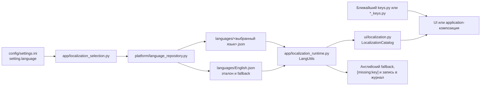

# Локализация текста интерфейса

Весь текст, который видит пользователь, хранится в JSON файлах каталога `languages`.

Код не должен содержать готовые подписи кнопок, заголовки окон, сообщения, названия режимов, форматов, файловых систем, образов или инструментов.

## Основное правило

Внутреннее значение и отображаемая подпись являются разными данными.

Внутреннее значение используется application, logic, platform и core. Оно остаётся стабильным и не зависит от выбранного языка.

UI и application composition получают отображаемый текст по ключу из текущего языкового файла. Logic, core, platform и модели запросов сохраняют внутреннее значение.

Пример для групп Super образа:

```text
qti_dynamic_partitions отображается как Qualcomm
main отображается как MTK
mot_dp_group отображается как Moto
```

Пользователь видит короткие подписи `Qualcomm`, `MTK`, `Moto`. В запрос сборки и в `lpmake` передаются исходные технические значения. `mot_dp_group` относится к схеме групп Motorola.

Такой же подход применяется к следующим значениям:

1. `raw`, `sparse`, `img`, `payload`, `super` и форматам `new.dat`.
2. `ext4`, `EROFS` и `F2FS`.
3. `boot`, `recovery`, `vendor_boot` и `vbmeta`.
4. `Magisk` и названиям инструментов.
5. `fs_config` и `file_contexts`.
6. Архитектурам Android.
7. Кодировкам файлов.
8. Единицам размера.
9. Светлой и тёмной теме.
10. Предустановленным названиям групп Super образа.

## Где находятся ключи

Единого Python-файла со всеми ключами нет. Каждая функция владеет своими ключами в ближайшем `keys.py` или `*_keys.py`. Значением константы является строковый ключ JSON, а сам видимый текст хранится только в `languages/*.json`.

`src/app/runtime/keys.py` — важное исключение: это не локализация, а имена полей runtime-сессии. Добавлять туда текстовые ключи нельзя.

### Точная схема хранения и загрузки



| Файл или каталог | За что отвечает | Когда редактировать |
|---|---|---|
| [`languages/English.json`](../../../languages/English.json) | Эталонный каталог и fallback для обязательного видимого текста | Всегда при добавлении нового ключа; при изменении английского текста |
| [`languages/Russian.json`](../../../languages/Russian.json) | Русские значения тех же ключей | При изменении русского текста или добавлении ключа |
| [`languages/*.json`](../../../languages/) | Все 15 каталогов; имя файла без `.json` является идентификатором языка | Новый ключ нужно добавить во все поддерживаемые языки |
| [`config/settings.ini`](../../../config/settings.ini) | `setting.language` хранит выбранное имя языкового файла | Обычно изменяется приложением при выборе языка, а не вручную |
| [`src/platform/runtime_paths.py`](../../../src/platform/runtime_paths.py) | Объявляет канонический `LANGUAGE_DIR` | Только при изменении расположения всего каталога языков |
| [`src/platform/language_repository.py`](../../../src/platform/language_repository.py) | Строит путь, перечисляет `*.json` и читает словарь через `JsonEdit` | При изменении формата хранения или правил обнаружения языков |
| [`src/app/localization.py`](../../../src/app/localization.py) | Загружает выбранный каталог и отдельно `English` как эталон; проверяет обязательные ключи | При изменении процесса загрузки, но не для обычного перевода |
| [`src/app/localization_runtime.py`](../../../src/app/localization_runtime.py) | `LangUtils`: разрешает ключ, применяет fallback, возвращает `[missing:key]` и журналирует источник вызова | При изменении общей политики отсутствующих и обязательных строк |
| [`src/app/localization_selection.py`](../../../src/app/localization_selection.py) | Читает выбранный язык из настроек, сохраняет и активирует новый выбор | При изменении сценария переключения языка |
| [`src/ui/localization.py`](../../../src/ui/localization.py) | Read-only Protocol `LocalizationCatalog`, который получают UI-компоненты | При изменении контракта разрешения текста между App и UI |

### Индекс файлов, объявляющих ключи

Ниже перечислены все группы localization-файлов текущего кода. Внутри группы конкретный `keys.py` отвечает только за одноимённую функцию или окно.

| Область | Конкретные файлы ключей | Ответственность |
|---|---|---|
| Действия Application | [`submit_action_keys.py`](../../../src/app/bug_report/submit_action_keys.py), [`cmdline_keys.py`](../../../src/app/cmdline_keys.py), [`input_actions_keys.py`](../../../src/app/input_actions_keys.py), [`view_controller_keys.py`](../../../src/app/projects/unpack/view_controller_keys.py) | Отчёт об ошибке, командная строка, импорт входных файлов и сообщения контроллера распаковки |
| Композиция Application | [`crash_keys.py`](../../../src/app/composition/crash_keys.py), [`debugger_keys.py`](../../../src/app/composition/debugger_keys.py), [`editor_keys.py`](../../../src/app/composition/editor_keys.py), [`file_dialog_keys.py`](../../../src/app/composition/file_dialog_keys.py), [`log_stream_keys.py`](../../../src/app/composition/log_stream_keys.py), [`main_window_keys.py`](../../../src/app/composition/main_window_keys.py), [`plugin_store_keys.py`](../../../src/app/composition/plugin_store_keys.py), [`project_import_keys.py`](../../../src/app/composition/project_import_keys.py), [`settings_tab_keys.py`](../../../src/app/composition/settings_tab_keys.py) | Сообщения, которые application-слой передаёт окнам, диалогам, главной композиции, импорту, Plugin Store и настройкам |
| Общие элементы UI | [`controls_keys.py`](../../../src/ui/common/controls_keys.py), [`error_helper_keys.py`](../../../src/ui/common/dialogs/error_helper_keys.py), [`editor/keys.py`](../../../src/ui/common/editor/keys.py), [`mkc_filedialog_keys.py`](../../../src/ui/common/mkc_filedialog_keys.py), [`technical_choice_keys.py`](../../../src/ui/common/technical_choice_keys.py), [`windowing_keys.py`](../../../src/ui/common/windowing_keys.py), [`debugger_keys.py`](../../../src/ui/log_interface/debugger_keys.py) | Общие диалоги, редактор, файловый выбор, технические подписи, окна и отладчик |
| Главное окно и запуск | [`main_window_keys.py`](../../../src/ui/main_window_keys.py), [`startup_checks_keys.py`](../../../src/ui/startup_checks_keys.py), [`startup_issue_keys.py`](../../../src/ui/startup_issue_keys.py), [`startup_status_keys.py`](../../../src/ui/startup_status_keys.py), [`crash_keys.py`](../../../src/ui/warn/crash_keys.py), [`dialog_keys.py`](../../../src/ui/warn/dialog_keys.py), [`main_window_presenter_keys.py`](../../../src/ui/window_sections/main_window_presenter_keys.py), [`right_panel_keys.py`](../../../src/ui/window_sections/right_panel_keys.py) | Главное окно, статусы и проблемы запуска, предупреждения, crash-диалог и правая панель |
| Мастер первого запуска | [`navigation_keys.py`](../../../src/ui/welcome/navigation_keys.py), [`page_builders_keys.py`](../../../src/ui/welcome/page_builders_keys.py) | Навигация и содержимое страниц welcome-мастера |
| Вкладки верхнего уровня | [`about/keys.py`](../../../src/ui/tabs/about/keys.py), [`home/keys.py`](../../../src/ui/tabs/home/keys.py) | Вкладки «О программе» и Home |
| Плагины | [`installer/keys.py`](../../../src/ui/tabs/plugins/installer/keys.py), [`manager/keys.py`](../../../src/ui/tabs/plugins/manager/keys.py), [`module_dialogs_keys.py`](../../../src/ui/tabs/plugins/module_dialogs_keys.py), [`store/keys.py`](../../../src/ui/tabs/plugins/store/keys.py) | Установщик, менеджер, диалоги создания/настройки и Plugin Store |
| Проекты | [`action_panel_keys.py`](../../../src/ui/tabs/project/action_panel_keys.py), [`convert/keys.py`](../../../src/ui/tabs/project/convert/keys.py), [`project_menu_keys.py`](../../../src/ui/tabs/project/project_menu_keys.py), [`pack/boot_images/keys.py`](../../../src/ui/tabs/project/pack/boot_images/keys.py), [`device_prompt_keys.py`](../../../src/ui/tabs/project/pack/hybrid/device_prompt_keys.py), [`partition/keys.py`](../../../src/ui/tabs/project/pack/partition/keys.py), [`payload/keys.py`](../../../src/ui/tabs/project/pack/payload/keys.py), [`postinstall/keys.py`](../../../src/ui/tabs/project/pack/postinstall/keys.py), [`super/keys.py`](../../../src/ui/tabs/project/pack/super/keys.py), [`zip_prompt_keys.py`](../../../src/ui/tabs/project/pack/zip_prompt_keys.py), [`unpack/boot_images/keys.py`](../../../src/ui/tabs/project/unpack/boot_images/keys.py), [`info_dialog_keys.py`](../../../src/ui/tabs/project/unpack/info_dialog_keys.py), [`layout_keys.py`](../../../src/ui/tabs/project/unpack/layout_keys.py), [`presenter_keys.py`](../../../src/ui/tabs/project/unpack/presenter_keys.py), [`view_keys.py`](../../../src/ui/tabs/project/unpack/view_keys.py) | Панель проекта, конвертация, меню, все окна упаковки и представления распаковки |
| Инструменты | [`tools/keys.py`](../../../src/ui/tabs/tools/keys.py), [`allow_selinux_audit/keys.py`](../../../src/ui/tabs/tools/allow_selinux_audit/keys.py), [`byte_calculator/keys.py`](../../../src/ui/tabs/tools/byte_calculator/keys.py), [`decrypt_xtc_xml/keys.py`](../../../src/ui/tabs/tools/decrypt_xtc_xml/keys.py), [`disable_avb_in_fstab/keys.py`](../../../src/ui/tabs/tools/disable_avb_in_fstab/keys.py), [`disable_encryption/keys.py`](../../../src/ui/tabs/tools/disable_encryption/keys.py), [`download_firmware/keys.py`](../../../src/ui/tabs/tools/download_firmware/keys.py), [`get_file_info/keys.py`](../../../src/ui/tabs/tools/get_file_info/keys.py), [`magisk_patch/keys.py`](../../../src/ui/tabs/tools/magisk_patch/keys.py), [`merge_qualcomm_image/keys.py`](../../../src/ui/tabs/tools/merge_qualcomm_image/keys.py), [`merge_super/keys.py`](../../../src/ui/tabs/tools/merge_super/keys.py), [`mtk_port_tool/keys.py`](../../../src/ui/tabs/tools/mtk_port_tool/keys.py), [`split_super/keys.py`](../../../src/ui/tabs/tools/split_super/keys.py), [`trim_raw_image/keys.py`](../../../src/ui/tabs/tools/trim_raw_image/keys.py) | Заголовок вкладки Tools и ключи каждого из 13 окон инструментов |
| Обновление | [`src/ui/update/keys.py`](../../../src/ui/update/keys.py) | Окно проверки, загрузки и применения обновления |

### Как понять, что именно редактировать

| Задача | Файлы, которые нужно изменить |
|---|---|
| Исправить существующий русский или английский текст | Только значение существующего ключа в `languages/Russian.json` или `languages/English.json`; идентификатор ключа не менять |
| Изменить перевод во всех языках | Значение того же ключа в каждом `languages/*.json` |
| Добавить обычную подпись, заголовок или сообщение | Ближайший к функции `keys.py`/`*_keys.py`, все `languages/*.json` и код, вызывающий `resolve_required_ui_text` |
| Добавить техническое значение в список | `src/ui/common/technical_choice_keys.py`, отображение `TECHNICAL_VALUE_KEYS` в `src/ui/common/technical_choices.py` и все языковые JSON |
| Добавить сообщение из logic-сервиса | Семантический код остаётся в logic; отображение кода на ключ добавляется в [`src/ui/common/service_output.py`](../../../src/ui/common/service_output.py), текст — во все JSON |
| Изменить обязательные строки композиции | Соответствующий `*_keys.py`; если модуль объявляет `ALL_KEYS` или `ALL_REQUIRED_KEYS`, новый ключ включается и туда |
| Добавить новый язык | Новый полный `languages/<Имя>.json`; отдельная регистрация в Python не нужна, язык обнаруживается по имени файла |

### Добавление обычного ключа

1. Найти UI или application-композицию, которой принадлежит текст.
2. Добавить понятную константу в ближайший `keys.py` или `*_keys.py`; значение должно быть уникальным `snake_case` ключом с префиксом функции.
3. Разрешать текст через `LocalizationCatalog.resolve_required_ui_text(keys.ИМЯ)`. Для действительно необязательного текста использовать `resolve_optional`.
4. Добавить ключ сначала в `languages/English.json`, затем в `languages/Russian.json` и остальные языковые JSON.
5. Сохранить `%s`, `%d`, `{name}` и другие placeholders одинаковыми по смыслу во всех переводах.
6. Если рядом существует `ALL_KEYS` или `ALL_REQUIRED_KEYS`, включить новый ключ в этот набор.
7. Запустить localization-контракты и строгую проверку ключей.

### Добавление нового языка

1. Скопировать полную структуру `languages/English.json` в `languages/<Имя>.json`.
2. Оставить все ключи без изменений и перевести только значения; `language_file_by` содержит автора перевода.
3. Имя файла без `.json` станет значением, которое возвращает `list_language_names` и сохраняет `setting.language`.
4. Проверить корректный JSON, непустые строки и совпадение placeholders с English.
5. Запустить приложение с новым языком и полный localization-контракт.

## Как добавить новое отображаемое техническое значение

1. Сохранить отдельное внутреннее значение, которое будет использовать логика.
2. Добавить константу ключа в `technical_choice_keys.py`.
3. Связать внутреннее значение с ключом в `TECHNICAL_VALUE_KEYS`.
4. Добавить ключ во все языковые JSON файлы.
5. Создать `LocalizedChoiceSet` через `build_choice_set`.
6. Передать в виджет только локализованные подписи.
7. Хранить техническое значение отдельно либо получать его по индексу выбранного элемента.
8. Не восстанавливать техническое значение из переведённой строки.
9. Добавить или обновить тест сценария.


## Подписи форматов

Названия форматов являются техническими обозначениями. Они всё равно хранятся в `languages/*.json`, но имеют одинаковое отображение во всех языках.

Список распаковки показывает:

```text
new.dat.br
new.dat
new.dat.xz
img
sparse
payload
super
update.app
zst
```

Поле формата вывода в окне упаковки разделов показывает только:

```text
raw
sparse
new.dat
new.dat.br
```

Внутренние значения этого поля остаются `raw`, `sparse`, `dat`, `br`. Отображаемая подпись `sparse` и техническое состояние `sparse` совпадают, но UI всё равно получает подпись через ключ локализации.

## Техническое состояние темы и графические ресурсы

Тема интерфейса хранится как точный технический идентификатор `light` или `dark`. Меню показывает локализованную подпись, но в application и UI actions передаётся только технический идентификатор.

Идентификаторы темы определены в `src/app/settings/theme.py` как `LIGHT_THEME` и `DARK_THEME`.

Анимация загрузки является отдельным графическим ресурсом. Она не называется темой. В `src/ui/assets/images.py` используются понятные имена `loading_indicator_light` и `loading_indicator_dark`. Выбор ресурса выполняет `src/ui/assets/loading_indicator.py` по техническому идентификатору темы.

Нельзя формировать имя ресурса из переведённой подписи или восстанавливать техническое состояние из текста меню.

Смена темы повторяет стабильный порядок старой версии. Сначала `sv_ttk` завершает применение выбранной темы. Затем один раз обновляются обычные Tk элементы и списки `Combobox`. Перекрывающие панели, повторное применение темы при `Map` и `FocusIn`, изменение `topmost` и восстановление фокуса не используются. Поэтому смена темы не должна менять геометрию интерфейса или порядок окон.

Первоначальный мастер использует одно корневое окно и заранее строит каждую страницу как отдельный `ttk.Frame` в одном стеке, пока корневое окно скрыто. При навигации выбранная страница поднимается через `tkraise`: видимая страница не уничтожается, пустая поверхность не появляется, а нативное окно не меняет размер. Для скрытых страниц отключается `takefocus`. Корневое окно измеряется и показывается только после полной компоновки исходного стека. При смене языка кадры страниц перестраиваются внутри `snapshot_window_transition`, после чего поднимается выбранная страница. Обычное перемещение окна не пересчитывает его размер.

Граница слоёв остаётся строгой. UI отвечает за виджеты, размеры, отступы и адаптивные кнопки. Application организует шаги, сохранение выбора и получение данных через внедрённые функции доступа. Logic содержит `WelcomeStepPolicy` и проверяет допустимый номер шага. Platform читает языки, лицензии и уведомление о конфиденциальности, а также выполняет системные действия. Конкретный platform репозиторий подключается только в `src/app/composition/welcome.py`.

Подпись настройки патча VBMeta также берётся только из ключа `project_pack_partition_window_patch_vbmeta`. В запрос сборки передаётся логическое состояние `patch_vbmeta`, а не отображаемый текст.

## Что нельзя делать

Нельзя передавать в `text`, `title`, `values`, `message` и похожие параметры готовые пользовательские строки.

Нельзя использовать локализованную подпись как техническое значение в application, logic, platform или core. Application composition может получить текст на границе UI, но не должна возвращать его в domain-запросы или сохраняемое состояние.

Нельзя менять внутреннее значение ради красивого отображения. Например, `main` нельзя заменять на `MTK` в запросе сборки.

Нельзя добавлять запасной английский текст в код. Отсутствующий ключ должен быть обнаружен проверкой локализации.

## Размеры файлов

Logic и application передают размер как числовое количество байтов. Готовая строка с `KB`, `MB`, `MiB` или другой единицей не должна формироваться в этих слоях.

UI форматирует размер через:

```text
src/ui/common/byte_size.py
```

Функции этого модуля выбирают технический идентификатор единицы, а отображаемую подпись получают через ключ из `languages/*.json`.

Обычные размеры используют локализованные подписи `B`, `KB`, `MB`, `GB`, `TB`, `PB`, `EB`. Результаты сборки Super используют отдельные подписи `B`, `KiB`, `MiB`, `GiB`, `TiB`.

Окно сведений о файле получает из logic числовой размер, временную метку и технический тип файла. Название типа и единица размера формируются только в UI.


## Проверки

Основной контракт технических подписей находится в:

```text
tests/contract/localization/test_technical_choice_localization.py
```

Он проверяет:

1. Наличие обязательных ключей во всех языках.
2. Уникальность подписей внутри каждого списка.
3. Отображение групп Super как `Qualcomm`, `MTK`, `Moto` без обратного разбора переведённой строки.
4. Наличие локализации для `Magisk`, `vbmeta`, `fs_config` и `file_contexts`.
5. Отсутствие прямых технических строк в значениях списков UI.
6. Локализацию типов файлов, полей сведений EXT4, профилей MTK и действий MTK.
7. Использование технических идентификаторов до закрытия окна Super и передачу локализованных подписей только в UI.
8. Локализацию единиц размера и использование общего formatter во всём UI.

Общий контракт видимого текста находится в:

```text
tests/contract/localization/test_no_hardcoded_translatable_ui_text.py
```

Полная ручная проверка:

```bash
python -m pytest tests/contract/localization -q --rootdir=. -c scripts/config/pytest.ini
```

## Профили и действия MTK

Внутренние названия профилей и флагов MTK являются техническими идентификаторами. Они используются конфигурацией, application и logic без изменения.

UI не показывает эти идентификаторы напрямую. Связь встроенных профилей и действий с ключами находится в:

```text
src/ui/tabs/tools/mtk_port_tool/labels.py
```

Пользователь видит подписи из `languages/*.json`. При выборе профиля UI получает техническое имя по позиции выбранного элемента и передаёт именно его в контроллер.

Для пользовательских профилей и действий применяются локализованные шаблоны. Само имя пользовательского объекта считается пользовательскими данными, а не захардкоренным текстом программы.

## Вспомогательные представления форматов

Модули `view.py` для упаковки и распаковки хранят только технические значения форматов. Поле `display_name` в них запрещено.

Функция `get_display_name` получает `LocalizationCatalog` и разрешает подпись через `technical_label`. Благодаря этому даже вспомогательное представление `raw`, `sparse`, `new.dat`, `payload`, `super` и других форматов не содержит готового текста для интерфейса.

## Типы файлов и сведения об образе

Распознанный тип файла остаётся техническим значением, например `ext`, `erofs`, `empty` или `vbmeta`.

Списки распаковки, список разделов Super и окно сведений об образе получают подпись через `technical_label`. Встроенный парсер EXT4 возвращает идентификаторы полей, например `magic_number` и `block_size`. Названия этих полей разрешаются в UI через `src/ui/tabs/project/unpack/presenter_keys.py`.

Core не содержит готовых английских подписей для таблицы сведений. Логи при этом сохраняют исходные технические значения, чтобы диагностика не зависела от выбранного языка.
