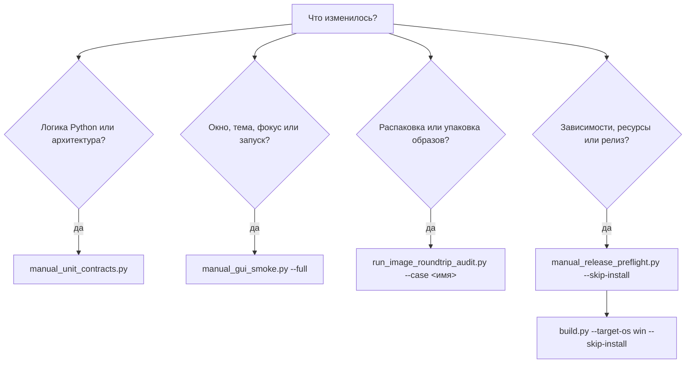

# Тесты и скрипты

Все проверки проекта запускаются только вручную. GitHub Actions устанавливает runtime зависимости, собирает программу и публикует архивы. Он не запускает Pytest, Ruff, Mypy, Architecture Guard, smoke сценарии, аудиты или release preflight.

Все служебные Python файлы находятся только в корневом каталоге `scripts`. Внутри `src` находятся только модули работающей программы.



## Подготовка окружения

Runtime зависимости устанавливаются отдельно.

```bash
python -m pip install -r requirements.txt
```

Инструменты проверки исходного кода находятся в `requirements-quality.txt`.

```bash
python -m pip install -r requirements-quality.txt
```

В Windows можно дважды щёлкнуть файл:

```text
scripts/install_quality_tools.cmd
```

Этот файл устанавливает Pytest, Ruff и Mypy. Он не запускается во время сборки.

## Что такое Pytest

Pytest запускает автоматические проверки поведения программы. Он находит файлы `test_*.py`, выполняет функции `test_*` и показывает, какая проверка завершилась ошибкой.

Конфигурация находится в:

```text
scripts/config/pytest.ini
```

Полный ручной запуск:

```bash
python -m pytest -q --rootdir=. -c scripts/config/pytest.ini tests
```

Один тестовый файл:

```bash
python tests/unit/core/test_byte_size.py
```

Одна функция внутри файла:

```bash
python -m pytest tests/unit/core/test_byte_size.py::test_name -vv --rootdir=. -c scripts/config/pytest.ini
```

Каждый файл `test_*.py` в этом проекте поддерживает прямой запуск. Файл сам находит корень репозитория и передаёт выполнение Pytest.

## Правила проверки реального кода

Contract, integration, smoke, end-to-end тесты и аудиты импортируют текущие production-модули из `src` и создают корректные файлы или записи во временных каталогах. Они не должны подставлять пакеты через `sys.modules`, импортировать скрытые тестовые реализации из скриптов или считать успешной проверку placeholder-байтов вместо настоящего формата образа либо архива.

Если операция пересекает неизбежную внешнюю границу — запускает bundled executable, показывает нативный desktop dialog или обращается к удалённому сервису — наблюдаться или обслуживаться локально может только эта узкая граница. Application controller, service, parser, serializer, структура проекта и модель данных остаются реальными. Структурную часть правила проверяет `scripts/quality/check_test_integrity.py`.

## Что такое Ruff

Ruff проверяет синтаксические и стилевые ошибки Python. В текущем проекте он ищет ошибки импорта, неопределённые имена, некорректные конструкции и основные нарушения правил `E` и `F`.

Конфигурация находится в:

```text
ruff.toml
```

Запуск из консоли:

```bash
python -m ruff check . --config ruff.toml
```

Запуск двойным кликом в Windows:

```text
scripts/run_ruff.cmd
```

Ruff не меняет код этой командой. Он только сообщает о найденных проблемах.

## Что такое Mypy

Mypy проверяет соответствие аннотаций типов реальным значениям и вызовам. В MIO Kitchen он применяется не ко всему наследуемому коду, а к выбранным архитектурным границам, где ошибка типа может нарушить связь между UI, application, logic, platform, Plugin Store и Tk callback.

Конфигурация находится в:

```text
scripts/config/mypy-typed-boundaries.ini
```

Список проверяемых модулей находится в:

```text
scripts/quality/check_typed_boundaries.py
```

Параметр `python_version = 3.12` задаёт базовую версию совместимости релиза для статического анализа, но не требует устанавливать Python 3.12 локально. Эта же проверка запускается под любой поддерживаемой версией Python 3, включая Python 3.13.

Запуск из консоли:

```bash
python scripts/quality/check_typed_boundaries.py
```

Запуск двойным кликом в Windows:

```text
scripts/run_mypy.cmd
```

Подробные правила описаны в [документе о типизированных границах](../architecture/typed_boundaries.md).

## Основные виды тестов

| Каталог | Что проверяет | Когда запускать |
|---|---|---|
| `tests/unit` | Отдельные функции, модели и небольшие классы | После изменения конкретной функции или алгоритма |
| `tests/functional` | Законченную возможность программы | После изменения поведения одной функции или одного окна |
| `tests/integration` | Совместную работу нескольких компонентов | После изменения связей между слоями и сервисами |
| `tests/contract` | Публичные интерфейсы, форматы данных и договорённости | После изменения сигнатур, конфигурации или структуры репозитория |
| `tests/regression` | Ошибки, которые уже исправлялись | После исправления похожей ошибки или изменения связанного кода |
| `tests/architecture` | Направление импортов, размещение файлов, Protocol budget и правила исключений | После перемещения модулей или изменения архитектуры |
| `tests/smoke` | Быстрый запуск основных окон и runtime сценариев | После изменения интерфейса, запуска программы или сборки |
| `tests/e2e` | Полный пользовательский сценарий | Перед выпуском и после крупных изменений |
| `tests/release` | Состав архива, воспроизводимость и правила упаковки | После изменения сборки, ресурсов или release скриптов |
| `tests/external` | Внешние библиотеки, бинарники и платформенные возможности | На системе, где установлены нужные внешние инструменты |
| `tests/embedded` | Проверки окружения и bundled dependencies | После изменения зависимостей и подготовки среды |
| `tests/support` | Общие тестовые помощники | Обычно напрямую не запускается |

Чтобы увидеть точный список тестов Pytest без их выполнения:

```bash
python -m pytest --collect-only -q --rootdir=. -c scripts/config/pytest.ini tests
```

## Полный справочник команд

Все команды ниже запускаются из корня репозитория. Параметр `--dry-run` у управляющих скриптов печатает дочерние команды, не выполняя их.

### Управляющие скрипты

| Команда | Что запускает | Когда использовать |
|---|---|---|
| `python scripts/manual/manual_unit_contracts.py` | Проверку целостности тестов, полный Pytest, прямой запуск файлов, Mypy, Ruff и Architecture Guard | Обычная неграфическая проверка после изменения кода или архитектуры |
| `python scripts/manual/manual_unit_contracts.py --dry-run` | Печатает состав набора без выполнения | Проверка определения набора или диагностика путей команд |
| `python scripts/manual/manual_gui_smoke.py` | Проверку GUI-зависимостей и основной набор реальных окон, темы, runtime, жизненного цикла и сквозного сценария | Быстрая проверка интерфейса после его изменения |
| `python scripts/manual/manual_gui_smoke.py --full` | Полный явный runtime-набор, включая сбор метрик | Перед релизом или после изменения запуска, окон и runtime |
| `python scripts/manual/manual_gui_smoke.py --dry-run` | Печатает выбранные GUI-команды | Проверка состава GUI-набора без открытия окон |
| `python scripts/manual/runtime_smoke_suite.py` | Предварительные проверки и все зарегистрированные реальные runtime-сценарии в отдельных процессах | Прямой поиск проблемы во всём GUI/runtime-контуре |
| `python scripts/manual/runtime_smoke_suite.py --dry-run` | Проверяет и печатает полный список сценариев | Убедиться, что в наборе нет устаревшего сценария или пути |
| `python scripts/manual/manual_release_preflight.py --skip-install` | Ресурсы, Python-зависимости, локализацию, тесты и релизные требования в уже подготовленном окружении | Непосредственно перед локальной сборкой |
| `python scripts/manual/manual_release_preflight.py` | Системные требования и установку пакетов, затем те же релизные проверки | Подготовка чистой машины для сборки |
| `python scripts/manual/manual_release_preflight.py --dry-run` | Печатает шаги предварительной проверки | Просмотр того, что выполнит релизный барьер |

### Явные runtime-сценарии

Это отдельные скрипты, а не обычные модули Pytest, потому что каждый сценарий владеет реальным процессом Tk/runtime и его очисткой.

| Скрипт | Какое реальное поведение проверяет |
|---|---|
| `tests/smoke/targeted.py` | Запускает текущую целевую выборку controller/contract-тестов через Pytest |
| `tests/smoke/welcome.py` | Собирает настоящий мастер первого запуска, проходит его шаги, применяет оформление и показывает окно |
| `tests/smoke/ui.py` | Компонует реальное главное окно и проверяет layout, сообщения запуска, прозрачность и поведение окна |
| `tests/smoke/settings_ui.py` | Использует реальные настройки, runtime-состояние, локализацию и технические значения |
| `tests/smoke/theme_cycle.py` | Проверяет цикл `dark → light → dark`, первую отрисовку, сохранение мастера и геометрии |
| `tests/smoke/windows.py` | Открывает основные окна через их production-функции композиции |
| `tests/smoke/window_catalog.py` | Открывает остальные диалоги и классы `Toplevel` с корректными production-моделями |
| `tests/smoke/byte_calculator.py` | Открывает и использует скомпонованный калькулятор байтов |
| `tests/smoke/toolbox_click.py` | Вызывает каждое действие Toolbox через реальные привязки кнопок и проверяет итоговый путь диалога или окна |
| `tests/smoke/runtime.py` | Создаёт принадлежащие runtime окна отладчика и менеджера плагинов |
| `tests/smoke/scenario.py` | Создаёт настоящее рабочее пространство проекта и выполняет текущие операции с sparse-образом |
| `tests/smoke/operational.py` | Выполняет операции Plugin Store через production-репозиторий и сервис с локальным HTTP-репозиторием |
| `tests/e2e/main_flow.py` | Создаёт проект, разделяет реальный raw-образ и упаковывает текущий проект через application-сценарий |
| `tests/smoke/lifecycle.py` | Проверяет очистку жизненного цикла проекта, настроек, Plugin Store, событий и загрузок |
| `tests/smoke/deep_happy_path.py` | Выполняет реальные успешные сценарии AVB/fstab, JSON, hybrid pack и post-install |
| `scripts/quality/collect_metric_observations.py` | Запускает приложение, открывает workspace, менеджер плагинов и Plugin Store, затем записывает production-метрики |
| `scripts/quality/check_metric_observations.py` | Читает собранный файл метрик и сравнивает все обязательные метки с production-порогами |

## Основные ручные наборы

### Полная проверка кода и тестов

```bash
python scripts/manual/manual_unit_contracts.py
```

Этот набор последовательно запускает:

1. Проверку целостности тестов.
2. Полный набор Pytest одним изолированным процессом для каталога `tests`.
3. Проверку структуры прямого запуска тестов и скриптов.
4. Mypy для типизированных границ.
5. Ruff для всего репозитория.
6. Architecture Guard.

В Windows можно дважды щёлкнуть:

```text
scripts/run_all_checks.cmd
```

### Проверка графического интерфейса

Быстрый набор:

```bash
python scripts/manual/manual_gui_smoke.py
```

Полный набор окон и runtime сценариев:

```bash
python scripts/manual/manual_gui_smoke.py --full
```

В Windows можно дважды щёлкнуть:

```text
scripts/run_gui_checks.cmd
```

GUI проверки открывают реальные окна. Их лучше запускать на обычном рабочем столе, а не через удалённую сессию без графического окружения.

`tests/smoke/windows.py` проверяет основные окна, которые открываются через application composition. `tests/smoke/window_catalog.py` проверяет остальные классы `Toplevel`, модальные предупреждения, системные диалоги проекта, окно настройки плагина и редакторы параметров. Архитектурный тест `tests/architecture/test_window_smoke_inventory.py` не позволяет добавить новый класс окна без включения в один из этих smoke сценариев.

### Проверка готовности релиза

Если runtime зависимости уже установлены:

```bash
python scripts/manual/manual_release_preflight.py --skip-install
```

Полный вариант с проверкой системных зависимостей и установкой Python пакетов:

```bash
python scripts/manual/manual_release_preflight.py
```

В Windows подготовленного окружения можно дважды щёлкнуть:

```text
scripts/run_release_checks.cmd
```

## Architecture Guard

Architecture Guard проверяет направление зависимостей, запрещённые импорты, размещение файлов, startup границы и другие структурные правила.

Полная проверка:

```bash
python scripts/arch_guard/main.py
```

Быстрая проверка без startup compile и import smoke:

```bash
python scripts/arch_guard/main.py --quick
```

Проверка отдельного раздела:

```bash
python scripts/arch_guard/main.py --section layers
```

Доступные значения показывает команда:

```bash
python scripts/arch_guard/main.py --help
```

Запуск двойным кликом в Windows:

```text
scripts/run_architecture_check.cmd
```

## Скрипты качества

| Команда | Назначение | Когда запускать |
|---|---|---|
| `python scripts/quality/check_direct_execution.py` | Проверяет рабочую точку прямого запуска у каждого теста и самостоятельного служебного файла | При добавлении, перемещении или переименовании тестов и скриптов |
| `python scripts/quality/check_direct_execution.py --verify-samples` | Дополнительно запускает показательные файлы вне каталога репозитория | При изменении bootstrap-кода и путей |
| `python scripts/quality/check_localization_keys.py` | Сопоставляет используемые ключи с языковыми JSON и проверяет обязательные значения | При изменении текста интерфейса или языка |
| `python scripts/quality/check_localization_keys.py --strict` | Запрещает каждый отсутствующий эталонный ключ и некорректное значение перевода | Перед объявлением локализации завершённой |
| `python scripts/quality/check_metric_baselines.py` | Проверяет обязательные метки в `src.app.metrics_baseline` | При изменении инструментирования запуска и производительности |
| `python scripts/quality/collect_metric_observations.py` | Собирает метрики через реальный запуск и реальные скомпонованные окна | Для получения локального файла наблюдений |
| `python scripts/quality/check_metric_observations.py` | Проверяет файл из `MIO_METRIC_OBSERVATIONS_FILE` по текущим порогам | После сбора метрик |
| `python scripts/quality/check_required_assets.py` | Проверяет ресурсы приложения, нужные исходному запуску и сборке | При изменении ресурсов или упаковки |
| `python scripts/quality/check_required_dependencies.py` | Проверяет обязательные и необязательные Python-пакеты по категориям | При подготовке сборки или диагностике импортов |
| `python scripts/quality/check_required_dependencies.py --smoke-only` | Проверяет только обязательные runtime/UI-пакеты | Перед GUI smoke-набором |
| `python scripts/quality/check_required_dependencies.py --json` | Печатает машиночитаемый отчёт о зависимостях | Для CI или диагностики |
| `python scripts/quality/check_runtime_contracts.py` | Сопоставляет runtime-протоколы с реальными production-реализациями | При изменении runtime-контекста или адаптера |
| `python scripts/quality/check_system_dependencies.py` | Проверяет известные системные требования сборки | При подготовке чистой машины |
| `python scripts/quality/check_system_dependencies.py --allow-missing` | Сообщает об отсутствующих системных компонентах без ошибки | Только для диагностической инвентаризации |
| `python scripts/quality/check_test_integrity.py` | Запрещает подмену пакетов, фиктивные smoke-данные, импорт тестов из скриптов и устаревшие буквальные пути | После любого изменения теста или скрипта |
| `python scripts/quality/check_typed_boundaries.py` | Запускает Mypy для выбранных production-границ | При изменении типизированного интерфейса или callback |

Контракт `tests/contract/localization/test_technical_choice_localization.py` отдельно проверяет локализацию технических подписей, точные названия форматов, короткие подписи групп Super, отсутствие обратного преобразования переведённого текста во внутренние значения и использование локализованных единиц размера.

Проверка структуры файлов, которые должны поддерживать прямой запуск:

```bash
python scripts/quality/check_direct_execution.py
```

Дополнительная проверка с реальным запуском нескольких примеров из внешнего рабочего каталога:

```bash
python scripts/quality/check_direct_execution.py --verify-samples
```

У каждого самостоятельного скрипта есть справка:

```bash
python scripts/quality/check_localization_keys.py --help
```

## Скрипты аудита

| Команда | Назначение | Когда запускать |
|---|---|---|
| `python scripts/audits/audit_ui_controls.py` | Читает текущий UI-код, печатает JSON-инвентаризацию и завершается ошибкой при неподключённых элементах | При добавлении или перепривязке кнопок, флажков и переключателей |
| `python scripts/audits/run_image_roundtrip_audit.py` | Создаёт корректные данные и проводит текущие пути распаковки, упаковки и чтения Ext4, EROFS, F2FS, sparse, DAT, BR, XZ, ZSTD, boot, vendor_boot и Super | При изменении image workflow или встроенного инструмента |
| `python scripts/audits/run_image_roundtrip_audit.py --case boot --case vendor_boot` | Запускает только названные случаи; `--case` можно повторять | Для локализации ошибки или точечной проверки |
| `python scripts/audits/run_legacy_migration_audit.py --output audit/migration.json` | Записывает JSON с результатами реальных циклов Imgkit, F2FS, GPT, splash и split-Super | Для проверки оставшихся низкоуровневых путей, чувствительных к миграции |

Аудиты не нужны при каждом изменении. Их запускают при работе с соответствующей областью.

Можно запустить все image-сценарии либо выбрать один или несколько повторяющимися аргументами `--case`:

```bash
python scripts/audits/run_image_roundtrip_audit.py
python scripts/audits/run_image_roundtrip_audit.py --case boot --case vendor_boot
```

## Скрипты сборки и релиза

| Команда | Назначение | Когда запускать |
|---|---|---|
| `python build.py --target-os win --skip-install` | Собирает Windows x64 `tool.exe`, формирует `dist`, проверяет релизное дерево и создаёт `MIO-KITCHEN-win.x64.zip` | Для Windows-сборки в уже подготовленном окружении |
| `python build.py --target-os win` | Сначала устанавливает зависимости, затем выполняет ту же сборку | Для подготовки и сборки одной командой |
| `python scripts/release/build_release_archive.py --root dist --output mio_kitchen_runtime.zip` | Упаковывает существующий runtime, исключает файлы только для репозитория и добавляет `release_manifest.json` | Для отдельного имени архива на основе `dist` |
| `python scripts/release/build_release_archive.py --root dist --output mio_kitchen_runtime.zip --skip-checks` | Упаковывает без повторения предварительных проверок | Только если те же проверки уже успешно завершились отдельно |
| `python scripts/release/build_release_archive.py --root dist --output mio_kitchen_runtime.zip --no-manifest` | Не добавляет манифест | Для явно требующей этого совместимости со старым контуром |
| `python scripts/release/release_archive.py --output mio_kitchen_runtime.zip` | Выполняет упаковку как изолированный релизный контур | Для проверки оркестрации релиза или CI |
| `python scripts/release/release_archive.py --dry-run --output mio_kitchen_runtime.zip` | Печатает команду упаковки | Для просмотра состава релизной команды |

`scripts/release/release_manifest.py` — импортируемый модуль поддержки для `build_release_archive.py`, а не самостоятельная команда создания архива. Он формирует список имён, размеров и SHA-256, сведения об окружении, зависимостях и локализации для вложенного манифеста.

Сначала приложение нужно собрать в `dist`. Если после этого нужен архив с отдельным именем, используйте:

```bash
python scripts/release/build_release_archive.py --root dist --output mio_kitchen_runtime.zip
```

Параметр `--skip-checks` допустим только после того, как те же проверки уже завершились успешно отдельными процессами.

## Вспомогательные скрипты

`scripts/support/command_runner.py` управляет дочерними командами, безопасно декодирует вывод на разных платформах и настраивает Xvfb. `scripts/support/direct_execution.py` обслуживает прямой запуск файлов. Это импортируемые помощники, которые обычно не запускают вручную.

Исключение:

```bash
python scripts/support/clean_workspace_artifacts.py
```

Команда удаляет только кэши Python, Pytest, Mypy и Ruff. Runtime каталоги `logs` и `temp` она не очищает.

Безопасный предварительный просмотр:

```bash
python scripts/support/clean_workspace_artifacts.py --dry-run
```

## Командные файлы Windows

Эти оболочки предназначены только для Windows. Они используют команду `python` из `PATH`, а если её нет — любой установленный Python 3 через `py -3`; конкретная минорная версия не зафиксирована.

В Linux и macOS запускайте указанную в таблице Python-точку входа напрямую через `python3` или `python`. Это тот же скрипт и та же проверка, а не отдельная реализация.

| Файл | Точное действие | Когда использовать |
|---|---|---|
| `scripts/install_quality_tools.cmd` | Устанавливает `requirements-quality.txt` | Один раз для локального окружения проверок |
| `scripts/run_all_checks.cmd` | Запускает `manual_unit_contracts.py` | Обычная полная неграфическая проверка |
| `scripts/run_gui_checks.cmd` | Запускает `manual_gui_smoke.py --full` | Полная desktop smoke-проверка |
| `scripts/run_architecture_check.cmd` | Запускает полный Architecture Guard | После изменения архитектуры или импортов |
| `scripts/run_mypy.cmd` | Запускает `check_typed_boundaries.py` | После изменения типизированной границы |
| `scripts/run_ruff.cmd` | Запускает Ruff без перезаписи файлов | После любого изменения Python |
| `scripts/run_release_checks.cmd` | Запускает release preflight с `--skip-install` | Непосредственно перед сборкой на подготовленной Windows-машине |

## Что запускать после разных изменений

| Изменение | Минимальная проверка |
|---|---|
| Обычное изменение Python кода | `scripts/run_all_checks.cmd` или `manual_unit_contracts.py` |
| Новое окно, изменение фокуса, темы или страниц первоначального мастера | Полный GUI smoke набор, включая `tests/smoke/theme_cycle.py`, который проверяет возврат `dark → light → dark`, стабильность панели логов, один постоянный контейнер мастера, сохранение размера после перемещения и отсутствие повторной перекраски при `Map` и `FocusIn` |
| Изменение архитектуры или импортов | Architecture Guard, Mypy и полный Pytest |
| Изменение локализации | `check_localization_keys.py` и полный Pytest |
| Изменение сборки или ресурсов | Release preflight и release тесты |
| Изменение распаковки или сборки образов | Соответствующие functional тесты и image roundtrip audit |
| Изменение плагинов | Mypy, Plugin Store тесты и полный Pytest |

## Коды завершения

Код `0` означает успешное завершение.

Любой другой код означает ошибку, отсутствующую зависимость или нарушение проверяемого правила. `.cmd` файлы сохраняют окно консоли открытым, поэтому сообщение можно прочитать после завершения.

## Состав пользовательской сборки

Каталоги `docs`, `tests` и `scripts` относятся только к исходному репозиторию. Они не попадают в пользовательский архив программы. Release тесты отдельно проверяют это правило.
