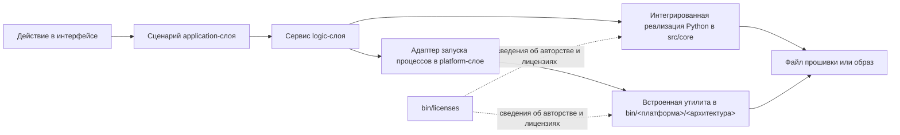

# Интегрированные и встроенные компоненты

Здесь перечислены сторонние разработки, которые действительно присутствуют в текущем исходном дереве или комплекте встроенных инструментов. Это справочник по происхождению и сопровождению компонентов, а не обещание доступности каждой операции на любой платформе. Точное покрытие платформ приведено в [матрице возможностей](../architecture/architecture_map_russian.md#22-режимы-и-доступность-функций) и [перечне встроенных бинарников](../architecture/architecture_map_russian.md#23-полная-матрица-встроенных-бинарников).

## Как компоненты связаны между собой

Слои сценариев решают, когда выполнять операцию. `src/core` знает бинарные форматы. `src/platform` находит и запускает платформенные инструменты. Код интерфейса не вызывает эти исполняемые файлы напрямую.

## Интегрированные реализации Python

| Компонент или исходный проект | Текущий код | Текущая задача | Источник и авторство |
|---|---|---|---|
| Распаковщик Spreadtrum PAC | [`src/core/unpac.py`](../../../src/core/unpac.py) | Читает структуры PAC и извлекает вложенные файлы | [spreadtrum_flash](https://github.com/ilyakurdyukov/spreadtrum_flash); Python-версия в модуле приписана affggh |
| FsPatcher | [`src/core/fspatch.py`](../../../src/core/fspatch.py) | Добавляет недостающие записи `fs_config` для дерева каталогов | [fspatch](https://github.com/affggh/fspatch); уведомление в [`bin/licenses/fspatch.txt`](../../../bin/licenses/fspatch.txt) |
| Патчер контекстов | [`src/core/contextpatch.py`](../../../src/core/contextpatch.py) | Определяет и добавляет недостающие SELinux-контексты файлов | [context_patch](https://github.com/ColdWindScholar/context_patch) |
| Инструменты переноса для старых MTK-устройств | [`src/core/mtk_port`](../../../src/core/mtk_port/) и [`src/core/extra.py`](../../../src/core/extra.py) | Пересобирают boot-образы и готовят метаданные файловой системы для старых устройств | [mtk-garbage-porttool](https://github.com/ColdWindScholar/mtk-garbage-porttool), ссылка сохранена в `extra.py` |
| Распаковщик логических разделов | [`src/core/lpunpack.py`](../../../src/core/lpunpack.py) | Читает метаданные raw или sparse Super и извлекает логические разделы | [lpunpack](https://github.com/unix3dgforce/lpunpack) |
| Реализация CPIO | [`src/core/cpio.py`](../../../src/core/cpio.py) | Читает и пересобирает CPIO-архивы ramdisk | [cpio_py](https://github.com/ColdWindScholar/cpio_py); лицензия в [`bin/licenses/cpio.txt`](../../../bin/licenses/cpio.txt) |
| Блочное преобразование Android OTA | [`src/core/ota_dat.py`](../../../src/core/ota_dat.py) | Преобразует transfer list и data в образы и образы в наборы OTA data | [sdat2img](https://github.com/xpirt/sdat2img), [img2sdat](https://github.com/xpirt/img2sdat) и их уведомления в [`bin/licenses`](../../../bin/licenses/) |
| Инструменты LG KDZ/DZ | [`src/core/kdz.py`](../../../src/core/kdz.py), [`src/core/unkdz.py`](../../../src/core/unkdz.py), [`src/core/mkkdz.py`](../../../src/core/mkkdz.py), [`src/core/mkdz.py`](../../../src/core/mkdz.py) | Разбирают, извлекают и пересобирают контейнеры LG KDZ/DZ | [kdztools](https://github.com/ehem/kdztools); авторство и текст GPL сохранены в модулях и [`bin/licenses/KdzExtractor.txt`](../../../bin/licenses/KdzExtractor.txt) |
| Расшифровщики пакетов Oppo | [`src/core/ozipdecrypt.py`](../../../src/core/ozipdecrypt.py), [`src/core/ofp_mtk_decrypt.py`](../../../src/core/ofp_mtk_decrypt.py), [`src/core/ofp_qc_decrypt.py`](../../../src/core/ofp_qc_decrypt.py) | Расшифровывают поддерживаемые варианты OZIP и OFP | [oppo_decrypt](https://github.com/bkerler/oppo_decrypt); авторство B. Kerler сохранено в каждом модуле |
| Распаковщик Huawei UPDATE.APP | [`src/core/splituapp.py`](../../../src/core/splituapp.py) | Находит и извлекает образы из UPDATE.APP | [splituapp](https://github.com/superr/splituapp); авторство SuperR сохранено в модуле |
| Парсер ROMFS | [`src/core/romfs_parse.py`](../../../src/core/romfs_parse.py) | Разбирает и извлекает образы ROMFS | [ROMFS_PARSER](https://github.com/ddddhm1234/ROMFS_PARSER), ссылка сохранена в модуле |
| Распаковщик Payload | [`src/core/payload_extract.py`](../../../src/core/payload_extract.py) и [`src/core/payload_manifest.py`](../../../src/core/payload_manifest.py) | Разбирает метаданные OTA payload и восстанавливает выбранные разделы | payload_dumper от vm03 указан в [`bin/licenses/other.txt`](../../../bin/licenses/other.txt) |
| Работа с DTBO | [`src/core/mkdtboimg.py`](../../../src/core/mkdtboimg.py) и [`src/logic/projects/dtbo/service.py`](../../../src/logic/projects/dtbo/service.py) | Читает, извлекает и пересобирает таблицы DTBO | Происходит от Android [`libufdt`](https://android.googlesource.com/platform/system/libufdt/) |

## Семейства встроенных исполняемых инструментов

Точные имена файлов зависят от операционной системы и архитектуры процессора. Эти семейства присутствуют в каталоге [`bin`](../../../bin/) и выбираются runtime-сервисом платформенных путей.

| Семейство | Для чего используется | Локальное подтверждение |
|---|---|---|
| Инструменты файловых систем Android: `mke2fs`, `e2fsdroid`, `make_ext4fs`, `img2simg`, `simg2img` | Создание Ext4 и преобразование Android sparse | [`bin/licenses/android-tools.txt`](../../../bin/licenses/android-tools.txt), [`bin/licenses/e2fsprogs.txt`](../../../bin/licenses/e2fsprogs.txt) |
| Инструменты EROFS: `mkfs.erofs`, `extract.erofs` | Создание и распаковка EROFS | [`bin/licenses/erofs-utils.txt`](../../../bin/licenses/erofs-utils.txt) |
| Инструменты F2FS: `mkfs.f2fs`, `sload.f2fs`, `extract.f2fs`, если они есть для платформы | Создание, заполнение и распаковка F2FS | [`bin/licenses/f2fs-tools.txt`](../../../bin/licenses/f2fs-tools.txt) |
| `lpmake` | Создание Android Super с логическими разделами | [`bin/licenses/android-tools.txt`](../../../bin/licenses/android-tools.txt) |
| `magiskboot` | Распаковка и упаковка семейства boot-образов | [`bin/licenses/Magisk.txt`](../../../bin/licenses/Magisk.txt) |
| `brotli` и `zstd` | Сжатые OTA data и потоки Zstandard | [`bin/licenses/brotli.txt`](../../../bin/licenses/brotli.txt) и платформенные каталоги в [`bin`](../../../bin/) |
| `busybox` | Внешние shell-точки входа установленных плагинов и переносимые консольные команды | [`bin/licenses/busybox-w32.txt`](../../../bin/licenses/busybox-w32.txt) |
| `dtc` | Компиляция и декомпиляция дерева устройств | [`bin/licenses/dtc.txt`](../../../bin/licenses/dtc.txt) |
| `cpio` | Внешние операции CPIO на платформах, где он входит в комплект | [`bin/licenses/cpio.txt`](../../../bin/licenses/cpio.txt) |
| `imgkit` | Распаковка файловых систем в runtime-сценариях и аудитах полного цикла | Платформенные каталоги в [`bin`](../../../bin/) |

## Правила сопровождения

- Нельзя выводить поддержку платформы из названия старого проекта или README. Проверяйте реальный платформенный каталог в `bin` и карту архитектуры.
- Уведомления о сторонних компонентах из `bin/licenses` должны оставаться в пользовательской сборке.
- При замене встроенной утилиты одновременно обновляются её лицензия, платформенный список и соответствующий аудит реального образа.
- Нулевого кода возврата утилиты недостаточно для round-trip теста: аудит обязан прочитать созданный образ и проверить восстановленное содержимое.
